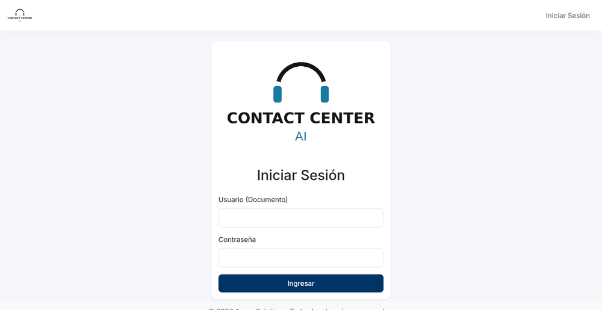
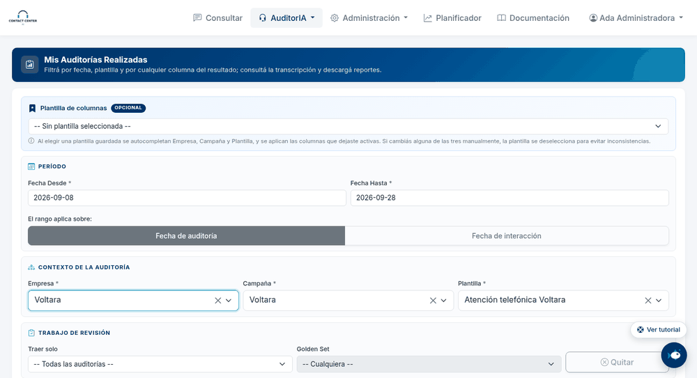
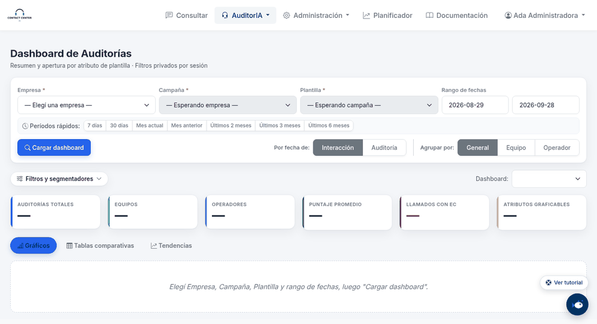
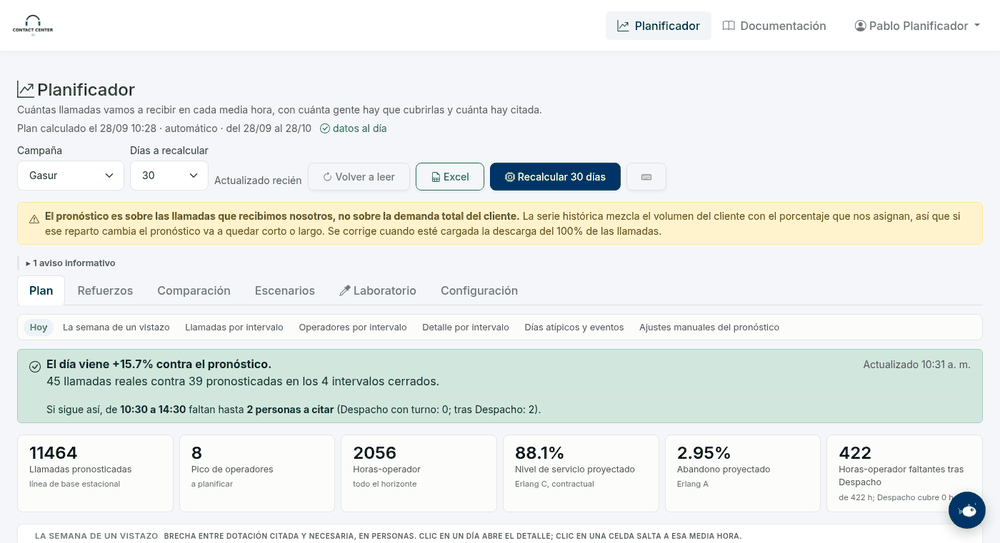
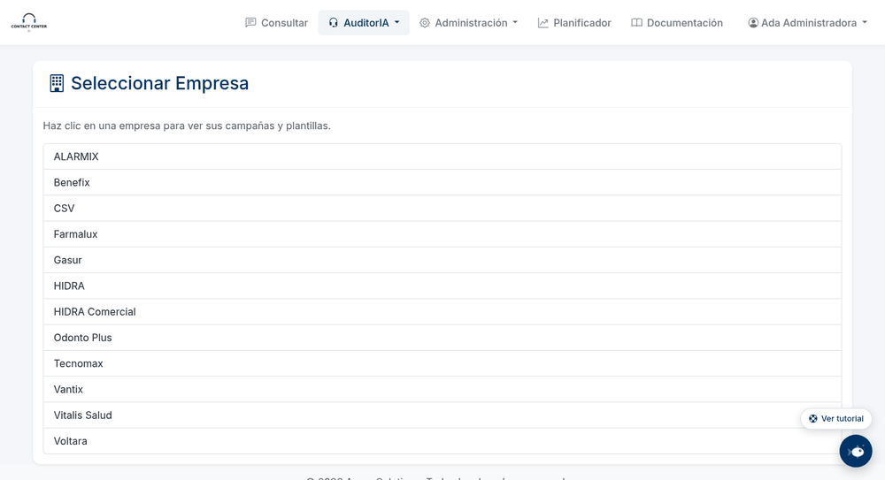
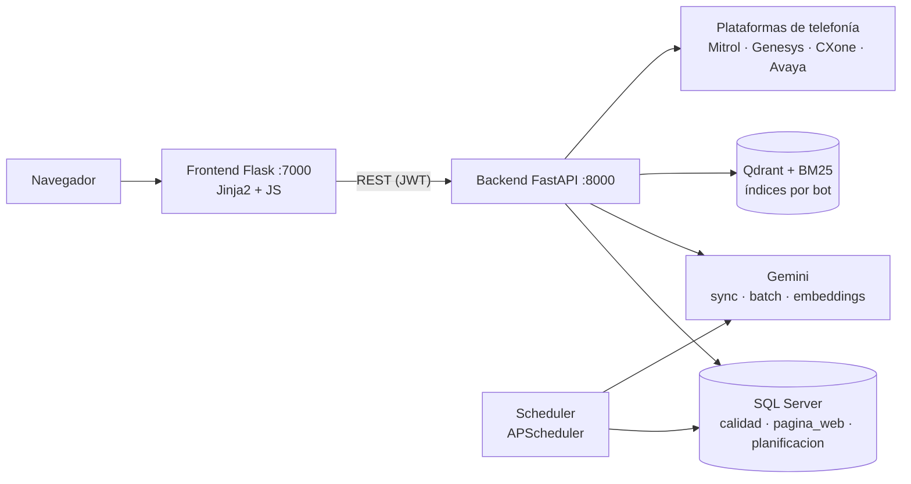

# Contact Center AI

Plataforma interna para operar un contact center con IA. La IA audita la calidad de llamadas y chats. Los
chatbots responden a los operadores con la documentación de cada campaña. Un planificador pronostica las llamadas
por media hora y calcula cuánta gente hace falta.


[](https://github.com/Foquitos/contact-center-ai/actions/workflows/tests.yml)



> **Sobre este repositorio.** Desarrollé este sistema para el área de operaciones de una empresa de BPO, donde
> estuvo en producción. Lo publico con autorización de la empresa. Esta versión está **anonimizada**: la empresa,
> sus clientes y las personas llevan nombres ficticios (Acme, Voltara, Hidra, Benefix, Gasur…). Saqué credenciales,
> direcciones internas y datos reales. Los datos que se ven en las animaciones son inventados: los genera la
> [base de demostración](db/README.md).

---

## Qué hace

| Módulo | Para quién | Qué resuelve |
|---|---|---|
| **Auditoría de calidad con IA** | Calidad | Baja llamadas y chats de las plataformas de telefonía y los evalúa con Gemini según la plantilla de cada campaña. Guarda el puntaje ponderado, los errores críticos y la transcripción de cada auditoría. |
| **Dashboard de auditorías** | Supervisores, gerencia | Gráficos, tablas comparativas y tendencias por operador, equipo y atributo, con un asistente de IA que analiza lo que está en pantalla. |
| **Evaluación de la IA** | Calidad | Mide cuánto coincide la IA con la revisión humana (kappa de Cohen por atributo) antes de confiar en una plantilla. |
| **Chatbots RAG** | Operadores | Responden con la documentación de cada campaña. La búsqueda es híbrida: vectores + BM25 + reranker. |
| **Planificador** | Planificación | Pronostica las llamadas por media hora y calcula los operadores necesarios (Erlang C/A). Compara el resultado con la malla publicada y con el forecast del cliente. |
| **Gobierno de la IA** | Administración | Muestra el costo por función y por campaña, el presupuesto mensual y el cupo de auditorías por campaña. |
| **Usuarios y permisos** | Administración | RBAC con jerarquía de roles y alcance por empresa. Permite simular un rol y deja un log de cambios. |

### Auditoría de calidad

Se filtra por campaña y plantilla. Se ven los resultados de cada atributo, y se puede abrir la transcripción del
llamado o la versión con audio.



### Dashboard

Muestra la distribución por atributo, la apertura por operador, la tendencia de cada persona y tablas
comparativas entre períodos.



### Planificador

Un mapa de calor muestra la brecha de dotación de las próximas semanas. Hay un gráfico de llamadas reales,
pronosticadas y del cliente, un simulador de escenarios, y el estado de cada fuente de datos.



### Plantillas, roles y costos

El editor de plantillas incluye asistentes de IA y controles de redacción. También hay una pantalla de gestión
de roles y el tablero de consumo de Gemini.



---

## Arquitectura



- El **frontend nunca toca la base**: todo pasa por el backend, que valida permisos en cada endpoint.
- El **scheduler** es un proceso aparte. Maneja colas, lotes batch de Gemini, auditorías programadas y alertas.
  Las colas filtran por entorno, así desarrollo y producción pueden compartir la base sin pisarse.
- El detalle de cada flujo está en [docs/ARQUITECTURA.md](docs/ARQUITECTURA.md).

## Decisiones técnicas destacadas

Cada una está explicada, con su contexto y sus alternativas, en [docs/DECISIONES.md](docs/DECISIONES.md).

- **Batch de Gemini por defecto.** Cuesta la mitad que el modo sincrónico. Tiene una cola propia con techo de
  jobs, lotes por archivo y un script que recupera los llamados cuando un lote termina "exitoso" con errores
  adentro.
- **Puntaje como foto.** La ponderación de cada atributo se guarda con la auditoría: editar una plantilla no
  reescribe la historia. Las plantillas se versionan, y reauditar archiva la corrida anterior.
- **Medir antes de confiar.** El Golden Set compara la IA contra la revisión humana con kappa de Cohen por
  atributo. Los chatbots tienen un set dorado de preguntas reales para medir la recuperación del RAG.
- **RAG híbrido** (Qdrant + BM25 + reranker). Cada fragmento repite el título de su sección, y cuando el bot no
  está seguro ofrece temas para elegir en vez de responder "no encontré".
- **Pronóstico validado con backtest.** GBDT + persistencia + corrección intradía, con clima, feriados y el
  forecast del cliente como señales. Ningún cambio de modelo entra sin ganarle al anterior en un año de historia.
  Ver [docs/PLANIFICADOR.md](docs/PLANIFICADOR.md) y [docs/ESTADISTICA.md](docs/ESTADISTICA.md).
- **Costos controlados.** Se usa caché de contexto de Gemini. Hay un catálogo de modelos con precios vigentes por
  fecha, cupos por campaña y el costo registrado por función.
- **SQL verificado en los tests sin ejecutarlo** (`sys.dm_exec_describe_first_result_set`). Las migraciones son
  aditivas e idempotentes, y cada cambio de esquema tiene la suya.

## Stack

| Capa | Tecnologías |
|---|---|
| Backend | Python 3.11, FastAPI, SQLAlchemy + pyodbc, Pydantic, APScheduler |
| Frontend | Flask, Jinja2, Bootstrap, Chart.js, JavaScript sin framework |
| Datos | SQL Server (T-SQL, stored procedures, vistas), Qdrant |
| IA | Google Gemini (audio y texto, batch, embeddings, caché de contexto), LlamaIndex |
| Pronóstico | scikit-learn (GBDT), Erlang C / Erlang A, clima (Open-Meteo) |
| Integraciones | Mitrol, Genesys Cloud, NICE CXone, Avaya/Verint, Google Sheets, Selenium |
| Calidad | pytest (~2.700 tests offline), migraciones SQL versionadas |

---

## Probarlo

La base original no viaja con el repo. [`db/`](db/README.md) trae un SQL Server en Docker con el esquema completo
y datos inventados: auditorías, dashboard, uso de IA y un año de llamadas para el planificador.

Requisitos: Python 3.11+, Docker, el [driver ODBC 18 de SQL Server](https://learn.microsoft.com/sql/connect/odbc/download-odbc-driver-for-sql-server) y `make`.

```bash
git clone <url-del-repositorio> && cd contact-center-ai
make install && cp .env.example .env
make db-demo              # SQL Server en Docker + base Acme con datos de ejemplo (~3 min)
make dev                  # http://localhost:7000 — usuario 11111111, clave demo1234
```

Hay cinco usuarios de ejemplo, uno por rol ([db/README.md](db/README.md)). Para auditar y usar los chatbots hace
falta una clave propia de Gemini en el `.env`.

## Para desarrolladores

```bash
make backend                                       # solo backend → http://localhost:8000/docs
make frontend                                      # solo frontend → http://localhost:7000
cd backend && ../.venv/bin/python run_scheduler.py # scheduler

scripts/correr_tests.sh -m "not tokens"            # suite offline (~2.700 tests, ~40 s, sin gastar IA)
scripts/correr_tests.sh tests/test_batch_cola.py   # un archivo
scripts/correr_tests.sh -m tokens                  # tests contra Gemini de verdad: gastan tokens
```

Varios tests validan SQL contra la base sin ejecutarlo (fixture `validar_sql`). Con la base de demostración
levantada, la suite corre completa; lo mismo hace la integración continua
([`.github/workflows/tests.yml`](.github/workflows/tests.yml)) en cada push.

```
contact-center-ai/
├── backend/
│   ├── main.py              # app FastAPI
│   ├── run_scheduler.py     # scheduler (proceso aparte)
│   ├── Auditor.py           # orquestador de auditorías
│   ├── chatBot.py           # motor de los chatbots RAG
│   ├── AuditorIA/           # auditoría: consultas por campaña, Gemini, lotes, conectores (downloads/)
│   ├── app/                 # routers/, configuración, seguridad, RBAC, planificador_*, cuotas…
│   └── tests/
├── frontend/app/            # blueprints, plantillas Jinja2, JS y CSS
├── scripts/                 # crons, recuperación de lotes, evaluación; migrations/ con el SQL de cada cambio
├── db/                      # base de demostración: esquema, datos inventados, docker-compose
└── docs/
```

| Documento | Qué tiene |
|---|---|
| [ARQUITECTURA](docs/ARQUITECTURA.md) | Flujos, módulos y API |
| [DECISIONES](docs/DECISIONES.md) | Por qué cada cosa está hecha como está |
| [PLANIFICADOR](docs/PLANIFICADOR.md) | Pronóstico, dotación y validación |
| [ESTADISTICA](docs/ESTADISTICA.md) | Kappa, semáforo de plantillas, Erlang, WAPE: qué miden y sus límites |
| [BASE_DE_DATOS](docs/BASE_DE_DATOS.md) | Tablas, cargas externas y migraciones |
| [CONFIGURACION](docs/CONFIGURACION.md) | Variables y dónde vive cada una |
| [GLOSARIO](docs/GLOSARIO.md) | Términos del negocio |
| [DESARROLLOS_FUTUROS](docs/DESARROLLOS_FUTUROS.md) | Lo que quedó estudiado para después |

El manual para usuarios finales está dentro de la aplicación, en `/documentacion`.

---

Licencia: todos los derechos reservados; se publica solo como portfolio (ver [LICENSE](LICENSE)).

**Autor:** Ignacio Otranto ·
[LinkedIn](https://www.linkedin.com/in/ignacio-julian-otranto/) ·
[otrantoignacio0@gmail.com](mailto:otrantoignacio0@gmail.com)
