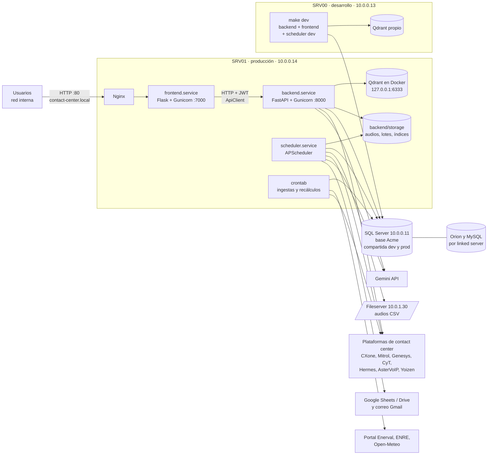
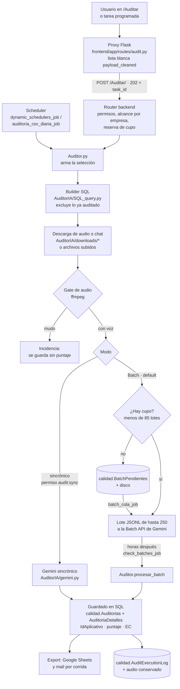

# Arquitectura

Cómo está armado **contact-center-ai**: sus piezas, cómo se hablan, los flujos principales y la superficie de la
API. Dónde corre cada cosa y cómo se opera: OPERACION.md. Tablas: [BASE_DE_DATOS.md](BASE_DE_DATOS.md).
Sistemas externos: INTEGRACIONES.md. Planificador: [PLANIFICADOR.md](PLANIFICADOR.md).
Por qué se decidió cada cosa: [DECISIONES.md](DECISIONES.md). Términos: [GLOSARIO.md](GLOSARIO.md).

## Visión general



| Pieza | Qué hace | Código |
|---|---|---|
| Frontend (Flask, :7000) | Pantallas (Jinja2), sesión del usuario y menú según permisos. **Nunca toca la base**: todo lo pide al backend con `ApiClient` | `frontend/`, `frontend/app/utils/api_client.py` |
| Backend (FastAPI, :8000) | API REST, control de acceso, lógica de negocio e IA. Es el único que habla con SQL Server y con los sistemas externos | `backend/main.py`, `backend/app/`, `backend/AuditorIA/` |
| Scheduler | Proceso aparte con APScheduler: colas, auditorías programadas, lotes de Gemini, alertas. Corre el mismo código que el backend | `backend/run_scheduler.py`, `backend/app/tasks.py` |
| Crons | Ingestas y recálculos del planificador, fuera del scheduler | `scripts/` |
| Qdrant | Base vectorial de los chatbots, **local a cada servidor** | `docker-compose.qdrant.yml` |
| SQL Server | Toda la información del sistema, **compartida por dev y prod** | Esquema solo en la base ([BASE_DE_DATOS.md](BASE_DE_DATOS.md)) |

Por qué la separación frontend/backend: las credenciales y las reglas de negocio quedan en un solo servicio, la
API se prueba aislada y el frontend se puede reemplazar sin tocar la lógica. La regla que se desprende: **un
cambio de endpoint que afecte al frontend actualiza los dos lados en el mismo commit**.

Cómo se reparten los módulos:

| Módulo | Qué hace | Dónde se amplía |
|---|---|---|
| AuditorIA | Audita interacciones (audio o chat) con IA según una plantilla de atributos | [Flujo de una auditoría](#1-auditoría-de-calidad-auditoria) |
| Golden Set y evaluación | Mide cuánto acierta la IA contra la corrección humana | [Golden Set](#golden-set--revisión-humana-y-evaluación-de-plantillas), [ESTADISTICA.md](ESTADISTICA.md) |
| Dashboard de auditorías | Gráficos, tablas y tendencias por operador, equipo y atributo | [Dashboard](#dashboard-de-auditorías-tagsbandeja) |
| Plantillas | ABM de campañas, plantillas y atributos, con asistente de IA | [Plantillas](#plantillas-y-prompts-tagsplantillas) |
| Chatbots RAG | Responden preguntas de los operadores sobre la documentación de cada campaña | [ChatBot RAG](#2-chatbot-rag) |
| Coral | Ayuda en pantalla sobre el manual de la aplicación | [Coral](#5-mero--asistente-del-manual-burbuja-de-ayuda) |
| Planificador | Pronóstico de llamadas y dotación necesaria | [PLANIFICADOR.md](PLANIFICADOR.md) |
| Uso de IA | Consumo, costo y presupuesto de IA | [Uso/gastos de IA](#usogastos-de-ia---uso_iaview-grupo-auditorias--uso_iachatbot-grupo-chatbot) |
| Usuarios y roles | RBAC, login, auditoría de cambios | [Autenticación](#autenticación-y-autorización-rbac) |
| ChatBot SQL | Consultas en lenguaje natural a la base para gerencia. **Discontinuado** | [ChatBot SQL](#3-chatbot-sql-discontinuado) |
| RRHH | Candidatos. **En desuso** | [RRHH](#4-rrhh-en-desuso) |

---

## Autenticación y autorización (RBAC)

```
Login (frontend)
   │  POST /token/   formulario OAuth2: username (documento, entero) y password
   │                 (+ client_ip y client_user_agent, para el log de ingresos)
   ▼
Backend valida la contraseña (bcrypt) ──▶ emite un JWT (python-jose), válido 6 h
   │
   └─▶ Respuesta: { access_token, token_type, permissions[], is_super_admin, campana,
   │                user_display_name, must_change_password, expires_at }
   ▼
Frontend guarda en la sesión de Flask: api_token, permissions, is_super_admin, campana,
user_display_name, must_change_password
   │
   ├─▶ Arma el menú (frontend/app/utils/menu_config.py, filtrado por permisos)
   │
   └─▶ Cada pedido al backend lleva: Authorization: Bearer <token>
          │
          ▼
Backend: dependencia RoleChecker([...]) en cada endpoint protegido
```

Quién puede ingresar: las personas de la nómina (`dbo.nomina`, que carga Reporting) y las de
`pagina_web.Usuarios_extra` (alta manual, ver [BASE_DE_DATOS.md](BASE_DE_DATOS.md#alta-de-un-usuario-que-no-está-en-la-nómina)).
Cada ingreso, salida e intento fallido queda en `pagina_web.LoginAudit`.

- **Permisos** (códigos de texto): `audit:execute`, `audit:review`, `goldenset:manage`, `template:read`,
  `users:create`, `roles:manage`, `chatbot:voltara`, `planificador.view`, …
  El prefijo `chatbot:` habilita por sí solo la pantalla del chatbot RAG (`require_chatbot_user`, salvo
  `chatbot:sql`), así que un permiso de chatbot que **no** sea "usar el bot X" va con punto:
  `chatbot.solicitudes`, `chatbot.adjuntos`.
  Los permisos nuevos **nacen sin asignar** a ningún rol: solo el super admin los tiene hasta que se
  reparten. Así una migración nunca amplía accesos por sorpresa.
- **Roles**: agrupan permisos. `is_super_admin` saltea toda verificación. Un usuario puede tener **varios
  roles** y sus permisos se suman (`pagina_web.UserRoles`).
- **Jerarquía**: `Roles.parent_role_id` define padre e hijo; el **hijo hereda los permisos del padre**. La
  vista `pagina_web.RoleEffectivePermissions` (recursiva) resuelve los permisos efectivos. El backend rechaza
  los ciclos.
- **Gestión delegada**: `roles:manage` abre la pantalla de roles a quien no es super admin. Un delegado solo
  ve y asigna permisos que él mismo tiene, y solo toca roles cuyos permisos efectivos sean un subconjunto de
  los suyos (anti-escalada). Lógica en `backend/app/rbac.py`.
- **Alcance por empresa**: los permisos `template:<empresa>` (mapeados en
  `calidad.Empresas.RequiredPermissionID`) limitan qué empresas ve y audita cada usuario: auditorías
  realizadas, dashboard, ejecución, tareas programadas y plantillas. `templates:manage` (o super admin) da
  todas; una empresa sin `RequiredPermissionID` es pública. Funciones `empresas_permitidas` y
  `exigir_acceso_empresa` en `backend/app/rbac.py`.
  **Las tareas programadas revalidan el alcance de su creador en cada corrida**: si el creador pierde el
  permiso o se da de baja, la tarea se omite (ver OPERACION.md).
- **Baja de empresas**: `calidad.sp_DesactivarEmpresa` / `sp_ReactivarEmpresa` marcan `Empresas.IsActive` y
  arrastran campañas, plantillas, atributos y skills. `calidad.sp_SincronizarPermisosEmpresas` recalcula
  `pagina_web.Permissions.activo`: un `template:<empresa>` queda activo si alguna empresa activa que lo usa
  tiene una campaña activa (`template:hidra` lo comparten HIDRA y HIDRA Comercial). Un permiso inactivo no
  otorga nada, pero sus filas en `RolePermissions` se conservan: reactivar la empresa lo devuelve.
- **Simulación de roles**: `roles:impersonate` habilita "ver como rol". `POST /roles/{id}/impersonate` emite
  un JWT con el claim `imp_role` y el backend trata al portador con los permisos efectivos de ese rol. Queda
  registrado en `RbacAuditLog`.
- **Auditoría de cambios**: todo cambio de roles y asignaciones queda en `pagina_web.RbacAuditLog`.
- **Contraseñas**: el primer ingreso obliga a cambiar la contraseña (`must_change_password`; lo hace cumplir
  el frontend). El blanqueo la vuelve al número de documento (`POST /admin/users/{documento}/reset_password`,
  permiso `users:reset_password`).
- **Dónde está cada cosa**: modelos `Permission` / `Role` / `User` en `backend/app/models.py`; JWT y usuario
  actual en `backend/app/security.py`; `RoleChecker` y `require_chatbot_user` en
  `backend/app/dependencies.py`; reglas de RBAC en `backend/app/rbac.py`.
- **Frontend**: `session['permissions']` y `menu_config.py` deciden qué ve cada usuario. La sesión refresca
  los permisos contra `GET /me` cada 5 minutos (`frontend/app/utils/decorators.py`): un cambio de rol se
  aplica sin volver a ingresar.

---

## Capa de datos

`backend/app/database.py` crea **dos conexiones (engines de SQLAlchemy)** a SQL Server con pyodbc:

| Engine | Variable | Uso |
|---|---|---|
| `engine` | `CONNECTION_STRING` | Todo el sistema |
| `engine_chatbot` | `CONNECTION_STRING_chatbot` | Misma base, otro usuario con permisos sobre el esquema `chatbot`. Lo usaba el chatbot SQL (discontinuado) |

Pool: `pool_size=10`, `max_overflow=20`, `pool_timeout=30`, `pool_recycle=1800` (recicla cada 30 min). No hay
sesiones del ORM: el código abre `engine.connect()` / `engine.begin()` y ejecuta SQL con `text()`. Al arrancar,
las dos conexiones se prueban con `SELECT 1` y si fallan el proceso aborta.

Qué tablas escribe cada módulo, qué cargan otros y cómo se hace una migración:
[BASE_DE_DATOS.md](BASE_DE_DATOS.md). Las ingestas propias (IVR de Enerval, Benefix, ENRE, clima) están en
INTEGRACIONES.md y sus crons en OPERACION.md.

---

## Flujos principales

### 1. Auditoría de calidad (AuditorIA)



Pasos, con el código de cada uno:

1. **Pedido.** La pantalla `/Auditar` manda el formulario al proxy Flask `frontend/app/routes/audit.py`, que
   arma `payload_cleaned` con una **lista blanca** de campos: un parámetro nuevo que no se sume ahí se
   descarta sin error. Las campañas por subida de archivos (CSV = empresa 10, Voltara = empresa 11) tienen rama
   propia en ese proxy. El backend (`POST /Auditar/`, `routers/auditoria.py`) valida permisos y alcance,
   reserva el cupo ([cupos](#cupo-mensual-de-auditorías-por-campaña-2026-08-31)) y
   responde **202** con un `task_id`. El avance se consulta con `GET /Auditar/status/{task_id}`.
2. **Selección.** `Auditor.py` elige los llamados con el builder de la campaña (`AuditorIA/SQL_query.py`),
   que ya excluye lo auditado con esa plantilla (`NOT EXISTS`). La clave que une auditoría, transcripción y
   deduplicación es el **`IdAplicativo`**, que se calcula **solo** en `calcular_id_aplicativo`
   (`AuditorIA/sql_a_Claude.py`); ojo: el `NOT EXISTS` de cada builder lo arma inline y puede divergir.
3. **Descarga.** Según la plataforma de la campaña (ver INTEGRACIONES.md).
4. **Gate de audio.** `AuditorIA/audio_calidad.py` mide cada audio con ffmpeg: lo mudo no se manda a la IA y
   queda guardado como **incidencia** (sin detalles, no promedia). Ver [Incidencias](#incidencias--el-llamado-que-no-se-puede-auditar-2026-08-18).
5. **IA.** El audio se comprime a Opus y viaja **inline** en el pedido. Una misma llamada a Gemini transcribe
   y evalúa según la plantilla (instrucción de sistema + consignas de cada atributo, con un `response_schema`
   que fuerza la estructura de la respuesta). El bloque fijo de la plantilla puede ir por la
   [caché de contexto](#caché-de-contexto-de-las-plantillas-2026-09-01).
   - **Batch** (default): lotes JSONL de hasta 250 llamados; cuesta la mitad y vuelve en horas.
   - **Sincrónico** ("Auditar ahora"): exige `audit:sync`.
6. **Guardado.** `calidad.Auditorias` y `calidad.AuditoriaDetalles`, con el puntaje ponderado y los Errores
   Críticos ([Ponderación](#ponderación-dinámica--errores-críticos-ec)). La persona auditada se congela al
   auditar ([Usuarios reciclados](#usuarios-reciclados--de-quién-es-la-auditoría-2026-08-25)).
7. **Salida.** Planilla de Google (si la tarea la tiene), un mail por corrida a los destinatarios de la
   tarea, una fila en `calidad.AuditExecutionLog` y el audio conservado para escucharlo después.

Tareas programadas: `calidad.AuditSchedulers`, que ejecuta `dynamic_schedulers_job` cada 5 minutos
(OPERACION.md).

#### Cómo viaja un lote y qué pasa cuando no hay cupo (2026-08-26)
La Batch API admite **100 jobs en estado no terminal** en toda la cuenta, cupo que
comparten las auditorías y la cola de transcripciones. Dos cambios sostienen ese techo:

- **El lote va como archivo, no como request inline.** `batch_cola.escribir_jsonl` serializa
  el lote a un JSONL (el audio sigue viajando inline, ahora en base64 adentro del archivo:
  los modelos 3.x rechazan con 403 cualquier `file_uri`) y `batches.create` lo recibe con
  `src=<archivo>`. El request inline topeaba en 20 MB → ~16 llamados por job, o sea ~125 jobs
  para una corrida de 2000 audios; un archivo de entrada llega a 2 GB, así que el corte pasó
  a ser por cantidad (`BATCH_MAX_LLAMADOS_POR_LOTE`, 250) y esos 2000 audios entran en 8 jobs.
  Como el lote se manda por archivo, **el resultado también vuelve por archivo**
  (`dest.file_name` en vez de `dest.inlined_responses`): lo normaliza `batch_cola.leer_respuestas`,
  que atiende las dos formas y ata cada respuesta a su `segment_id` por la `key` de la línea
  (la API no garantiza el orden).
- **Sin cupo, el lote espera en vez de perderse.** Antes, al tocar el techo, `batches.create`
  rebotaba, el lote se descartaba con un `print` y sus audios no se auditaban nunca: no quedaba
  fila en `AuditExecutionLog` (se abre después de crear el job), la tarea igual mostraba
  "en cola" y en el camino CSV la carpeta del fileserver se borraba lo mismo. Ahora el lote
  queda en `calidad.BatchPendientes` con su JSONL en disco y el tick `batch_cola_job` lo manda
  apenas hay lugar (`PENDIENTE → ENVIANDO → ENVIADO`, claim atómico FIFO, 5 intentos).
  `process_batch` devuelve `"pendiente:<LoteID>"` para un lote encolado y `None` **solo** si los
  audios se quedaron sin destino — de esa distinción depende que la carpeta CSV se borre o se
  conserve para reintentar.

Config: `BATCH_CUPO_MAX` (85, no 100: el conteo se cachea ~1 min y las transcripciones crean
jobs contra el mismo techo), `BATCH_MAX_LLAMADOS_POR_LOTE`, `BATCH_MAX_BYTES_POR_LOTE`,
`BATCH_COLA_MAX_POR_TICK`, `BATCH_PENDIENTES_DIR`. Migración:
`scripts/migrations/2026-08-26_batch_pendientes.sql`. Tests: `test_batch_cola.py`,
`test_batch_cola_sql.py`.

#### Cuando un lote vuelve con errores o la corrida no llega a Gemini
Gemini puede cerrar un lote en `SUCCEEDED` con **cada respuesta en error** (pasó el 15/09/2026:
`[7] The caller does not have permission` en los que usaban caché de contexto, `[13] Internal error` en los
demás). El sistema lo maneja así:

- **Un lote parcial cierra `PARCIAL`, no `EXITO`**: las interacciones que volvieron sin respuesta van a
  `filas_error` y al `error_message` de la corrida en `AuditExecutionLog`.
- **Un lote sin nada que guardar se reintenta** en cada pasada de `check_batches_job` y se abandona a los 5
  intentos (`Auditor.MAX_INTENTOS_PROCESO`). Mientras no se procesa, su `calidad.Batch_data` no se borra.
- **Una tarea programada Batch que no encola nada es un error** (por ejemplo, porque falló el login de la
  plataforma): entra al circuito de reintentos del scheduler y a los 3 fallos se desactiva y avisa.
- **Recuperación** con `scripts/recuperar_batches_fallidos.py`: rearma el pedido desde `calidad.Batch_data`
  con el audio original o el conservado (que se guarda al **enviar** el lote), sin repetir lo ya auditado.
  Paso a paso en OPERACION.md.

Tests: `test_batch_motivo_error.py`, `test_scheduler_batch_fallido.py`, `test_cxone_login.py`,
`test_cardnet_callinfo.py`.

#### Caché de contexto de las plantillas (2026-09-01)
De todo lo que viaja en una auditoría hay una parte **idéntica en los miles de llamados de una plantilla**: la
instrucción de sistema y el texto de la plantilla (los atributos con su consigna y las instrucciones fijas).
Medido sobre las plantillas reales, ese bloque va de 1.200 a 9.400 tokens y era casi la mitad de todo lo que
se mandaba a la IA en auditorías.

`AuditorIA/cache_plantillas.py` sube ese bloque **una vez** a Gemini (`CachedContent`) y cada pedido lo
referencia por nombre; `texto_del_turno` manda solo los datos de la interacción (por eso la consigna de
transcripción va en el turno y no en la instrucción de sistema). Gemini cobra lo cacheado unas 10 veces más
barato, pero cobra también el almacenamiento por hora. Reglas:

- **La caché se identifica por su contenido** (hash de instrucción + texto + modelo), no por plantilla: si
  alguien edita la plantilla, la corrida siguiente crea una caché nueva y la vieja vence sola.
- **Se reusa entre corridas y cada uso le corre el vencimiento.** Crear una caché nueva exige un mínimo de
  llamados en la corrida (`minimo_llamados()`, 40 con el TTL de 24 h) porque solo conviene si recibe más de
  ~1,7 auditorías por hora de vida; reusar una viva no tiene mínimo.
- **Un lote que se va a la cola de espera no referencia ninguna caché**: puede salir horas después y un
  pedido que apunta a una caché vencida falla y se pierde. El TTL de 24 h cubre el plazo de los lotes que sí
  salen.
- **Nada de esto puede romper una auditoría**: si la caché falla, la corrida sale con el bloque inline.

Costeo: `prompt_token_count` de Gemini **incluye** los tokens cacheados, así que el costo se calcula como
`(input − cacheados) × precio_input + cacheados × precio_cacheado + salida × precio_salida`. Esa fórmula está
dos veces y hay que mantenerlas iguales: en la vista `pagina_web.vw_IA_Uso_Costos` (pantallas de uso de IA) y
en `execution_log.calcular_costo_usd` (mail por corrida, listado de corridas y cupos).

La pantalla de Auditar avisa, al elegir la plantilla, si la cantidad pedida alcanza para crear la caché y
cuánto ahorra (`GET /Auditoria/plantillas/{id}/cache-contexto`, `cache_plantillas.estimar_ahorro`, que estima
los tokens por caracteres sin llamar a Gemini).

Config: `GEMINI_CACHE_PLANTILLAS`, `GEMINI_CACHE_TTL_HORAS`, `GEMINI_CACHE_MIN_LLAMADOS`,
`GEMINI_CACHE_MIN_TOKENS`. Tests: `test_cache_plantillas.py`, `test_costo_tokens_cacheados.py`.

#### Batch por defecto y modo sincrónico con permiso (`audit:sync`, 2026-08-14)
El batch de Gemini cuesta **la mitad** que el sincrónico y deja los resultados en "Auditorías Realizadas" con
aviso por correo; el sincrónico solo agrega ver el resultado en el momento.

- **`/Auditar`**: "Enviar a la Cola (Batch)" es el botón principal y el default; el sincrónico es una acción
  secundaria, **visible solo con `audit:sync`**, y pide confirmación a partir de 5 interacciones.
- **Tareas programadas**: "Ejecutar en modo Batch" viene tildado; guardar una programación sincrónica también
  exige `audit:sync` (`_exigir_modo_scheduler`).
- Backend: `rbac.exigir_modo_sincronico` (403). El proxy Flask corta antes para no subir audios de más, pero
  la autoridad es el backend.
- `audit:sync` es **adicional a `audit:execute`** y nace sin asignar. Tests: `test_audit_modo_sincronico.py`.

#### Formulario de `/Auditar`
- El selector de empresas sale entero de `GET /Auditoria/empresas` (`Plantillas_prompts.empresas_disponibles`,
  que filtra por `template:<empresa>`): el frontend no agrega opciones propias.
- El período (`Fecha_desde`, `Fecha_hasta`) es obligatorio. La duración se elige en segundos, con opción
  "sin tope".
- Los operadores se eligen en un modal con buscador y filtro por supervisor (resuelto con
  `calidad.fn_ResolverOperadorAuditoria` y la tabla `equipos`).
- **Conteos en vivo** (`POST /Auditoria/filtros-resumen/{campana_id}`, `backend/app/utils/filtros_resumen.py`):
  con cada cambio de filtro, el backend cuenta en la base cuántos audios hay disponibles, por sentido y por
  tipificación. Tiene rama propia para Mitrol, Orion (Vantix), Hermes, Wize (Vitalis Salud), AsterVoIP, CXone y
  Genesys; una plataforma desconocida cae a la consulta de Mitrol. Bloquea el envío si hay 0 audios.
  Tests: `backend/tests/test_filtros_resumen.py`.

#### Cupo mensual de auditorías por campaña (2026-08-31)
Permisos: `audit:cuotas` (ver y editar cupos) y `audit:cuota_exento` (fuera del sistema de cupos).

Con "Auditar", "Auditorías Realizadas" y el Dashboard abiertos a **todos los supervisores**,
auditar sin tope es un cheque en blanco: cada llamado se paga en Gemini. El cupo pone un techo
por campaña que el **gerente de operaciones** sube o baja, y lo traduce a plata.

- **Modelo** (`backend/app/cuotas.py`, migración `scripts/migrations/2026-08-31_cuotas_auditoria.sql`):
  `calidad.CuotaCampana` (bolsa mensual compartida por campaña + sublímite opcional por usuario)
  y `calidad.CuotaConsumo` (1 fila = 1 pedido, con lo `Reservado` al enviarse y lo `Consumido` al
  cerrar). Período = **mes calendario en hora Argentina** (con UTC el cupo se renovaría a las
  21:00 del último día).
- **Qué cuenta 1**: un llamado auditado y un llamado enviado a transcribir a demanda.
- **Reserva y ajuste**: `POST /Auditar/` descuenta lo pedido (un batch tarda horas en cerrar su
  fila de log: sin reserva se pueden lanzar diez lotes de 100 antes de que cuente el primero) y el
  barrido `cuotas.conciliar()` —scheduler cada 15 min, y también al abrir la pantalla— lo ajusta a
  `AuditExecutionLog.filas_auditadas` cuando cerraron **todos** los lotes del `task_id`. Con
  muestreo por operador/tipificación se reserva el tope duro de 200 (`cantidad` es por grupo y el
  total real recién se sabe con el df descargado). Las tandas CSV/Voltara reservan por
  `upload_group_id`, no por `task_id`: comparten una sola fila de log.
- **Al excederse**: 403 con el saldo en el mensaje. No se recorta al saldo (cuánto auditar de
  menos lo decide el usuario). La pantalla de auditar muestra el saldo antes de mandar
  (`GET /cuotas/mi-saldo`).
- **A quién alcanza**: a todos salvo super admin y `audit:cuota_exento` (Calidad). El alcanzado
  por un cupo activo audita **solo en Batch** y no puede usar `omitir_limite`; tampoco puede
  programar en el Scheduler sobre una campaña con cupo (`_exigir_cupo_scheduler`), porque las
  corridas programadas no pasan por `POST /Auditar/` y serían la puerta de atrás.
- **Sin cupo cargado = sin tope, pero se mide**: al desplegar no cambia nada para nadie, y el
  gerente elige el primer número mirando el consumo real.
- **Pantalla** `/cuotas` (🔒 `audit:cuotas`, `GET /cuotas/`): cupo, consumido, **costo promedio por
  auditoría** de la campaña (últimos 90 días, misma fórmula que `/uso-ia`) y **gasto máximo** =
  cupo x costo unitario. Editar queda registrado en `pagina_web.RbacAuditLog`.
- Los dos permisos nacen **sin asignar**. Antes de cargar el primer cupo hay que darle
  `audit:cuota_exento` a los roles de Calidad. Tests: `backend/tests/test_cuotas_auditoria.py`,
  `backend/tests/test_cuotas_migracion_sql.py`.

**Auditoría de chats (Mitrol: Odonto Plus / Facebook / WhatsApp).** Cuando la
interacción tiene `Chat = 1` no hay audio: en lugar del WAV se adjunta un JSON
(`AuditorIA/downloads/Mitrol.py` → `Chat_historico`) con **todos los chats del mismo
cliente de los últimos 14 días**, contados desde el día del chat auditado hasta el
final de ese día. Ese contexto es parte del criterio de evaluación (si el paciente ya
tuvo contacto no corresponde la bienvenida institucional). El JSON trae la ficha de
la gestión auditada (operador, LoginId, tipificación, cliente), las gestiones de cada
conversación —una conversación se parte en segmentos y **cada segmento tiene su
operador y su tipificación**— y la transcripción con cada mensaje marcado como
`OPERADOR`, `CLIENTE` o `BOT_IVR`, más `es_operador_auditado` en los del operador bajo
auditoría. El rol sale del encabezado de cada segmento del HTML de Mitrol, que
alterna de lado; cuando ese encabezado nombra a un operador distinto del que atendió
según la base, Mitrol manda todas las burbujas al mismo lado y el emisor queda como
`INDETERMINADO` en vez de atribuirse mal.

Como los chats no se transcriben (ya son texto), antes no había forma de leerlos desde
la plataforma. Ahora, en el mismo punto donde se conserva el audio de un llamado, la
conversación se guarda en `calidad.transcripciones` con el formato `segments` de una
transcripción (`Trancribir.py` → `guardar_chats_como_transcripcion`), sin consumir
tokens: el botón de detalle de "Auditorías Realizadas" y su modal la muestran igual que
la transcripción de un llamado, con una burbuja por mensaje y el rol de cada hablante.
El prompt de la plantilla CALIDAD CHAT explica el formato del JSON adjunto — ver
`scripts/migrations/2026-08-07_prompt_calidad_chat_formato.sql`.

#### Transcribir después de auditar (cola a demanda)

La transcripción se obtiene **en el mismo llamado** que la auditoría de calidad (una sola
lectura del audio, ver `gemini.py::process_batch`). Si la corrida no la pidió, ese llamado
quedaba sin transcripción para siempre: la única forma de conseguirla era re-auditar y pagar
la auditoría entera de nuevo.

Como el audio auditado se conserva en disco (`AuditorIA/audio_store.py`), ahora se puede pedir
**solo la transcripción**, después:

```
"Auditorías Realizadas"            calidad.TranscripcionJobs
  🎤 1 llamado (reproductor)  ──▶  Motor FLEX  ──▶ despacho INMEDIATO (background task
        │                                          de la API): generate_content con
        │                                          service_tier=flex, respuesta en minutos
        │                                              │
        │ POST /Auditoria/                             ▼  calidad.transcripciones (+ IA_Uso)
        │      transcripciones/encolar             el modal la muestra sola (polling
        │                                          a /transcripciones/estado)
        ▼
  🎤 N filas tildadas         ──▶  Motor BATCH ──▶ tick del scheduler (cada 5 min):
                                                   job de Gemini con el audio inline;
                                                   el resultado se recoge horas después

     flex:  PENDIENTE -> ENVIANDO -> LISTO            (o -> PENDIENTE como batch, si Flex
     batch: PENDIENTE -> ENVIANDO -> ENVIADO -> LISTO  no tuvo capacidad)
```

- La request solo **encola** y responde al instante. **Qué motor le toca lo decide el tamaño
  del pedido** (`transcripcion_cola.elegir_motor`, tope `TRANSCRIPCION_FLEX_MAX_PEDIDO`): el
  criterio no es la plata —Flex y Batch cuestan **lo mismo**, 50% del precio estándar— sino
  quién está esperando. Un llamado suelto sale del reproductor con el auditor mirando la
  pantalla; una tanda de 200 no la mira nadie.
- **Flex** (`service_tier=flex`) es sincrónico y best-effort: Google apunta a 1-15 min y **no**
  garantiza latencia; si no hay capacidad devuelve 429/503 y no sube solo a estándar. Por eso
  el despacho reintenta con backoff y, si no cede, **degrada el pedido a batch** (mismo precio,
  más tarde) en vez de fallarle al auditor. Timeout del llamado: 15 min (la doc recomienda
  ≥10, porque el pedido puede quedar encolado del lado de Google).
- El modal **espera solo**: mientras el pedido está en curso muestra "Transcribiendo…", pregunta
  el estado cada 5s (después cada 20s) y pinta la transcripción apenas está, sin que el auditor
  tenga que volver a buscar. Al cerrar el modal, el polling se corta.
- No se encola lo que ya tiene transcripción, lo que ya está en cola ni lo que no tiene audio
  conservado (índice único filtrado por `Entorno + IdAplicativo` sobre los estados abiertos).
- El `SegmentID` ata cada respuesta del lote a su interacción; los tiempos que estima el modelo
  se corrigen contra la duración real que midió el store al conservar el audio.
- **Costo**: el consumo se registra con `modo='flex'` y `pagina_web.vw_IA_Uso_Costos` le aplica
  el -50% igual que a batch (migración `2026-08-25_uso_ia_modo_flex.sql`). La fórmula gemela del
  lado Python es `execution_log.MODOS_MITAD_DE_PRECIO`: si se toca una, hay que tocar la otra.
- **Motor pluggable** (`settings.TRANSCRIPCION_MOTOR`): hoy la base es `gemini_batch` (y de ahí
  el ruteo flex/batch por tamaño). Cuando el servidor tenga GPU pasa a `fastwhisper`
  —transcripción local, sincrónica y sin costo por token— y ni la cola, ni la tabla, ni la
  pantalla cambian: el punto de extensión es `transcripcion_cola._despachar_fastwhisper`.
- Migraciones: `scripts/migrations/2026-08-14c_transcripcion_jobs.sql` (la cola) y
  `2026-08-25_uso_ia_modo_flex.sql` (costeo del modo flex).

### 2. ChatBot RAG

Consultas documentales por chatbot usando **LlamaIndex + Qdrant** (servidor, ver
`docker-compose.qdrant.yml`). Los chatbots viven en la BD (`pagina_web.Chatbots` +
`ChatbotDocMarkdown` + `ChatbotPcrc`): nombre, system prompt, documentos del conocimiento
en markdown (editables desde el panel con el asistente de documentación; un documento puede
prestarse a otro bot vía `ChatbotDocVinculo`) y permiso RBAC propio (`chatbot:<slug>`; los del grupo CSV comparten `chatbot:csv` y el bot
concreto de un operador se resuelve por su PCRC vigente). El equipo de calidad los
administra desde el panel `Administración > Chatbots` (permiso `chatbot:admin`), que crea
el permiso automáticamente al crear un bot. Respuestas en streaming
(`POST /consultar/stream/`), con historial y calificación; el selector del frontend usa
`GET /chatbots/disponibles`.

El reindexado es una cola en BD (`pagina_web.ChatbotIndexJobs`) que el scheduler procesa cada 60 s. **Se
dispara a demanda** (panel o CLI): el refresco nocturno de todos los bots se desactivó el 13/07/2026. Materializa el markdown a disco, construye
la colección `bot_{slug}_v{N}` en Qdrant y publica con un swap atómico de alias — los
workers recargan el bot en caliente (por `index_version`, TTL 60s) **sin reiniciar el
backend**. CLI equivalente: `python reindex_all.py [slug|all]`.

**Cómo se parte el markdown en nodos** (`chatbot_indexer._nodos_desde_documentos`, 2026-09-14).
Una sección por encabezado (`MarkdownNodeParser`) y, si no entra en 512 tokens, pedazos con
solape (`SentenceSplitter`). Encima de eso, dos reglas que salieron de un reclamo de Calidad de
Isla de Productos ("me trae la mitad de las preguntas"):

- **Cada pedazo arranca con el encabezado de su sección.** El splitter solo se lo deja al primero y
  `header_path` trae los ancestros, no el título propio, así que del segundo pedazo en adelante el
  texto no decía de qué tema era. La sección de IP para la Flag 003 (4.500 caracteres) quedaba en 6
  pedazos, y el que tenía las 3 preguntas le llegó al bot 1 vez en 13 consultas. Mientras se parte,
  el encabezado viaja en la metadata para que el splitter lo descuente del tamaño. Se repite exacto,
  sin "continuación", para que la desambiguación siga viendo un solo tema.
- **Los nodos de solo encabezado no se indexan** (`# Manual` seguido de `## Capítulo`): no informan
  nada (el título viaja en el `header_path` de los hijos) y ocupaban lugares entre los 12 candidatos.

Con esas dos reglas, la sección que antes llegaba partida al modelo llega entera (medido sobre consultas reales
de Isla de Productos y el set dorado de Voltara, sin empeorar el resto).

Solo afecta a los índices que se construyan después: **hay que reindexar** para que tome efecto.

**Los encabezados con sangría NO se normalizan, a propósito.** Para el parser `" ### Título"` no es
encabezado y queda como texto de la sección anterior (el doc 67 de Isla de Productos tiene 314 así).
Reconocerlos sin más empeora: ese documento pasa a 400 nodos de mediana 154 caracteres, el contexto
que recibe el LLM cae de ~9.500 a ~3.000 caracteres y el score top-1 de las 67 consultas baja de
3,36 a 2,44. Para reconocerlos hay que agrupar además las secciones chicas.

**El reindexado es a demanda, no automático** (2026-08-20). Guardar documentos deja el bot
marcado con *cambios sin indexar* (se calcula comparando el `updated_at` de los documentos
contra el `last_indexed_at` del entorno: no hay columna nueva) y el reindexado se dispara a
mano cuando la carga terminó. Antes cada guardado encolaba uno y una sola sesión de carga de material
disparaba varias reconstrucciones completas del índice.

**Bandeja de material pendiente** (`pagina_web.ChatbotDocMaterial`, migración
`2026-08-20_chatbot_doc_material.sql`). El panel pasó a tener **tres pasos con tres botones**, y
solo el del medio le paga a Gemini:

1. **Sumar material** — pegar/subir contenido crudo. Se guarda tal cual llega (con una `nota`
   opcional de quien lo carga y, si se cargó desde la fila de un documento, el `doc_id_destino`
   al que apuntaba). **No llama a la IA: es un INSERT.**
2. **Procesar con IA** — una única corrida sobre TODO el material pendiente, con confirmación
   explícita que dice cuántos ítems entran y con qué criterio (integrar en la documentación
   existente / crear documentos nuevos). Devuelve la propuesta a revisar.
3. **Reindexar** — publica los cambios al chatbot.

Importa porque cada corrida del asistente **regenera el markdown completo** de los documentos
que toca (ver `AuditorIA/asistente_docs.py`): cargar de a un archivo multiplicaba esa
regeneración por la cantidad de archivos. La nota y el destino viajan al prompt como
**indicación**, no como imposición — forzar `doc_ids` por ítem partiría la corrida en una
llamada por documento, que es exactamente lo que se vino a evitar. Los ids que entran en una
corrida se **congelan** al encolar el job y el material se borra recién cuando el usuario
**acepta** la propuesta (misma transacción que el guardado): un job fallido o una propuesta
descartada no se lleva puesto el material que alguien cargó a mano. El progreso del trabajo se
muestra en la card (no en un modal), así se puede seguir cargando material o cerrar la página
mientras la IA trabaja.

**Un trabajo por bot, cancelable y sin tope de espera en la pantalla** (2026-09-14). La cola del
asistente es de a uno para todo el sistema, así que un trabajo largo frena a todos. Un manual de
202 páginas tardó 72 minutos; la pantalla dejaba de consultar a los 15 y perdía la propuesta, así
que se volvió a lanzar dos veces y cada copia sumó horas de espera y el mismo gasto.

- **Uno por bot:** encolar con otro trabajo abierto del mismo bot responde **409** con su
  `job_id`, y el panel se engancha a ese. Es por bot y no por id de material porque volver a
  subir el mismo archivo le da otro id.
- **Cancelar** (`POST /docs/jobs/{id}/cancelar`): el trabajo queda `failed` con un motivo de
  cancelación. No hay migración: el CHECK de `status` solo admite los cuatro estados de siempre.
  Si ya estaba corriendo, el scheduler lo corta antes de su próxima llamada a Gemini
  (`asistente_docs.cancelable`, consultado en `_generar_json`), y los UPDATE de cierre exigen
  `status='running'` para no pisar la cancelación.
- **En cola**, el estado trae cuántos trabajos van adelante y cuánto lleva el que está corriendo.
- **La pantalla no corta por tiempo:** espera mientras el servidor diga que el trabajo sigue vivo.
- **Al abrir un bot**, `GET /{id}/docs/jobs/actual` le devuelve su trabajo abierto (para retomarlo
  desde otra pestaña u otro usuario) o su última propuesta terminada cuyo material sigue entero en
  la bandeja, que es la señal de que nadie la guardó.

**Imágenes de apoyo: el material las trae, no hay que subirlas aparte**
(`pagina_web.ChatbotImagenes`, `app/chatbot_imagenes.py`). El system prompt y el frontend ya
sabían mostrar ``, pero la URL había que conseguirla en un gestor externo y pegarla
a mano, así que no se usaba. Ahora las capturas de un `.docx` / `.pptx` / `.xlsx` / PDF se
extraen al procesar el material, se guardan **en SQL Server** (misma base en SRV00 y SRV01: lo
que se sube en dev ya está en prod, sin sincronizar carpetas) y a la IA le llega la **lista de
URLs** para que las inserte en el paso que corresponde. Se normalizan con Pillow (rotación EXIF
y reescalado a 1600 px de lado mayor) y se deduplican por SHA-256, así el logo que está en las
30 diapositivas se guarda una sola vez. Se descarta lo que no es contenido: menos de 3 KB o de
80x80 px son viñetas e íconos. Y cada imagen viaja con **dónde estaba** (*diapositiva 4*,
*pág. 7*): sin esa referencia el modelo recibe una lista de `image7.png` y no tiene con qué
decidir en qué procedimiento va cada una.

**Gemini no lee los Office: el material se convierte a texto acá**
(`AuditorIA/office_a_texto.py`, 2026-09-03). Mandar los bytes de un `.docx`/`.pptx`/`.xlsx`
inline **no da error**, que es justamente el problema. Medido contra `gemini-3.8-flash`: con un
PDF transcribe todo; con un `.pptx` o un `.docx` responde que *"no se visualiza ningún archivo
adjunto"* y aun así devuelve parte del texto —las **notas del orador se pierden siempre**— y
con un `.xlsx` de dos columnas **inventó** un plano de edificio con salas y baños. Es decir: la
documentación salía incompleta o directamente falsa, sin ningún error que lo delatara. Tampoco
se le puede delegar la conversión a la File API, que responde 403 con los modelos 3.x. Los
formatos modernos de Office son ZIPs de XML, así que la conversión se hace con la librería
estándar (sin dependencias nuevas para el deploy) y produce markdown: títulos y viñetas de
Word, una sección por diapositiva **con sus notas** en PowerPoint, y una tabla por hoja en
Excel. Como efecto secundario se sabe el largo exacto del material, que es lo que decide si va
en una pasada o repartido en varios documentos, en vez de estimarlo por el tamaño del ZIP. El
Office **viejo** (`.doc`/`.ppt`/`.xls`, binario) no lo lee nadie: se rechaza **al subirlo**,
con el usuario en la pantalla, pidiendo que lo guarde como `.docx`/`.pptx`/`.xlsx` o PDF —
antes entraba igual y el trabajo fallaba (o peor, no fallaba) minutos después.

**El 429 de los embeddings no es un reindexado fallido** (2026-09-03). Reindexar un
bot son miles de llamadas de embeddings, y cuando Gemini contestaba
`429 RESOURCE_EXHAUSTED` el job entero moría y quedaba en rojo en *Últimos reindexados*
—mandando a Calidad a buscar un problema en la documentación que no existía—. Se
arregló en tres capas, de la causa al síntoma:

- **Diez veces menos llamadas.** El batch de embeddings estaba en 10 (el default de la
  librería) porque el `Settings.embed_batch_size = 2` que había en `rag_settings` no
  configuraba nada: `Settings` no tiene ese atributo, así que quedaba una propiedad
  suelta. Ahora va en el constructor y en 100, que es el **tope de la API** (con 250
  contesta 400: *"at most 100 requests can be in one batch"*). Un bot de 800 nodos pasó
  de 80 requests en ráfaga a 8.
- **Reintentos con paciencia de minutos.** La librería reintenta los 429/503 sola, pero
  con 3 intentos y ~6 segundos en total, que no cubre una ventana de cuota por minuto.
  Se sube a 8 intentos con backoff de hasta 2 minutos (`EMBED_*` en config): del otro
  lado hay un job de fondo, no una persona esperando.
- **Y si igual no hay cupo, el job vuelve a la cola.** No se marca `failed`: pasa a
  `pending` con la nota de en qué intento va (`INDEX_REINTENTOS_SIN_CUPO`) y el tick
  siguiente lo retoma —el tick además **corta**, porque seguir drenando la cola sería
  tomar el mismo job al instante y quemar los intentos en el mismo minuto—. El índice
  viejo sigue sirviendo todo ese tiempo. Recién agotados los intentos queda fallido, que
  es cuando sí hay que enterarse.

**Pantalla del operador:** las respuestas con capturas ensanchan la burbuja y cada imagen se abre en un visor
con zoom. La lista de etiquetas permitidas de DOMPurify (`static/js/app.js`) incluye las tablas: sin eso, una
tabla del manual le llega al operador como un renglón corrido.

**Adjuntos (capturas y PDF):** una consulta puede llevar hasta 3 archivos (PNG/JPG/WEBP/PDF)
que el modelo mira al responder — el operador manda la captura del error en vez de tener que
describirlo. La validación vive en `app/chatbot_adjuntos.py` y mira el **contenido** (magic
bytes), no el content-type declarado; ahí también se corrige la rotación EXIF y se reescala
lo que supera `CHATBOT_ADJUNTOS_MAX_LADO_PX`. Como `astream_chat()` solo acepta texto, el
turno con adjunto arma a mano los mismos mensajes que el motor de LlamaIndex
(`_condensar_pregunta` → `_recuperar_nodos` → `_armar_mensajes` en `chatBot.py`) y la
generación va con bloques (`ImageBlock`/`DocumentBlock`). La **recuperación sigue siendo por
texto** (Qdrant y BM25 solo indexan texto): se busca con lo que escribió el operador y el
adjunto se usa al momento de responder. Dos reglas fijas: el caché semántico se saltea
siempre (su clave es el embedding del texto, así que serviría la respuesta calculada sobre el
documento de otro cliente) y el contenido del archivo se le presenta al modelo como dato y
nunca como instrucción (`PREAMBULO_ADJUNTOS`, contra prompt-injection en documentos de
terceros). Los archivos **no se persisten**: viven lo que dura la consulta y en el log queda
la marca `[Adjuntos: ...]`.

**Habilitación (dos condiciones, las dos en la BD):** el permiso `chatbot.adjuntos` dice
QUIÉN puede adjuntar (por rol) y `Chatbots.permite_adjuntos` dice A QUÉ BOT. El endpoint
valida los adjuntos **después** de resolver el bot efectivo — antes no habría contra qué
chequear el flag — y devuelve 403 (sin permiso) o 400 (bot que no acepta archivos). El
permiso usa punto y no dos puntos a propósito: `require_chatbot_user` toma cualquier
`chatbot:*` como "puede usar un bot", así que `chatbot:adjuntos` habría abierto la pantalla
del chatbot a quien solo debía poder adjuntar.

Un turno con adjunto además **no se marca como vacío de conocimiento por score bajo**
(`evaluar_cobertura(..., con_adjuntos=True)`): recupera mal por diseño —el error de pantalla
que el operador está mirando no está en ningún manual— y el bot responde igual leyendo la
imagen, así que la deducción "score pésimo ⇒ no lo sacó de la documentación" deja de valer.
La rama por texto sigue activa: si el bot dice "no encontré", el hueco existe igual.

**Las cuatro reglas que comparten todos los system prompt** (`pagina_web.Chatbots.system_prompt`;
migraciones `2026-07-30b`, `2026-07-31`, `2026-07-31c` para Voltara, `2026-09-02c` para el resto
y `2026-09-04c` la cuarta). Cada campaña escribe su prompt, pero estas cuatro salieron de medir el
tráfico real y
están en todos:

1. **Anclaje al corpus.** Ningún procedimiento, requisito, canal, teléfono, plazo ni monto
   puede salir de otro lado que no sea la documentación —el operador se lo transmite al
   cliente como oficial—, y se permite explícitamente lo que sí es seguro: el significado de
   un término general del rubro y una cuenta matemática. Sin esto el bot improvisa pasos de
   gestión; y como la pantalla de vacíos se alimenta de la frase de "no encontré", un bot que
   improvisa además deja a Calidad sin saber qué falta documentar.
2. **Perspectiva del canal.** La respuesta se ordena por lo que hace el operador que
   pregunta (telefónico: qué pregunta, qué carga, qué dice; digital: qué verifica, qué pide,
   qué responde por escrito) y lo que se resuelve por otro canal baja al final como
   derivación en una línea. El contenido no se separa por canal —solo el 25% de las secciones
   es específico de uno—, se reordena.
3. **"No encontré" EXCLUYENTE.** O se responde con lo que hay —aunque sea parcial, aclarando
   qué parte no figura— o se dice la frase **sola**, nunca las dos cosas; más la regla de que
   una consulta de dos palabras o con typos no habilita la frase. La versión anterior
   ("Basa tu respuesta 100% en el contexto; si no está, indicá <frase>") producía negaciones
   sobre consultas que recuperaban perfecto: al 2026-09-02, el 32% de los "no encontré" de
   benefix y el 57% de los de csv_isla_de_productos eran casos con score de reranker ≥ 3,0 (el
   mismo umbral con el que el sistema decide que el tema SÍ existe). El daño es doble: el
   operador descarta una respuesta correcta, y la pantalla de vacíos se llena de falsos
   positivos.

4. **Un título del contexto es una consulta válida** (migración `2026-09-04c`). Cuando lo
   consultado coincide con el título de una sección recuperada, esa sección ES la respuesta. Es el
   caso extremo de la regla 3, y hubo que escribirlo aparte porque el modelo no lo resolvía solo:
   en los vacíos clasificados como *generación* hay consultas como `Aclaraciones Técnicas para la
   Categorización de SVP` que llegaron con esa sección PRIMERA en el contexto (score 3,85) y aun
   así terminaron en la frase de negación. Y no es una consulta rara: es la que genera el propio
   asistente cuando el operador elige un tema de la lista de desambiguación.

**Desambiguación — ofrecer temas en vez de "no encontré"** (`app/chatbot_desambiguacion.py`).
El operador tiene al cliente en línea y escribe corto ("poda", "medidor"): eso no recupera
un fragmento que responda, recupera varios pedazos parecidos de secciones distintas, y el bot
contestaba "no encontré información" aunque el manual tuviera los tres temas. Cuando el bot
está en `CHATBOT_DESAMBIGUACION_SLUGS` (desde 2026-09-02, todos los bots telefónicos), antes de
generar se miran los nodos ya
rerankeados y, si corresponde, se responde con la **lista de temas** para que el operador elija
— el frontend los muestra como botones y un clic manda la nueva consulta. La lista sale de los
encabezados del markdown indexado (`header_path` del `MarkdownNodeParser` + el título propio del
fragmento), así que es determinística, **no llama al LLM** (el turno cuesta 0 tokens) y lo que se
ofrece existe de verdad.

**La etiqueta es el título de la sección, no la ruta entera** (corregido 2026-09-02 con el tráfico
real de agosto). La primera versión mostraba `sección padre › título` y recortaba a 80 caracteres:
**26 de las 48 opciones distintas que los operadores eligieron llegaron cortadas a mitad de
palabra** (`"Reclamos de Red, Trabajos de Vereda e Instalaciones › ¿Cuándo no vamos a generar"`), y
como la etiqueta es *también* la consulta que se manda al elegirla, el recorte se pagaba dos veces:
se leía mal y buscaba peor. El prefijo aportaba ~45 caracteres para no decir nada que el título no
dijera ya. Ahora se muestra el título solo, y la sección padre se agrega **únicamente** cuando el
título mide menos de `LARGO_MIN_SIN_CONTEXTO` (25) caracteres y no se explica solo —"Carga en
Sistema", "Definición y Medios"—, que en el corpus de Voltara son 32 de 226. El H1 del documento
("Guía de Procedimientos VOLTARA") no cuenta como sección padre: es el mismo para todas las
opciones del archivo, así que no distingue nada y solo le suma 30 caracteres a la etiqueta — y a
la consulta que se manda al elegirla. El tope
(`LARGO_MAX_ETIQUETA`, 120) quedó como red de contención: ningún encabezado del corpus llega, y si
alguna vez cortara lo hace en un espacio y marca con `…`, que el frontend saca antes de buscar. Ese bot pasa a usar el camino manual —el mismo que ya usaban los
adjuntos— porque hay que ver lo recuperado *antes* de generar; el resto de los bots sigue por
`CondensePlusContextChatEngine` sin cambios.

**Cómo convive con los vacíos de conocimiento** (es la parte delicada: cada consulta respondida
con opciones es una consulta que Calidad NO ve como hueco). El gate solo dispara dentro de una
banda de score acotada por los umbrales que la detección de vacíos ya tiene calibrados:

| score máximo del reranker | qué pasa |
|---|---|
| `< CHATBOT_DESAMB_SCORE_MIN` (0.0) | **no se toca**: nada de lo recuperado tiene que ver. El bot dice "no encontré" y el vacío se registra como siempre |
| `>= CHATBOT_VACIO_SCORE_EXISTE` (3.0) | contesta el modelo (algo responde de verdad). Si aun así se niega, la lista sale **después** de generar — ver más abajo |
| en el medio, con **≥ 2 temas parejos** | se ofrece elegir |

"Parejos" es literal: si el mejor tema le saca al segundo más que `CHATBOT_DESAMB_EMPATE_FRACCION`
del ancho de la banda, no hay ambigüedad — la pregunta se entendió y lo que falta es el dato, o
sea un vacío que tiene que llegar a Calidad. Los pedazos de una misma sección (el `SentenceSplitter`
parte las largas; desde 2026-09-14 cada pedazo repite el encabezado de su sección) se juntan por rama de encabezados para
que **una** sección no se vea como dos temas e invente una ambigüedad. Tampoco se ofrecen opciones
**dos turnos seguidos**: a la segunda se responde como siempre, aunque sea con un "no encontré".
El bloque emitido queda marcado en el texto (comentarios HTML `<!--opciones-->`), y
`evaluar_cobertura` lo reconoce para no contarlo como hueco aunque algún día se recalibren los
umbrales para otro reranker. Tampoco entra al caché semántico: es una repregunta, no una respuesta.

**Segunda oportunidad: cuando el modelo se niega igual** (`proponer_tras_negativa`, 2026-09-04).
La banda de arriba le cede el turno al modelo apenas algo pasa 3,0 — *si algo responde de verdad,
que conteste*. Esa apuesta sale mal seguido: sobre el tráfico de agosto (sin el smoke test),
**89 de los 382 "no encontré" de voltara —el 23%— salieron con el mejor fragmento por encima de
3,0**, o sea sobre material que el propio sistema da por documentado (benefix 12 de 45,
csv_isla_de_productos 8 de 15). El caso que lo destapó es el más común de todos, la consulta de una
palabra: `Medidor` recupera *Tapa de Medidor* (3,59), *Medidor Quemado* (3,51), *Traslado*
(2,47), *Inspección de Funcionamiento* (2,20) e *Inversión de Medidores* (2,07) —cinco temas
documentados, todos sobre medidores— y como el primero pasa 3,0 el gate previo se abstiene... y
el modelo contesta que no encontró información. El operador se queda sin nada con el manual
entero atrás.

Por eso hay un segundo intento **después** de generar: si la respuesta terminó siendo la negación
sola, se la reemplaza por la lista de temas. Tres detalles hacen que no cueste nada:

- **El stream se retiene solo mientras lo generado pueda terminar siendo la negación**
  (`retener`): se compara lo acumulado contra los arranques conocidos ("no encontré", "no tengo
  información", …) y una respuesta normal —🖥️, un título, la respuesta directa— se suelta entera
  en la primera palabra. El TTFT, que es lo único que el operador siente, no se toca.
- **El tope de largo separa la negación pura de la muletilla** ("No encontré… No obstante, la
  documentación menciona…"): pasado `CHATBOT_DESAMB_NEGATIVA_MAX_CHARS` (280) la respuesta trae
  contenido y se muestra tal cual. De los 114 casos reemplazables de agosto, 93 miden exactamente
  los 78 caracteres de la frase canónica y 111 quedan por debajo de 280.
- **Acá alcanza con UN tema** (a diferencia del gate previo, que exige dos parejos): el modelo ya
  se negó sobre material que puntúa alto, así que el único tema fuerte que había es justamente lo
  que el operador buscaba. `Medidor monofasico` recupera *Traslado de Medidor
  (Monofásico/Trifásico)* en 4,70 y nada más, y esa negación era puro desperdicio. Con una sola
  opción cambia el encabezado del bloque (`ENCABEZADO_UNICO`): "varios temas" sería mentira.

El gate es al revés que el de la banda: exige score **alto** (`>= CHATBOT_VACIO_SCORE_EXISTE`),
porque lo que habilita el reemplazo es la **contradicción** entre el sistema —que dice que el tema
está documentado— y el modelo —que dice que no lo encontró—. Por debajo de ese umbral no se toca
nada: ahí el gate previo ya tuvo su oportunidad. El turno sí se cobra en el libro de uso de IA (el
modelo se llamó), y se cobra lo que el modelo **generó**, no la lista que terminó viendo el
operador.

**Lo que se muestra cambia; lo que se registra, no.** Es la diferencia con el gate previo y es lo
que hace seguro al reemplazo: acá el modelo SÍ se negó, así que la fila se sigue marcando
`sin_cobertura` — `_log_query_details` recibe la negativa del modelo en `respuesta_modelo` y juzga
la cobertura sobre ESA, no sobre la lista— y el clasificador diferido decide leyendo el contexto
servido, que es mejor criterio que cualquier umbral de score. La cuenta que lo justifica: de las
negativas históricas con score >= 3,0 que el clasificador alcanzó a leer, **60 de cada 100
resultaron huecos de documentación de verdad**. Taparlas habría sido cambiarle un problema al
operador por uno a Calidad. Para que el clasificador no lea la lista como si fuera una respuesta,
`respuesta_para_clasificar` (`app/vacios_conocimiento.py`) la encuadra antes: *"El asistente NO
respondió la consulta: … le ofreció al operador elegir entre estos temas"*.

**Y cuando no hay nada que ofrecer, la frase invita a repreguntar** (migración
`2026-09-04b_frase_no_encontre_invita_a_repreguntar.sql`). La frase canónica —*"No encontré
información sobre ese tema específico en los manuales disponibles"*— era una puerta cerrada:
afirmaba que el manual no tiene el tema cuando lo que pasó, casi siempre, es que la consulta no
alcanzó. Ahora dice que no lo encontró **escrito así** y pide las dos cosas que de verdad mejoran
la búsqueda (qué necesita resolver, con qué palabras figura en el sistema). Sigue empezando con
"No encontré", que es lo que `_PATRONES_SIN_COBERTURA` usa para reconocerla, y sus 178 caracteres
quedan por debajo de los dos topes que la miran (280 para poder reemplazarla, 400 para no contarla
como respuesta). El texto para bots nuevos vive en `DEFAULT_PROMPT_TEMPLATE`
(`frontend/app/routes/chatbot_admin.py`) y tiene que moverse junto con las migraciones de prompts.

**Tablas de datos — lo que no es prosa y no debe pasar por el retriever**
(`app/chatbot_tablas.py`, alta en `app/chatbot_tablas_admin.py`). Parte del material que
carga Calidad no es un procedimiento sino un **listado de entidades con sus atributos**, y la
pregunta del operador es un lookup o un filtro. Medido sobre `query_chatbots_logs`:

| caso | qué es | cómo salía por RAG |
|---|---|---|
| `vantix` — bases/talleres de instalación | ~40 entidades (dirección, zona, vehículos aptos, responsables) | **48 de 113 consultas (42%)**, con score promedio −0,47 y casos en −8,43 (`sucursal de palermo`), −6,51 (`sucursal boedo`), −6,05 (`sucursal cerca de haedo`); y **2.451 tokens** de entrada contra 1.639 del resto |
| `benefix` — cartera de cobranzas | ~2.500 filas en 10 documentos, 217k caracteres | el retriever trajo un documento de cartera **3 veces en 197 consultas**; el doc 68 tenía la misma tabla **duplicada en dos ordenamientos** para que el chunk correcto cayera según cómo se preguntara |

Las tres causas son estructurales, no de tuning: `MarkdownNodeParser` + `SentenceSplitter`
parten la tabla y las filas quedan **sin la fila de encabezado**; el nombre de la entidad no
está en el título de la sección, que es lo que domina la señal recuperable; y el reranker
`ms-marco` castiga el contenido de referencia. Y sobre todo: *"¿quién gestiona al cliente
X?"* no es una pregunta semántica, tiene UNA respuesta exacta en UNA fila.

Una tabla es una fuente **paralela** a `ChatbotDocMarkdown`: vive en SQL
(`ChatbotTabla` + `ChatbotTablaFila`), **no se indexa en Qdrant** y se consulta antes del
retrieval. Dos modos, y que existan los dos es lo que hace que el mismo diseño sirva para los
dos casos de arriba:

- **`completa`** — la tabla entera entra en el prompt, sin búsqueda. Cuesta lo mismo que hoy
  (~2.500 tokens con las bases de vantix) pero con recall 100%, resuelve filtros de varias
  columnas (*"moto en zona norte"*) y deja que el modelo **razone geografía** (*"un cliente
  de Benavídez"* → la base de Tigre), que es justo lo que ningún retriever puede hacer porque
  ese dato no está escrito en ninguna parte del corpus.
- **`lookup`** — se buscan las filas por sus columnas clave y solo esas van al prompt. Es lo
  único que escala a 2.500 filas: de 3.606 tokens a ~150, sin depender de qué rango
  alfabético cayó en el chunk.

`auto` (el default) elige por tamaño contra `CHATBOT_TABLA_MAX_CHARS_COMPLETA`, así una tabla
que hoy entra entera y mañana crece pasa sola a lookup.

**El ruteo no cuesta ninguna llamada**: (1) *clave* — la consulta contiene el valor de una
columna clave (`33815.1`, `daytona tigre`), la señal más fuerte porque el dato está
literalmente escrito; (2) *términos* — palabras declaradas de la tabla, que propone la IA y
Calidad edita; (3) *descripción* — coseno contra el embedding de la descripción de la tabla,
reutilizando el embedding de la consulta que `stream_query` ya calculó. El match por clave usa
**IDF sobre las columnas clave**, que es lo que hace que "SA"/"SRL" no arrastren media cartera
y que los empates reales (dos clientes con el mismo nombre, dos subcuentas de una razón social) lleguen
**todos** al modelo en vez de que se elija uno. En modo lookup, una consulta que rutea por
término pero sin clave se responde con el **resumen** de la tabla (valores distintos de las
columnas de baja cardinalidad): alcanza para *"¿qué gestores de cobranza hay?"* y para que el
bot pida el dato que le falta.

**Una respuesta de tabla nunca se cachea.** El caché semántico compara embeddings con umbral
0.95, y *"el gestor del cliente 33815.1"* contra *"...33816.1"* está muy por encima siendo dos
preguntas con respuestas distintas: un hit ahí sería servir el gestor equivocado con total
seguridad.

**Ingesta: el modelo define el esquema, un parser determinístico mueve los datos.** Para
Calidad no hay un flujo nuevo — sigue siendo *sumar material* → *procesar con IA*, y la IA
decide qué es prosa y qué es tabla. Lo que cambia es que el pipeline de formateo, después de
producir el markdown (con su verificación de que no se pierde nada), pasa cada documento por
un filtro **determinístico y gratis** (`parece_tabla`: una tabla markdown con muchas filas, o
bloques `Campo: valor` repetidos como los de vantix) y solo a los candidatos les pregunta a la
IA. La IA aporta nombre, descripción, términos, qué columnas son clave y la regla de uso; las
**filas se parsean del markdown**, nunca las transcribe el modelo — con 2.500 filas, un modelo
que las copia se saltea algunas y no hay forma de notarlo hasta que un operador pregunta por
la que faltaba. Las tablas se agrupan por **conjunto** de columnas (no por orden), así la
duplicación del doc 68 se colapsa sola, y hay dos guardas determinísticas: dedupe por clave y
verificación de que toda clave aparezca en el texto de origen.

La `nota` de la tabla (*"no informar estos teléfonos de forma proactiva"*, la política real de
la cartera de benefix) **viaja con los datos en cada respuesta**, en lugar de depender de que
alguien se acuerde de ponerla en el system prompt.

**El camino de prosa es el único que puede perder entidades, y por eso tiene su propia guarda.**
Cuando el material ya trae la grilla, las filas salen del parser y no hay nada que perder. Pero
un listado escrito en prosa —las bases de vantix eran bloques con `Dirección:` / `Entrecalles:`—
no tiene grilla, así que ahí sí el modelo reescribe las filas. Pasó de verdad el 2026-09-02: el
documento tenía 28 bloques, la tabla salió con 17 y **desapareció toda la sección de bases
terceras** sin que nada avisara, porque `filas_no_verificadas` detecta invenciones (una clave que
no está en la fuente) y no omisiones. Ahora `entidades_estimadas` cuenta la etiqueta más repetida
del material y, si la tabla queda por debajo de `UMBRAL_ENTIDADES` (0,9) de ese número, la
propuesta lo dice con un aviso destacado antes de guardar. Es determinístico, gratis, y no
señala *cuál* falta — solo que falta, que es lo que hace que alguien mire.

**Un listado repartido en varios documentos es UNA tabla, no una por documento.** Es el caso
de la cartera de benefix: 10 documentos, uno por gestor. Con una tabla por gestor se pierden
las consultas cruzadas (*"¿qué gestores hay?"*, *"¿cuántos clientes tiene tal gestor?"*), el ruteo
por descripción se degrada (diez descripciones casi idénticas), `auto` mandaría las carteras
chicas a modo `completa` —una consulta sin clave volcaría esa cartera entera al prompt— y un
cliente que cambia de responsable obliga a tocar dos tablas. El gestor es un **valor de
columna**. Por eso la conversión acepta varios documentos y devuelve una sola tabla.

Eso obliga a unificar esquemas, porque los 10 documentos **no comparten el suyo** (verificado
contra la base): `Razón Social | N° Cliente | ...` en el 68, `... | Cliente | ...` en el 69/70,
`Cliente | SubCta | Cl2 | Razón Social | ...` en el 75/78/79/80, y el **encabezado roto** en el
81 y el 82 — 1 y 4 columnas declaradas sobre filas de 6, o sea 1.384 filas (el 30% de la
cartera) que hoy el modelo lee con los nombres corridos. La unificación es una decisión de
esquema, así que la toma la IA (`mapeo_grupos`: el nombre canónico de cada columna de cada
grupo) y el parser solo la aplica; un grupo sin mapeo válido **se deja afuera y se reporta**,
porque insertar filas con las columnas corridas es peor que no insertarlas. Las tablas se
agrupan por **secuencia** de columnas y no por conjunto — las filas se conservan también en
crudo (posicionales) y juntar dos órdenes distintos correría los valores una columna; la
duplicación del doc 68 se colapsa después, en el dedupe por clave, que no depende del orden.

**Mantenimiento: una tabla tiene dos caminos de escritura y los dos hacen falta.** La carga
masiva desde la fuente oficial (que reemplaza todo) y la corrección puntual del analista que ve
un dato mal — obligar a re-subir 2.500 filas para arreglar un teléfono garantiza que el
teléfono quede mal. Desde la pantalla se editan la **definición** (nombre, descripción,
términos, columnas clave, regla de uso, modo; cambiar las claves recalcula `busqueda` en todas
las filas) y las **filas** de a una (alta, corrección, baja). Cada escritura de fila mueve
`ChatbotTabla.updated_at` y recuenta `filas_total`: sin lo primero los workers seguirían
sirviendo la tabla vieja hasta el próximo cambio, y sin lo segundo el modo efectivo se calcula
sobre un número que miente. Una fila corregida a mano queda marcada (`editada_at`) y el listado
muestra cuántas hay, porque una recarga masiva se las lleva puestas y perderlas en silencio es
cómo un dato que alguien ya arregló vuelve a estar mal.

**Actualizar una tabla con material nuevo.** *Procesar material* gana un tercer destino
—además de *integrar en la documentación* y *crear documentos*— que es **actualizar una tabla
de datos**, y aparece solo si el bot tiene alguna. Dos decisiones lo ordenan:

- **Una planilla se parsea, no se le pide a un modelo que la lea.** Un Excel ya *es* una tabla;
  hacerle reconstruir la grilla a un LLM es caro y pierde filas — de hecho así fue como la
  cartera terminó con dos documentos de encabezado roto. `grupos_desde_fuentes` lee xlsx/csv
  con pandas y las tablas markdown de un texto pegado; un PDF o una imagen se rechazan con un
  mensaje que dice qué formato hace falta. El modelo interviene en **una llamada chica**
  (`mapear_material_a_tabla`) para decir a qué columna de la tabla destino corresponde cada
  columna del archivo, guiándose por los valores y no solo por el encabezado: es una decisión
  de esquema, no un traslado de datos.
- **Nada se aplica sin ver el diff.** Se compara por clave y se muestran altas, cambios y bajas
  para aprobar de a una. Una carga que borra 400 filas porque el archivo vino cortado es
  indistinguible de una baja masiva legítima si no se mira antes.

El material puede ser **novedades** (solo altas y correcciones, nunca da de baja) o **la tabla
completa** (lo que no viene se da de baja). No hay default: sobre los mismos datos las dos dan
resultados opuestos, así que lo elige quien carga. En el diff vienen tildadas las altas y los
cambios inocuos; las **bajas** y los cambios que **pisan una corrección hecha a mano** se marcan
de a uno, porque son los dos que pueden borrar trabajo. Solo se cuentan como cambio las columnas
que realmente cambiaron —si no, una planilla con un espacio de más da miles de cambios y nadie
revisa ninguno— y los enteros de una planilla se normalizan (`1824.0` → `1824`), que si no la
clave no matchea y la cartera entera entraría como altas.

Lo ya cargado se migra sin volver a subir nada: se tildan los documentos en la lista y
**Convertir en una tabla de datos** encola el análisis; al aceptar la propuesta se crea la
tabla, se desactivan **todos** los documentos de origen y se encola un reindexado (sus chunks
tienen que dejar de competir en el retrieval). Guardar o borrar una tabla, en cambio, **no** reindexa: no hay nada que
reconstruir y el cambio se ve en `CHATBOT_TABLAS_TTL_SECONDS`.

**Aislamiento dev/prod:** dev y prod comparten el SQL pero tienen Qdrant y filesystem
separados. La cola (`ChatbotIndexJobs.environment`) y el estado de índice
(`ChatbotIndexState`, con `index_version`/`index_status`/`last_indexed_at` por
`environment`) están particionados por `ENVIRONMENT`: cada entorno reclama solo sus jobs y
publica/lee su propia versión, así dev reindexa sin tocar prod. La definición del bot
(prompt, docs, permiso) sigue compartida en `Chatbots`. Si un entorno no tiene fila de
estado todavía, el registry sirve el índice presente en su filesystem local.

### 3. ChatBot SQL (discontinuado)

Consultas en lenguaje natural a la base para gerencia: un orquestador (`backend/chatbot_sql_service.py`)
repartía la pregunta entre agentes por campaña, cada uno generaba un `SELECT` sobre las vistas del esquema
`chatbot` y el resultado volvía con tabla, análisis y gráfico sugerido. **Se discontinuó** y las 18 vistas
del esquema `chatbot` quedaron en desuso.

El código sigue en el repo: endpoints `POST /consultar/sql/`, `GET /consultar/sql/status/{task_id}` y
`GET /consultar/sql/resultado/{task_id}` (router `routers/chatbot.py`), pantalla `/consultar_sql` y el ítem
de menú, todo detrás del permiso `chatbot:sql`. También siguen la conexión `engine_chatbot` y la variable
obligatoria `CONNECTION_STRING_chatbot`. Retirarlo es un cambio de código pendiente.

### 4. RRHH (en desuso)

Listado, aceptación y rechazo de candidatos (`routers/RRHH.py`, `backend/RRHH.py`, permiso `rrhh:analyze`).
**El módulo está en desuso.** Los jobs que sincronizaban candidatos desde Google Sheets y mandaban la
invitación a los aceptados están comentados en `run_scheduler.py`: hoy `POST /RRHH/aceptar_candidato_completo`
solo marca al candidato como aceptado, aunque su respuesta diga que "se procesarán en breve". No sale ningún
mail.

### 5. Coral — asistente del manual (burbuja de ayuda)

Ayuda contextual en **todas** las pantallas: responde "¿cómo hago X?" con el manual de uso
(`/documentacion`), en streaming y linkeando la sección (`/documentacion#plantillas`). Se llama
**Coral** (un pez): el nombre está en el prompt del sistema y en la UI.

Es el único feature de IA del sistema **sin recuperación**: el manual completo (~14,5k tokens)
entra en el prompt. Un índice vectorial acá solo agregaría un corpus duplicado que se
desincroniza del template y chunks sueltos para preguntas que cruzan capítulos.

```
Navegador          Frontend (Flask)                     Backend (FastAPI)
  pregunta ──────▶ POST /documentacion/asistente
                   │ 1. _accesos_documentacion(session)   (mismo gateo que el manual)
                   │ 2. render documentacion.html
                   │ 3. manual_texto.html_a_texto()       (cache por perfil de permisos)
                   └──────────────────────────────────▶ POST /manual/asistente/stream
                                                          │ system_instruction = reglas
                                                          │   + pantalla actual + manual
                                                          └─▶ Gemini (stream)
  ◀───────────── relay del stream ◀─────────────────────── text/plain chunks
```

Decisiones que importan:

- **El cuerpo lo arma el servidor.** El navegador manda solo la pregunta; si el manual viajara
  desde el cliente, cualquiera podría reemplazarlo y usar el asistente como chatbot general.
- **El filtro por permisos es el del manual**: los capítulos que la persona no puede ver no salen
  del frontend, así que el modelo no puede contarlos.
- **Sin persistencia**: no hay tabla ni migración. El historial vive en el navegador (últimos 6
  turnos) y lo único que se escribe es el consumo en `pagina_web.IA_Uso`
  (`feature='asistente_manual'`, modelo `GEMINI_MANUAL_MODEL`).
- Código: `app/asistente_manual.py` + `app/routers/manual.py` (backend);
  `routes/docs.py`, `utils/manual_texto.py`, `static/js/asistente_manual.js` (frontend).

---

## Tutorial guiado — recorrido sobre la pantalla real

Es **100% frontend**: no toca el backend ni la base. Un motor propio (sin librerías) oscurece la
pantalla dejando un hueco sobre el control que está explicando y muestra un globo con el texto.

```
  layout.html
    └─ partials/tutorial.html
         ├─ <script type="application/json" id="tutorial-config">   ← lo arma el servidor
         │     { version, actual, recorrido: [ {id,label,url}… ], flags }
         ├─ botón flotante "Ver tutorial"
         ├─ static/js/tutorial.js          ← motor (resaltado, globo, teclado, memoria)
         └─ static/js/tutorial_pasos.js    ← contenido: los pasos de cada pantalla
```

Decisiones que importan:

- **Qué pasos le tocan a cada uno se decide en el navegador, con lo que hay en el DOM.** Un paso
  cuyo control no existe se descarta antes de empezar: así el mismo tutorial sirve para permisos
  distintos sin duplicar contenido. Lo que el DOM no puede contestar en el momento de arrancar
  (el cupo mensual, que aparece recién al elegir campaña) viaja como *flag* desde
  `utils/tutorial_config.py`, con el mismo criterio de permisos que el menú y el manual.
- **La pantalla NO se bloquea: se usa.** El hueco se dibuja con cuatro paneles alrededor del
  control (`pointer-events: none`), así que la persona completa el formulario de verdad mientras el
  tutorial explica. Es lo que permite mostrar lo que solo existe con algo elegido: los modos por
  operador/tipificación, el árbol de tipificaciones, las columnas de la plantilla, la tabla de
  resultados.
- **Lo que sí se bloquea son los botones que lanzan algo.** `bloquear` (clics) y `bloquearSubmit`
  (el Enter del formulario) se anulan **en fase de captura**, antes que el handler de la pantalla:
  registrarlos sin `true` llegaría tarde y la auditoría saldría igual. Son listas separadas porque
  en *Auditorías Realizadas* conviven en el mismo `<form>` botones a bloquear (borrar una plantilla
  de columnas) con el botón *Buscar*, que el tutorial necesita que ande.
- **Los pasos esperan a la persona.** `avanzarCuando` (una función: el `<select>` con valor, los KPI
  cargados) o `avanzarAlVer` (un selector que aparece) se miran con un intervalo, porque estos
  formularios cambian por jQuery/select2 y por respuestas del backend, no por un evento propio. Si
  la condición ya se cumplía al entrar al paso, no se avanza sola: sería un paso que pasa de largo
  sin que se llegue a leer.
- **El rectángulo a resaltar se recorta contra lo que realmente se ve**: la ventana y todos los
  ancestros con scroll propio. `#results-table-container` tiene `max-height: 600px; overflow-y:
  auto`, así que una fila scrolleada fuera de la tabla sigue teniendo posición y tamaño —lejísimos
  del contenedor— y `getBoundingClientRect()` la devuelve igual; sin recortar, el resaltado se
  dibujaba en la nada y el globo se iba de la pantalla al mover ese scrollbar. Si de la
  intersección no queda nada (la persona scrolleó lejos), se apaga el resaltado y el texto queda
  centrado, nunca fuera de la vista.
- **Un control más alto que la pantalla se marca por su parte de arriba.** El tope se calcula con
  el alto real del globo de ese paso, para que abajo quede lugar donde ponerlo sin taparlo. Y
  `bajar` permite que un paso apunte a un contenedor que siempre está en el DOM (así sobrevive al
  filtro del arranque) pero resalte algo de adentro que aparece después: el `<tbody>` de los
  resultados con `bajar: 'tr'` marca una fila, no la tabla entera.
- **El globo nunca se pone encima del control resaltado.** Se prueban los cuatro lados y se
  descarta el que lo pise; para arriba/abajo solo se exige que entre a lo alto (el globo se corre a
  los costados sin acercarse), y para los costados, que entre a lo ancho. Si tapa el control, el
  paso interactivo se vuelve imposible de hacer.
- **Los pasos pueden preparar el terreno.** El `antes` de un paso abre un panel, cambia de pestaña
  o —en *Auditorías Realizadas*— corre el "Fecha Desde" un mes atrás: con las dos fechas en hoy la
  búsqueda del tutorial no trae nada y se queda sin tabla que explicar. Nunca dispara algo que
  cueste plata ni que navegue.
- **Con un modal abierto el tutorial se corre de la escena**: apaga la oscuridad y centra el globo,
  para no dejar el modal atrás de los paneles.
- **Los `<select>` con select2 se resuelven a su caja visible**: select2 deja el original en 1×1 px,
  así que resaltarlo sería resaltar un punto invisible.
- **La memoria es del navegador** (`localStorage` por tutorial + versión para el "ya lo vi";
  `sessionStorage` para el recorrido encadenado). No hay tabla ni migración.
- Código: `utils/tutorial_config.py`, `templates/partials/tutorial.html`,
  `static/js/tutorial.js`, `static/js/tutorial_pasos.js`, `static/css/tutorial.css`.

---

## Scheduler — tareas programadas

`backend/run_scheduler.py` es un proceso aparte (`scheduler.service`) con APScheduler, en hora de Argentina.
Corre el mismo código que el backend y hace dos tipos de trabajo:

- **Colas por entorno**: revisan una tabla de trabajo pendiente y toman solo lo de su `ENVIRONMENT` (lotes
  de Gemini, tareas programadas, transcripciones, reindexados, asistente de documentación). Corren en dev y en
  prod sin pisarse. Ver [BASE_DE_DATOS.md → Entorno](BASE_DE_DATOS.md#la-columna-entorno).
- **Jobs fijos solo prod** (`agregar_job(..., solo_prod=True)`): la auditoría diaria de CSV, las alertas por
  mail, la conciliación de cupos y los vacíos de conocimiento. Con `ENVIRONMENT=dev` no se registran; en dev
  se prueban llamando a la función a mano.

Todo job nuevo tiene que clasificarse en uno de los dos grupos (lo exige `tests/test_entorno_colas_sql.py`).
Una tarea programada la ejecuta el servidor donde se creó; la pantalla de tareas programadas lista las de los
dos entornos y marca las del otro.

La lista de jobs con su frecuencia, los que están comentados, los logs y cómo seguir una corrida están en
OPERACION.md → Jobs del scheduler y
OPERACION.md → Logs. Las auditorías programadas se etiquetan en el log como
`sched:<nombre de la tarea>`.

---


## Módulos en detalle

Cada sección describe un módulo y sus endpoints principales. La lista completa de endpoints con su permiso
está en el [Índice de endpoints](#índice-de-endpoints). Todos (salvo el login) requieren
`Authorization: Bearer <token>`; los marcados con 🔒 piden además un permiso. Las rutas del router de
plantillas (`routers/planillas_prompts.py`) llevan el prefijo `/Auditoria`, aunque algunas secciones las
nombren sin él (`/plantillas/...` = `/Auditoria/plantillas/...`).

### Autenticación
- `POST /token/` — login, devuelve JWT + permisos.
- `GET /me` — permisos vigentes del token (el frontend refresca la sesión con esto).

### ChatBot RAG — 🔒 algún `chatbot:<slug>`/`chatbot:csv` (o `chatbot:admin`)
- `GET /chatbots/disponibles` — bots que el usuario puede usar + preselección.
- `POST /consultar/stream/` — consulta en streaming (el bot se valida contra los permisos).
  Acepta `adjuntos` (multipart, imágenes/PDF): se validan **antes** de abrir el stream, así un
  archivo rechazado vuelve como 400 con el motivo y no como texto mezclado en la respuesta.
- `POST /consultar/calificar/{task_id}` — calificar una respuesta.
- `GET /consultar/historial` · `DELETE /consultar/historial` — historial del bot indicado
  en `?campana=<slug>` (cada bot tiene su propio hilo; sin slug se resuelve como en el stream).

### Administración de chatbots — 🔒 `chatbot:admin`
- `GET /chatbots/admin/` — listado con docs, PCRCs y estado del índice.
- `POST /chatbots/admin/` — crear bot (crea su permiso `chatbot:<slug>` si es standalone).
- `PUT /chatbots/admin/{id}` — editar nombre, descripción, system prompt y PCRCs (los documentos van por `/docs-md`).
- `POST /chatbots/admin/{id}/activar` · `/desactivar` · `/reindex` (202, encola job).
- `GET /chatbots/admin/jobs` — últimos reindexados.
- `GET/POST/DELETE /chatbots/admin/{id}/docs-material` (+ `DELETE .../{material_id}`) — bandeja
  de material pendiente del asistente: guardar sin procesar (opcionalmente con `nota` y
  `doc_id_destino`), listar, quitar uno, vaciar.
- `POST /chatbots/admin/docs/formatear` · `/docs/merge` (202) — procesan la bandeja
  (`material_ids`; `null` = todo lo pendiente) y/o las `fuentes` que vengan en la request.
  **409** con `job_id` si el bot ya tiene un trabajo abierto (lo mismo en los encolados de tablas).
- `GET /chatbots/admin/docs/jobs/{job_id}` — estado para el polling; en cola suma `adelante`,
  `en_curso_bot` y `en_curso_segundos`. `POST .../{job_id}/cancelar` — cancela uno en cola o en
  curso (409 si ya terminó).
- `GET /chatbots/admin/{id}/docs/jobs/actual` — el trabajo abierto del bot, o su última propuesta
  terminada sin guardar (`null` si no hay nada).

### Coral (asistente del manual) — sin permiso propio
- `POST /manual/asistente/stream` — responde en streaming una pregunta sobre el uso del sistema.
  Body: `pregunta`, `manual` (el manual ya filtrado por permisos, lo arma el frontend),
  `pantalla`, `historial`. Sin permiso, igual que `/documentacion`: el recorte por permisos ya
  viene hecho en el manual que llega en el body.

### ChatBot SQL — 🔒 `chatbot:sql`
- `POST /consultar/sql/` — encola la consulta (202).
- `GET /consultar/sql/status/{task_id}` — estado.
- `GET /consultar/sql/resultado/{task_id}` — resultado.

### AuditorIA
Todo el router exige `audit:execute`; además `POST /Auditar/`, el listado, el discovery de
columnas y los schedulers validan el **alcance por empresa** (`template:<empresa>`).
- `POST /Auditar/` — encola auditoría (202). Valida empresa/campaña/plantilla contra el alcance
  antes de encolar. Con `batch=false` exige además **`audit:sync`** (ver abajo).
- `GET /Auditar/status/{task_id}` · `GET /Auditar/resultado/{task_id}`.
- `GET /Auditoria/transcripcion/{id_interaccion}`.
- `POST /Auditoria/transcripciones/encolar` — `{ids: [...]}` (tope 500 por pedido). Encola la
  transcripción de llamados ya auditados que tienen audio conservado y no la tienen. Devuelve
  el destino de cada id (`encoladas` / `ya_en_cola` / `ya_transcriptas` / `sin_audio` /
  `fallidas`), el `motor` que le tocó y el estado resultante. No transcribe DENTRO de la
  request: si el pedido es chico dispara el despacho **flex** como background task (respuesta
  en minutos); si es grande queda para el tick del scheduler (horas).
- `POST /Auditoria/transcripciones/estado` — `{ids: [...]}` → `{estado, motor, error}` del
  último pedido de cada uno. Lo usa la grilla (reloj en vez de botón) y el polling del modal
  mientras espera una transcripción flex.
- `GET /auditorias_realizadas/` — admite `columnas=col1,col2,...` para que el backend
  filtre el set retornado antes de devolverlo (reduce payload de la descarga). Para usuarios
  con alcance acotado el filtro `empresa` es obligatorio (la salida del SP no trae EmpresaID,
  no se puede post-filtrar); el JS de la página siempre lo manda.
  Incluye `tipificacion_interaccion` (tipificación del llamado) como columna fija,
  persistida al auditar en `calidad.Auditorias`.
  **Paginado + filtros por columna** (ver más abajo): `page`, `page_size` (0 = todas, lo que
  usan las descargas), `filtros` (JSON), `incluir_facetas` y `refrescar`. La respuesta suma
  `total` (filas que pasan los filtros), `total_sin_filtros`, `page`, `page_size`, `tipos`,
  `facetas` y `desde_cache`.
- `GET /Auditoria/auditorias/columnas?empresa=&campana=&plantilla=` — devuelve las
  columnas disponibles para esa combinación (incluye atributos dinámicos de la plantilla)
  sin traer filas. Alimenta el panel de toggles de columnas en la UI.

### Golden Set — revisión humana y evaluación de plantillas
Permisos propios, **adicionales** al `audit:execute` del router: `audit:review` (corregir a la
IA) y `goldenset:manage` (administrar sets). Todos validan alcance por empresa a partir de la
plantilla/campaña de la auditoría.
- `GET /Auditoria/revision/{auditoria_id}` — atributos de la auditoría con lo que respondió la
  IA, la revisión previa del usuario (si la hay) y cuántas otras personas la revisaron.
- `POST /Auditoria/revision/{auditoria_id}` — guarda el veredicto humano. Solo viajan los
  atributos que el revisor tocó: lo que no marcó no lo afirmó, y contarlo como acuerdo inflaría
  el acierto de la IA. Re-enviar pisa la revisión propia (no la de otros).
- `DELETE /Auditoria/revision/{auditoria_id}` · `POST /Auditoria/revisiones/existentes`
  (lote de AuditoriaID → cuáles ya están revisadas, para marcarlas en el listado).
- `GET|POST /Auditoria/golden-sets/` · `GET|POST /Auditoria/golden-sets/{id}/items` ·
  `DELETE /Auditoria/golden-sets/items/{item_id}` · `DELETE /Auditoria/golden-sets/{id}`.
- `GET /Auditoria/golden-sets/candidatas?plantilla=` — auditorías sin revisar sugeridas,
  **estratificadas** (con EC / con fallas / limpias). No son las últimas N: en una campaña sana
  casi todo da OK y un set así no tendría casi NO OK ni EC, que es donde el prompt se rompe.
- `GET /Auditoria/evaluacion?plantilla=&golden_set_id=&split=` — **todo lo que muestra la pantalla
  de evaluación en un solo llamado**: cobertura, resumen (global + por atributo con su matriz de
  confusión), acuerdo humano-humano, vigencia y métricas por versión de plantilla. Va junto y no
  en cinco endpoints porque son cinco lecturas sobre el mismo conjunto de revisiones: separarlas
  significaría recorrerlas cinco veces y dejar que la pantalla muestre partes inconsistentes.
  Sale todo de SQL — cero tokens, se puede recargar sin costo.

**Pantalla** `/evaluacion` (Flask, "Evaluación de la IA" en el menú de AuditorIA). Filtros
empresa → campaña → plantilla → Golden Set (+ split), tarjetas de indicadores con el **kappa
destacado** (no el acierto: con 90 % de OK, responder siempre OK saca 90 % y no detecta nada),
tabla por atributo ordenada de peor a mejor kappa con su matriz de confusión, comparación por
versión de plantilla, y la administración de Golden Sets (crear, sumar candidatas estratificadas,
quitar llamados). El **replay no está en la pantalla** a propósito: tarda minutos y gasta tokens,
así que sigue siendo una corrida explícita por consola.
Permisos: `audit:review` o `goldenset:manage`, **adicionales a `audit:execute`** (mismo criterio
que `audit:scheduler`); el menú exige ambos para no ofrecer una página que daría 403.

**Texto libre fuera de la medición.** Los atributos `string` / `array_string` (resumen, feedback)
no se revisan: no tienen una redacción correcta única, así que compararlos por igualdad daría
desacuerdo siempre y hundiría el kappa sin que nadie se haya equivocado — y obliga al revisor a
reescribir un párrafo para nada. Se filtra en tres lugares
(`golden_metricas.TIPOS_NO_REVISABLES`): la pantalla los muestra como informativos,
`revision.guardar_revision` rechaza el veredicto, y `golden_set.cargar_casos` los descarta al
medir (esto último limpia además las correcciones de texto libre cargadas antes del bloqueo).

**Diagnóstico por atributo.** `golden_metricas.diagnosticar()` (puro) lee la matriz de confusión y
nombra el patrón dominante — perdona de más / exige de más / marca EC que no ocurrieron / deja
pasar EC / se escapa sin evaluar / confunde dos opciones / disperso — con una sugerencia concreta.
Los errores asimétricos (falsos EC) tienen prioridad sobre el patrón dominante aunque sean pocos.
Está pensado para servir con POCAS revisiones: marca `es_indicio` debajo de 5 desacuerdos en vez
de callarse hasta tener significancia. Se ve en la fila de la tabla, en el detalle del atributo y
en la salida del script de consola.

**Kappa no concluyente.** `golden_metricas.confiabilidad_kappa()` (puro) separa "el prompt no
distingue nada" de "la muestra no tenía con qué medir", que dan el mismo 0.00 y se corrigen al
revés. Caso real de Hidra: 34 llamados revisados, la IA respondió OK en los 34, el humano encontró
un solo NO OK → po = pe = 0.9706 → kappa exactamente 0. El cálculo está bien (la IA nunca eligió
la otra opción, así que no hay evidencia de que sepa hacerlo) pero con UN caso del lado minoritario
ese cero lo dicta la composición de la muestra: con 6 NO OK bien detectados el mismo atributo daría
1.00. Se marca no concluyente en tres situaciones — un lado usó una sola clase (IA o humano), o la
clase minoritaria tiene menos de `MINIMO_CLASE_MINORITARIA` (5) casos — y la UI muestra
"no concluyente" en gris con el motivo, en vez de "muy bajo" en rojo, que manda a reescribir un
prompt que quizás está bien. El script de consola lo marca con `*`. El arreglo no es el prompt sino
la muestra: ver el muestreo por cobertura, abajo.

**Muestreo por cobertura de atributos** — `AuditorIA/golden_muestreo.py` (puro). Estratificar por
resultado del llamado (EC / con fallas / limpia) no alcanza: un llamado "con fallas" puede fallar
siempre en el mismo atributo, y se juntan 30 casos de un criterio mientras otro sigue sin un solo
NO OK. Lo que hay que balancear es la grilla **atributo × valor**, porque el prompt se escribe de a
un atributo. Se resuelve con cobertura codiciosa (greedy set cover) — cada escucha cubre una celda
de cada atributo a la vez, así que en cada paso se elige el llamado que llena más celdas flojas
ponderadas por lo que les falta. Como la verdad humana del llamado sin revisar todavía no existe
(es lo que se va a averiguar), se estratifica sobre la respuesta de la IA como proxy: la IA decide
a quién escuchamos, no qué se anota.
- `golden_set.cobertura_por_atributo()` — la grilla actual, sumando las **opciones declaradas que
  nunca aparecieron** (una celda en cero es invisible si solo se miran las revisiones existentes).
- `golden_set.recomendar_para_revisar()` — pool estratificado + greedy; cada fila trae `motivos`
  ("aporta el primer NO OK de Verifica identidad") y el resumen dice cuántos criterios se destraban.
- `golden_set.evaluar_aporte()` — la versión "sobre lo que ya está en pantalla" para el listado de
  Auditorías Realizadas: aporte de cada llamado por separado, sin greedy secuencial (que dependería
  del orden en que aparecen las filas).
- `golden_set.candidatas_para_reauditar()` — llamados con verdad humana cuya **respuesta de la IA**
  quedó vieja. Es distinto de la vigencia: ahí vence el veredicto humano, acá vence el de la IA.
  Compara contra el **estado actual de la plantilla** (hash del snapshot), no contra la última
  versión registrada: como las versiones nacen al auditar, justo después de editar un prompt no
  existe versión con ese contenido — y es exactamente cuando se pregunta qué hay que rehacer.
- Endpoints: `GET /Auditoria/golden-sets/cobertura-atributos`, `GET /Auditoria/golden-sets/reauditar`,
  `POST /Auditoria/revisiones/aporte`; `GET /Auditoria/golden-sets/candidatas` ahora devuelve las
  candidatas ordenadas por aporte. UI: pestañas "Cobertura por atributo" y "Para reauditar" en el
  modal de sets, columna "Qué aporta" en Proponer llamados, y en Auditorías Realizadas el botón de
  revisión en azul cuando el llamado destraba un criterio + ⟳ cuando conviene reauditar.
- `candidatas_para_revisar` **no tiene límite temporal**: sortea con `ORDER BY NEWID()` sobre toda
  la historia de la plantilla. Lo que empuja la muestra hacia lo reciente es `solo_con_audio`, que
  exige `EXISTS AudioAuditoria` y el store es un FIFO de 100 GB por entorno (`AUDIO_STORE_MAX_BYTES`). Con `solo_con_audio=False` (o
  `desde`/`hasta`) se llega más atrás y se revisa contra la transcripción, que sí se conserva.

**Reauditar: reemplazo en su lugar, no fila nueva** — `AuditorIA/reauditoria.py`,
migración `scripts/migrations/2026-08-27_reauditoria_versionado.sql`.

La decisión que ordena todo: `calidad.Auditorias` sigue teniendo **una fila por llamado, con el
MISMO AuditoriaID, y siempre la última versión**. Lo anterior se archiva en
`calidad.AuditoriaVersiones` + `AuditoriaVersionDetalles`. Consecuencias buscadas:
- el SP del listado, los dashboards, los exports a Sheets, los reportes y el promedio del operador
  **no se tocan y nunca ven duplicados**. "Traer solo la última versión" no es un filtro que alguien
  se pueda olvidar de poner: es la única fila que existe;
- `AuditoriaRevisiones`, `GoldenSetItems` y `AudioAuditoria` siguen apuntando al mismo AuditoriaID:
  no se pierde el veredicto humano ni hay que reindexar nada.

Detalles que importan:
- **El snapshot va en JSON** (`SnapshotJSON`). `calidad.Auditorias` gana columnas cada tantas
  migraciones (PlantillaVersionID, Incidencia, OperadorNominaID…): duplicar su DDL en el archivo lo
  dejaría incompleto en silencio la próxima vez. Solo van tipadas las columnas que la pantalla
  ordena o muestra.
- **Archivar y reemplazar van en UNA transacción** (`_reemplazar`): no puede quedar una auditoría
  con los detalles nuevos y el puntaje viejo. Si el archivado falla, la corrida nueva no se guarda.
- **Una corrida fallida o con incidencia bloqueante NO reemplaza nada**: se conserva la auditoría
  anterior en vez de pisarla con una peor.
- **La revisión humana no se toca.** `AuditoriaRevisionDetalles.ValorIA` sigue siendo el registro
  fiel de qué vio la persona. Lo que cambia es contra qué se compara: `golden_set.cargar_casos`
  detecta (vía `AuditoriaVersiones.FechaArchivado > FechaRevision`) que hubo una reauditoría
  posterior a la revisión y compara contra `AuditoriaDetalles` vigente — que es el punto del
  ejercicio. `Resumen.casos_reauditados` lo informa, porque cambia el sentido de la métrica.
- **`sql_a_Claude.auditoria_a_SQL` también reemplaza.** El flag `reauditar=True` de la pantalla
  Auditar saltea el dedup de `verificar_calidad_en_SQL` y antes insertaba una fila nueva: el llamado
  aparecía DUPLICADO en el listado, en los tableros y en el promedio del operador. Ahora, si ya
  existe una auditoría para `(IdAplicativo, PlantillaID)`, se archiva y se reemplaza en su lugar.
  Solo se pisan las columnas que produce la corrida: el contexto del llamado (operador, fecha,
  empresa) no se toca, porque pisarlo podría cambiarle el dueño a una auditoría vieja.
- Endpoints: `POST /Auditoria/reauditar/preparar` (qué se puede y qué no, **sin gastar tokens**),
  `POST /Auditoria/reauditar` (en Batch por defecto; tope `REAUDITAR_MAX_LLAMADOS_BATCH` = 1000, o `REAUDITAR_MAX_LLAMADOS_SYNC` = 10 en sincrónico), `GET /Auditoria/auditoria/{id}/versiones` (historial +
  diff entre corridas, con `audit:review`: es la evidencia de por qué la nota es la que es).
- Permiso propio **`audit:reauditar`**, nace sin asignar. Separado de `audit:execute` porque
  reauditar cambia una nota que el operador ya vio y además gasta tokens.

**El filtro de revisión vive en Auditorías Realizadas.** Quien revisa trabaja en esa pantalla —es
donde escucha, lee la transcripción y corrige—; la de Golden Set es de administración y casi no se
abre, así que un filtro que hay que ir a buscar allá es un filtro que no se usa. `revision=` en
`GET /auditorias_realizadas/` acepta `golden_set | para_reauditar | recomendadas | revisadas |
sin_revisar` (+ `golden_set_id` para los dos primeros). Detalles que importan:
- El **SP no se toca** (`sp_ObtenerAuditoriasFiltradas` solo filtra por empresa/campaña/plantilla/
  fecha/IdAplicativo): `golden_set.ids_para_filtro()` resuelve el conjunto de `AuditoriaID` y el
  router filtra las filas del SP contra él, antes de facetas, filtros de columna y totales.
- **El rango de fechas del usuario se descarta.** Un Golden Set está armado para cubrir períodos
  distintos: respetar el rango del formulario (días) se comería la mitad del conjunto sin avisar.
  Se usa el rango que efectivamente cubren los llamados (`MIN/MAX` de `FechaAuditoria` o
  `fecha_interaccion` según `base_fecha`) ±1 día de margen — sobrar es gratis porque después se
  filtra por ID exacto; faltar perdería llamados en silencio.
- **No usa el paginado en SQL**: el SP pagina sin conocer el conjunto, así devolvería páginas
  incompletas. Se va por el camino completo + paginado en memoria (la caché incluye `revision` y
  `golden_set_id` en su clave).
- Los **motivos viajan en `response.revision.motivos`**, no como columna: son de la revisión y no
  de la auditoría, y meterlos en las columnas rompería las plantillas de columnas guardadas.
- `sin_revisar` / `revisadas` están topeados (`limite`, 500 por defecto) y el response marca
  `truncado` para que "500 sin revisar" no se lea como el total de la campaña.
- `GET /Auditoria/golden-sets/` (listar) pasó a `require_evaluacion`: es de solo lectura y lo
  necesita quien revisa para acotar el filtro a un set. Crear/borrar/items siguen en
  `goldenset:manage`.

**Cómo se guarda la verdad.** `calidad.AuditoriaRevisiones` (1 fila = un humano revisó una
auditoría entera; es el denominador, sin él solo se sabrían los errores y no sobre cuántos casos)
+ `calidad.AuditoriaRevisionDetalles` (1 fila = veredicto sobre un atributo, con `ValorIA`
snapshot y `ValorHumano`; `ValorHumano` NULL = "no correspondía responderlo"). Se guardan también
los acuerdos, no solo las correcciones. En los atributos **opcionales** ese NULL es una
corrección de primera clase — la IA contestó donde el criterio no aplicaba — y la pantalla lo
ofrece como botón explícito ("Debió quedar sin responder") en vez de esconderlo en la opción
vacía del combo; `golden_metricas.normalizar` mapea vacío ↔ None, así que dos "sin respuesta"
cuentan como acuerdo y en la matriz de confusión hay una clase `(sin responder)` propia.
**El N/A de `critical_audit` entra en esa misma clase**: es el mismo veredicto escrito por un
tipo distinto de atributo, así que `normalizar(NA, 'critical_audit') is None` y las métricas no
dependen de con qué tipo se modeló el criterio (por eso hay un solo contador `sin_responder`,
que absorbió al viejo `falsos_na`). En un enum común, en cambio, "No aplica" sigue siendo una
respuesta más. `calidad.AuditoriaDetalles` **nunca se toca**: la
respuesta de la IA queda intacta y la auditoría publicada no cambia a espaldas del operador.
El UNIQUE `(AuditoriaID, RevisorUsuarioID)` permite que dos analistas revisen el mismo llamado,
que es lo que habilita medir el acuerdo humano-humano.

**Sets y audios.** `calidad.GoldenSets` / `GoldenSetItems` (split `train`/`test`: el proponente
automático de prompts solo verá `train` y se validará contra `test`, si no el prompt memoriza el
set). Agregar un item **fija** su audio (`calidad.AudioAuditoria.Fijado`), que así queda fuera del
descarte FIFO del store (100 GB por entorno) y no cuenta para el tope — ver `AuditorIA/audio_store.py`.

**Versionado de plantillas (trazabilidad)** — `calidad.PlantillaVersiones` guarda el estado
COMPLETO de la plantilla (system prompt + recordatorio + modelo + atributos con tipo, prompt,
restricciones y ponderación). La versión se identifica por el **hash** del snapshot, no por la
fecha: nace sola al auditar o al revisar, y editar y volver atrás no crea una versión nueva
(vuelve a la que ya existía con ese hash). `calidad.Auditorias.PlantillaVersionID` registra con
qué prompt se auditó cada llamado y `calidad.AuditoriaRevisiones.PlantillaVersionID` con qué
criterio sentó postura el humano.
**Una versión se crea SOLA al AUDITAR (o al revisar), no al guardar en el editor.** Es
deliberado: se traza el prompt que produjo resultados, no cada clic. Consecuencia que la UI tiene
que explicar sola — editar y guardar no agrega nada al historial hasta la próxima corrida. Por eso
el endpoint devuelve `estado_actual_versionado`, y el panel muestra "la plantilla tiene cambios
que todavía no auditaron; la próxima corrida los registrará como vN".
- `GET /Auditoria/plantillas/{id}/versiones` — historial con cuántas auditorías produjo cada una
  y si el estado actual del editor ya está versionado.
- `POST /Auditoria/plantillas/{id}/versiones` — **guardar el estado actual a mano** (body opcional
  `{motivo}`). Llena el hueco del alta automática: entre editar y la próxima corrida no había
  punto de retorno, y forzar una auditoría solo para tenerlo cuesta plata. Es la MISMA alta por
  hash, así que apretar el botón dos veces no crea dos versiones: devuelve `{version_id, numero,
  creada}` con `creada: false` cuando ese estado ya estaba guardado. Escribe: exige
  `template:create` (los GET no). Sin la migración aplicada responde **409** con el motivo, en vez
  de degradar en silencio como hace el alta automática — el usuario apretó un botón y tiene que
  saber que no guardó.
- `GET /Auditoria/plantillas/versiones/{version_id}` — snapshot completo.
- `GET /Auditoria/plantillas/versiones/{a}/diff/{b}` — qué cambió entre dos versiones.
Todos viven en el router de **plantillas** (`planillas_prompts.py`, `audit:execute` OR
`template:read`) y no en el de auditorías, que exige `audit:execute`: quien solo edita plantillas
no tiene por qué poder auditar. UI: botones "Historial" y "Guardar en el historial" en el editor
de plantillas (el segundo también aparece dentro del aviso "tenés cambios que todavía no
auditaron", que es donde el usuario se entera del problema). El botón versiona lo GUARDADO: si
quedó texto sin guardar en la cabecera, el front avisa y lo guarda antes.
- `GET /Auditoria/golden-sets/vigencia?plantilla=` — **qué parte de la verdad humana venció**.
  Compara la versión con la que se revisó contra la actual y marca solo los atributos que
  cambiaron en el medio: el set no se vence entero, se vencen esos atributos. El audio de marzo
  sigue siendo válido; lo que puede haber cambiado es el criterio con el que se lo juzgó.
Desde 2026-09-21 el snapshot incluye además los documentos del conocimiento de referencia (ver
"Conocimiento de referencia por plantilla").
Módulo: `AuditorIA/versionado.py` (el diff es puro y se testea sin DB).
Migración: `scripts/migrations/2026-08-06d_plantilla_versiones.sql`.

**Evaluación** — `scripts/eval_auditoria.py` (sin flags mide sin tokens sobre lo ya auditado; `--cobertura`,
`--vigencia`, `--split`, `--set` y `--json` acotan o cambian la salida;
`--por-version` compara los prompts entre sí sobre la misma verdad humana, sin gastar tokens;
`--replay` re-audita el set con la plantilla actual reusando el audio conservado y registra su
consumo en `pagina_web.IA_Uso` con `feature='golden_set'`; `--acuerdo` mide el techo humano).
Métricas en `AuditorIA/golden_metricas.py` (módulo puro): kappa de Cohen por atributo, matriz de
confusión, falsos EC / EC omitidos, sin responder y desvío del puntaje final calculado con el mismo
motor que producción (`AuditorIA/scoring.py`), más la lectura de confiabilidad del kappa.
Migración: `scripts/migrations/2026-08-06c_golden_set_fase0.sql`.
### Uso/gastos de IA — 🔒 `uso_ia.view` (grupo auditorias) / `uso_ia.chatbot` (grupo chatbot)
- `GET /uso-ia/dashboard?desde=&hasta=&grupo=` — agregados de costo/tokens del libro
  `pagina_web.vw_IA_Uso_Costos`: total, por mes, por mes×modelo, por mes×feature, por
  feature, por feature×modelo, por modelo, por modo, por campaña, top usuarios, y
  bloque `analisis` (costo unitario por modelo/campaña de la feature `auditoria` — o
  `chatbot` si `grupo=chatbot` — y ahorro por Batch). `grupo`: `auditorias` (todo menos
  chatbot, 🔒 `uso_ia.view`) | `chatbot` (🔒 `uso_ia.chatbot`, permiso propio desde
  2026-07-13); sin `grupo` devuelve todo y exige ambos. Todos los agregados llevan el
  mismo WHERE (rango + grupo + segmentadores de empresa/campaña/modelo/modo/usuario):
  si a uno se le escapa un segmentador, la pantalla mezcla recortes distintos sin
  avisar (`tests/test_uso_ia_costo_por_uso.py`).

**Detalle de costo por uso** (2026-08-20): el reparto del gasto entre usos
(auditoría, transcripción, chatbot, asistentes, vacíos de conocimiento) se veía solo
en un doughnut chico — decía la proporción y nada más. El Resumen ahora tiene una
tabla a ancho completo con costo, participación, costo promedio por llamada, reparto
sync/batch y tokens abiertos por tipo (entrada / salida / razonamiento), cada fila
desplegable en los modelos que la componen (`por_feature_modelo`) y exportable a CSV
desde el navegador. El gráfico mensual apilado se puede leer por modelo o por uso
(`por_mes_feature`). Para eso `por_feature` trae `input/output/thoughts_tokens` y el
desglose sync/batch: el Batch cuesta la mitad por token, así que un promedio mezclado
no es el precio de ninguno de los dos modos (`_DESGLOSE_MODO` + `_promedios_por_modo`).
- `GET /uso-ia/logs` — historial unificado de corridas (`calidad.AuditExecutionLog`,
  ver más abajo), con `modelo` y `costo_usd` por fila. Filtros: `fecha_desde`,
  `fecha_hasta`, `trigger_source` (manual|scheduler), `modo` (sync|batch), `status`,
  `empresa`, `campana`, `scheduler_id`, `limit`, `offset`. **Una fila = una corrida,
  no un job de Gemini**: los lotes de una misma ejecución se colapsan por `run_id`
  (`_SQL_CORRIDAS`) y el campo `lotes` dice cuántos eran. `status` se filtra sobre el
  estado agregado de la corrida (incluye `PARCIAL`, que como fila suelta no existe).
- `GET /uso-ia/logs/{run_id}/lotes` — los lotes que componen una corrida (batch_id,
  estado, auditadas, tokens, costo y `error_message` de cada uno). Es lo que se
  despliega al abrir una fila del listado: ahí se ve *cuál* lote falló. En el listado,
  el motivo también sale como tooltip del badge de estado.

**Un mail por corrida, a los destinatarios de la tarea** (2026-08-19, migración
`scripts/migrations/2026-08-19_mail_por_corrida.sql`): el mail de resultado del Batch
salía de `_procesar_grupo_batch`, o sea **uno por lote** — una corrida de Vantix partida
en 14 lotes mandaba 14 mails, cada uno con una fracción de la auditoría. Y como sale
horas después de encolar, el único destinatario a mano era el mail interno del creador:
los `email_addresses` de la tarea programada **no recibían nada**. Ahora:
- Los destinatarios viajan con el lote en `calidad.Batch_data` (igual que `gsheet_id` /
  `column_template_id`) y se guardan en `mail_destinatarios` al abrir la fila del log.
  Sin destinatarios configurados se sigue cayendo al mail interno del creador.
- Cada lote deja en `id_aplicativos` lo que auditó; el **último en cerrar** (ningún lote
  del `run_id` en `EN_CURSO`, ver `execution_log.corrida_terminada`) reconstruye el
  export de la corrida entera y manda **un solo mail**, con el rango del SP arrancando en
  el día en que empezó la corrida (un batch puede cruzar la medianoche).
- El mail de log a `ADMIN_EMAIL` también pasó a ser uno por corrida, y ahora se manda
  **aunque no se haya auditado nada** — que es cuando más hace falta enterarse.
- Google Sheets sigue subiendo por lote: `dataframe_a_sheet` agrega al final de la hoja
  si ya existe, así que los lotes se acumulan solos en la misma pestaña.

**Diagnóstico de lotes fallidos** (2026-08-18): Gemini puede cerrar un lote en
`JOB_STATE_SUCCEEDED` y aun así devolver `response = None` en cada request, con el
motivo real en `.error` (cuota, argumento inválido, modelo no habilitado). Ese campo se
ignoraba: el parseo explotaba con `'NoneType' object has no attribute 'candidates'` por
interacción y la corrida cerraba con un genérico "no se pudo procesar después de 5
intentos" — la causa solo vivía en el journal (17/08/2026: 30 llamados de ALARMIX perdidos
así). Ahora `procesar_batch` detecta la respuesta vacía antes de parsearla, cuenta los
motivos por lote (`_texto_error_gemini` / `_resumen_motivos`) y los guarda en
`error_message` junto con `filas_error` al abandonar.

  Ambos alimentan la página unificada `/uso-ia` (Flask, pestañas Resumen /
  Solicitudes / Análisis — reemplaza a las viejas "Gastos de IA" y "Logs de
  Auditoría"; `/logs_auditoria` redirige ahí; 🔒 `uso_ia.view`) y la sección
  separada `/uso-ia/chatbot` (🔒 `uso_ia.chatbot`, único consumo no ligado a
  auditorías). `/uso-ia/logs` y `/uso-ia/presupuesto` quedan con `uso_ia.view`.

### Log de ejecuciones de AuditorIA (`calidad.AuditExecutionLog`)

Antes de esta tabla, el estado de una corrida quedaba repartido sin conexión entre
`AuditSchedulerHistory` (solo scheduler, sin modo/tokens/duración), `AuditTasks`
(solo manual, y nunca se cerraba para batch) y `pagina_web.IA_Uso` (tokens por fila
de consumo, no por corrida), y el mail final no informaba modo, origen, duración,
errores ni tokens de la corrida.

`calidad.AuditExecutionLog` (migración `scripts/migrations/2026-07-01_audit_execution_log.sql`)
es 1 fila = 1 corrida completa (modo sync, abre/cierra en el mismo hilo) o 1 job de
Gemini (modo batch, keyed por `batch_id`: abre al subirlo, cierra horas después
cuando Gemini devuelve resultado).

**`run_id` — la corrida** (migración `scripts/migrations/2026-08-18_run_id_audit_execution_log.sql`):
en batch una corrida no es una fila. `gemini.py::calidad_batch` parte los audios en
lotes de hasta 250 llamados (`BATCH_MAX_LLAMADOS_POR_LOTE`) y cada lote abre la suya, así que una tarea
programada de 30 llamados que cae en dos lotes se veía en `/uso-ia` como dos corridas
de 30 — se leía como que el scheduler había corrido dos veces, con `AuditSchedulerHistory`
mostrando una sola ejecución. `Auditor.run_batch` genera un `run_id` por corrida y lo
propaga por `contexto_ejecucion` hasta cada `iniciar_ejecucion`; el listado agrupa por
ahí. Dos sutilezas del agregado: `cantidad_solicitada` se **suma** solo con muestreo por
grupo (sin muestreo, todos los lotes guardan el total pedido y sumarlos lo duplicaría), y
la corrida solo tiene `finished_at`/duración cuando cerraron **todos** sus lotes. La puebla `backend/AuditorIA/execution_log.py`
(`iniciar_ejecucion` / `finalizar_ejecucion` / `obtener_contexto`, todo best-effort:
nunca debe interrumpir una auditoría real). Guarda trigger_source, scheduler,
modo, empresa/campaña/plantilla, rango y cantidad solicitada vs. auditada,
filas con error/omitidas, tokens, duración, si se envió mail/Sheets, el `modelo`
de Gemini REAL de la corrida (migración `2026-07-04_audit_execution_log_modelo.sql`;
en sync lo cierra `Auditor.run()`, en batch lo abre `gemini.py::process_batch`) y el
`nivel_razonamiento` con el que se auditó (migración `2026-08-19b_nivel_razonamiento.sql`,
ver "Nivel de razonamiento por plantilla") —
y con eso se arma el detalle que ahora incluye el mail final (`Auditor.py::_enviar_mail_resultado_corrida` a los destinatarios de la tarea y
`_enviar_mail_log_admin` a `ADMIN_EMAIL`) y el costo por
fila de `GET /uso-ia/logs`.

Muestreo por operador / por tipificación (`por_operador`, `por_tipificacion` y el
`desglose_muestreo` que se muestra como tooltip en la pantalla de Solicitudes): con
esos filtros, `cantidad` deja de ser el total y pasa a ser "por cada grupo"
(`SQL_query.py::construir_query_muestreo`, `PARTITION BY`), así que el total real y el
reparto por grupo recién se conocen con el df ya descargado. En sync los completa
`Auditor.run()` al cerrar la fila; en batch los registra `gemini.py::process_batch` al
abrirla, por lote y sobre las filas efectivamente enviadas a Gemini (el df todavía no
pasó por `_estandarizar_columnas_sql` — eso ocurre horas después, al procesar la
respuesta —, por lo que `execution_log.py::calcular_desglose_muestreo` resuelve la
columna de operador/tipificación por alias, con las mismas listas
`ALIAS_OPERADOR`/`ALIAS_TIPIFICACION` que usa la estandarización).

De paso, `Auditor.py::procesar_batch` ahora agrupa los resultados por `batch_id`
antes de guardar/exportar/mailear (antes tomaba `iloc[0]` de todos los jobs de
Gemini completados en la misma ventana de polling de 15 min, lo que podía mezclar
resultados de campañas/usuarios distintos si dos batches terminaban juntos).

### Filtros por columna y paginado (Auditorías Realizadas)
Hasta 2026-08-14 la pantalla se traía **todas** las filas del rango y las pintaba de una en
el DOM, con solo cuatro filtros (fechas, contexto, ID aplicativo y auditor). Ahora la tabla
tiene una fila de filtros bajo el encabezado — uno por columna, incluidos los atributos
dinámicos de la plantilla — y trae solo la página que se está mirando.

Todo se resuelve **sobre el resultado del SP** (`backend/app/utils/tabla_filtros.py`), sin
tocar `calidad.sp_ObtenerAuditoriasFiltradas` (lo comparten `tasks.py`, `Auditor.py` y la
Bandeja):

- **Filtros** (`filtros`, JSON `[{col, op, val}]`): ops `contiene` / `no_contiene` /
  `empieza` / `termina` / `igual` / `distinto` / `en` / `no_en` / `mayor[_igual]` /
  `menor[_igual]` / `entre` / `vacio` / `no_vacio`. Se aplican sobre las filas crudas, así
  un filtro sigue valiendo aunque su columna esté apagada en la selección de columnas. El
  texto compara sin acentos ni mayúsculas y un `entre` de fechas incluye el día completo del
  límite superior.
- **Control por columna** (`incluir_facetas=1` devuelve `tipos` y `facetas`): columnas de
  baja cardinalidad (≤60 valores distintos, sin textos largos) → multiselect con los valores
  y su conteo; numéricas → rango mín/máx; fechas → rango desde/hasta; el resto → "contiene".
  Las facetas se calculan sobre el set **sin** filtros de columna, para que las opciones no
  se achiquen al tildar la primera.
- **Paginado** (`page`, `page_size`; `0` = todas): la proyección de columnas se hace después
  de paginar. Las descargas CSV/Excel mandan `page_size=0` **con** los filtros: bajan todo lo
  filtrado, no solo la página visible.
- **Paginado en SQL** (migración `2026-08-14b`, ver abajo): cuando no hay filtros de columna,
  no se piden facetas y la caché está fría, el endpoint le pasa `@Offset/@Fetch` al SP y este
  devuelve solo esa página (con el total en la columna técnica `__Total`, que el backend saca
  antes de responder). Si el SP todavía es el viejo, la primera llamada falla con "too many
  arguments", queda marcado en memoria y se sigue por el camino completo: el deploy del código
  no depende del orden con la migración.
- **Caché** (`refrescar=1` la saltea): el resultado crudo del SP se guarda en memoria 5 min
  (LRU, 6 entradas y 60k filas en total, clave = usuario + parámetros de la consulta). Solo
  "Buscar Auditorías" va a la base; refiltrar y paginar reusan lo cacheado. Las descargas "Completo"
  (transcripción + CoT) no se cachean: son de un solo uso y pesan decenas de MB.

Tests: `backend/tests/test_tabla_filtros.py` (unitarios del módulo) y
`backend/tests/test_auditorias_realizadas_endpoint.py` (contrato del endpoint, caché y camino
paginado, con engine falso). Ninguno toca DB ni IA.

### `sp_ObtenerAuditoriasFiltradas` — reescritura de performance (2026-08-14)
El SP lo comparten esta pantalla, la Bandeja, el scheduler (`tasks.py`) y el export de batch
(`Auditor.py`). Su costo no estaba en escanear (89k auditorías, 1,77M detalles) sino en lo que
hacía **una vez por fila**. Migración: `scripts/migrations/2026-08-14b_sp_auditorias_filtradas_performance.sql`
(con su `_ROLLBACK.sql` al lado, que restaura la definición anterior tal cual).

- **Agente/Equipo memoizado.** El `OUTER APPLY` que los resuelve corría por cada fila devuelta
  (6.796 en 30 días) y adentro tiene un `EXISTS` que joinea operadores × campanas ×
  `Normalizador_calidad_omnia` comparando strings con `LTRIM/RTRIM + COLLATE`. Ahora se resuelve
  una vez por cada pareja `(operadorUsuario, EmpresaID)` distinta (315 en esos mismos 30 días).
  **No es una aproximación**: cuando el criterio de empresa deja más de una persona candidata
  (el mismo `usuario` existe en varias empresas), esas filas caen al APPLY original completo,
  que sigue textual en el SP. Verificado contra datos reales: 2.065 filas, **0 diferencias**.
- **Los detalles se leen una sola vez** (antes: una pasada para descubrir las columnas del PIVOT
  y otra para pivotear). Con paginado, las columnas se siguen calculando sobre el set completo
  para que no cambien al pasar de página.
- **El WHERE dejó de armarse concatenando strings**: `(@X IS NULL OR col = @X)` +
  `OPTION (RECOMPILE)`, que el optimizador resuelve igual y deja el SP legible.
- **Índice** `IX_Auditorias_Base_Busqueda (PlantillaID, IsActive, FechaAuditoria DESC)`:
  `IsActive` no estaba en ningún índice y forzaba un key lookup por fila candidata.
- **Bug corregido**: el `LEFT JOIN` a `transcripciones` era 1:N y **duplicaba** la auditoría
  cuando un `IdAplicativo` tenía más de una transcripción (128 casos). Ahora es `OUTER APPLY
  TOP 1` por la más reciente, así que esas auditorías aparecen una sola vez (los conteos de la
  Bandeja pueden bajar levemente: es el número correcto). El texto de la transcripción, además,
  solo se lee si lo piden.
- **Compatibilidad**: `@Offset/@Fetch` son opcionales y sin ellos el SP devuelve lo mismo que
  antes, con las mismas columnas. `__Total` solo aparece si se pide paginado.

`backend/tests/test_migracion_sp_auditorias.py` valida el script contra SQL Server con
`SET PARSEONLY ON` (sintaxis, sin crear ni ejecutar nada) y chequea las invariantes que
romperían a los llamadores.

### Usuarios reciclados — de quién es la auditoría (2026-08-25)
`calidad.Auditorias` **no guarda a la persona**: guarda el string de la plataforma
(`operadorUsuario`, p.ej. el Agent ID de Avaya en CSV). La persona se resolvía recién **al leer**,
cruzando `usuarios.usuario = operadorUsuario → nomina`.

El problema es que esos usuarios **se reciclan**: distintas plataformas, distintos clientes, y el
mismo string termina siendo de otra persona. Hoy hay **1.429 usuarios con más de un dueño** y
**18.603 de 96.279 auditorías activas (19%)** colgando de uno de ellos (`_b` llega a 298 personas,
aunque los casos extremos no tienen auditorías).

El desempate anterior fallaba en cadena. Caso testigo, auditoría **98046** (usuario `642409`,
empresa 10 = PAGONET, llamado del 2026-08-20): el criterio *"¿estuvo alguna vez en esta empresa?"*
no miraba ni la fecha ni el `estado`, así que empataban las 4 personas del usuario; después
empataban las 2 que seguían activas; y ganaba por `fecha_desde DESC` el legajo 6470 —que ese día
estaba en **VOLTARA**— en lugar del 11276, que estaba en **Retención Paygo**. La campaña del
llamado nunca entraba en la decisión.

El arreglo tiene dos mitades:

- **La persona se congela al auditar.** `calidad.Auditorias.OperadorNominaID` guarda quién fue,
  resuelto en el momento del INSERT (`AuditorIA/sql_a_Claude.py`, dentro del propio INSERT para no
  pagar un round-trip por auditoría). Que la atribución dependiera del estado de nómina *de hoy*
  era el defecto de fondo: la misma auditoría mostraba una persona distinta según cuándo se la
  mirara, y volvía a romperse en el siguiente reciclado.
- **La resolución, arreglada y en un solo lugar.** `calidad.fn_ResolverOperadorAuditoria(usuario,
  empresa, fecha)` ordena candidatos por: (1) asignación **vigente a la fecha de la interacción en
  una campaña de la empresa auditada** — el criterio que resuelve el caso —, (2) vigente a la fecha
  en cualquier campaña, (3) pasó alguna vez por la empresa (el criterio viejo, degradado a red de
  contención), (4) la asignación más **cercana** al llamado, prefiriendo las que empezaron antes.
  Devuelve además `Criterio` (1..5) para poder auditar la atribución. La usan el SP, el backfill y
  el INSERT.

Migraciones, en orden: `2026-08-25_operador_reciclado.sql` (función + columna),
`2026-08-25b_backfill_operador_nomina.sql` (auditorías ya existentes, por lotes de 5.000, con
reporte de antes/después) y `2026-08-25c_sp_auditorias_operador_congelado.sql` (el SP pasa a leer
la columna congelada y cae a la función solo si está en NULL). El SP queda **más simple y más
barato** que la versión memoizada: desaparecen `#Par` / `#Cand` / `#Persona`, que existían para
abaratar una resolución que ya no se hace ahí. Rollback: volver a correr la migración `2026-08-14b`.

Medición previa sobre 10 días (2.006 auditorías con usuario reciclado): **cambian 10**, todas en la
misma dirección (llamados de PAGONET atribuidos a gente que ese día estaba en VOLTARA); las otras
1.996 quedan igual.

El mismo criterio flojo estaba en otros dos lugares, corregidos acá: el **enriquecido de ALARMIX** de la
Bandeja (`_RESOLVER_ALARMIX_SQL`, que ponía el equipo de *hoy* en un llamado de hace meses) y el **aviso
de calidad** de `Auditor.py`, que le mandaba el mail al supervisor de cualquiera de las personas con
asignación abierta.

Tests: `backend/tests/test_operador_reciclado.py` (parseo de las 3 migraciones, invariantes del SP y
del backfill, el INSERT con y sin migración aplicada, y el caso 98046 contra la base cuando ya corrió).

### Plantillas de columnas (Auditorías Realizadas)
Plantillas privadas por usuario y atadas a una combinación empresa/campaña/plantilla.
Tabla: `[calidad].[AuditColumnTemplates]`. El scheduler las referencia opcionalmente
vía `AuditSchedulers.column_template_id`; si está seteado, el reporte enviado por
email / Google Sheets se filtra a esas columnas (caso contrario va con todas, como antes).

- `GET /Auditoria/column-templates/?empresa=&campana=&plantilla=` — listar.
- `POST /Auditoria/column-templates/` — crear (body: `{name, columns, empresa, campana, plantilla_id}`).
- `GET /Auditoria/column-templates/{id}` · `PUT /Auditoria/column-templates/{id}` · `DELETE /Auditoria/column-templates/{id}`.

**Qué columnas se pueden configurar** las decide `GET /Auditoria/auditorias/columnas`
(el panel deja prenderlas/apagarlas y reordenarlas arrastrando; lo que no está ahí no se
puede configurar ni guardar en una plantilla). Son: las fijas de identificación, los
atributos de la plantilla en su orden, y el bloque de resultado
**`PuntajeFinal` · `Incidencia` · `EsErrorCritico`**.

Ese bloque se ofrece **siempre** (2026-08-18). Antes `PuntajeFinal`/`EsErrorCritico`
aparecían solo si la plantilla tenía atributos de *Calidad ponderada*
(`critical_audit`), pero el SP los devuelve en todos los casos: en una plantilla sin
ponderación —Voltara— salían igual en la grilla y en las descargas, con `PuntajeFinal`
en NULL en todas las filas, y no había forma de apagarlos ni moverlos. Peor: al no estar
en el descubrimiento, desaparecían sin querer apenas el usuario apagaba cualquier otra
columna (la selección que viajaba no los incluía). `Incidencia` se ofrece solo si la
migración `2026-08-18b` está aplicada (se resuelve una vez por proceso); si no lo está,
sería un chip que no hace nada. Tests: `tests/test_columnas_disponibles.py`.

Las plantillas **ya guardadas no se rompen**: al aplicarlas, las columnas que no figuran
en su `columns_json` quedan apagadas y al final de la lista, listas para prenderlas y
volver a guardar.

### Scheduler de auditorías — 🔒 `audit:scheduler` (además del `audit:execute` del router)
- `POST /Auditoria/scheduler/` · `GET /Auditoria/scheduler/`.
- `GET /Auditoria/scheduler/{id}` · `PUT /Auditoria/scheduler/{id}` · `DELETE /Auditoria/scheduler/{id}`.
- `PUT /Auditoria/scheduler/{id}/toggle` — activar/desactivar.
- El body acepta `column_template_id` opcional para acotar las columnas del reporte.
- Permiso propio desde 2026-07-13: programar corridas recurrentes se asigna aparte
  de auditar a demanda (la página y el menú también lo exigen).
- Desde 2026-08-14, crear/editar una programación **sincrónica** (`parametros_json.is_batch`
  falsy) exige además `audit:sync`; el default de la pantalla es Batch.

### Cupos de auditoría — 🔒 `audit:cuotas` (`tags=["Cuotas"]`)
- `GET /cuotas/` — tablero del mes: cupo, consumido, costo por auditoría y gasto máximo por
  campaña (acotado por `empresas_permitidas`). Concilia las reservas antes de responder.
- `PUT /cuotas/{campana_id}` — fija el cupo de la campaña (y el sublímite por usuario).
  Valida que el tope personal no supere al de la campaña y deja rastro en `RbacAuditLog`.
- `GET /cuotas/{campana_id}/consumo` — quién consumió el cupo en el mes.
- `GET /cuotas/mi-saldo?campana_id=` — 🔒 `audit:execute`: saldo propio para la pantalla de
  auditar (un exento recibe `{"exento": true}` y no se le muestra nada).
- Pantalla `/cuotas` (Flask, `audit.cuotas_view`) + proxy `/api/cuotas/*`. Ver el detalle del
  modelo en "Cupo mensual de auditorías por campaña".

### Dashboard de Auditorías (`tags=["Bandeja"]`)
Reemplazo del Google Sheets compartido por un dashboard analítico privado por sesión.
Resumen general (auditorías totales, equipos, operadores) + un mini-gráfico por
cada atributo de la plantilla, agrupable por **General / Equipo / Operador**
(small multiples — un mini-chart por grupo). El tipo de gráfico es, **por defecto**,
según el `tipo` del atributo (se puede pisar por atributo desde la personalización —
ver "Personalización del dashboard (perfiles)"):

| Tipo de atributo               | Gráfico             |
|--------------------------------|---------------------|
| `boolean` / `array_boolean`    | Doughnut (Sí/No)    |
| `enum` / `array_enum` ≤5 opts  | Doughnut            |
| `enum` / `array_enum` >5 opts  | Bar (top 12)        |
| `integer` / `number` (pocos)   | Bar por valor + avg |
| `integer` / `number` (muchos)  | Histograma 10 bins  |
| `string` / `array_string`      | **Omitido** (libre) |

- `GET /bandeja/dashboard` — 🔒 `bandeja.view`. Body: `?plantilla=N&fecha_desde&fecha_hasta&empresa?&campana?&id_aplicativo?&dashboard_id?`.
  Devuelve `{atributos, columns, data, filtrado_por_user, dashboards, dashboard_id, viz_config, puede_configurar}`
  (los últimos cuatro para la personalización — ver abajo). Trae la campaña completa:
  el alcance lo da la empresa, no el auditor. `?usuario=N` es un filtro opcional para
  mirar a un auditor puntual (`@AuditorUsuarioID`). La plantilla (y empresa/campaña si
  vienen) se validan contra el alcance por empresa (`template:<empresa>`), igual que la
  cascada `/bandeja/campanas` y `/bandeja/plantillas`.

UI en el frontend Flask: `audit.bandeja_view` (`/bandeja`, 🔒 `bandeja.view`) en Chart.js +
Bootstrap. El proxy genérico `/api/bandeja/<path>` reenvía al backend. Cascada
Empresa→Campaña→Plantilla servida por `/bandeja/empresas`, `/bandeja/campanas/{id}`,
`/bandeja/plantillas/{id}`.

Tres vistas client-side (sin refetch) sobre los datos cargados:
- **Gráficos** — small multiples por atributo, uno por operador/equipo (agrupable
  General/Equipo/Operador), paginados. El tipo y escala de cada atributo se fija una
  sola vez (consistencia entre operadores). Total de casos por operador destacado.
- **Tablas comparativas** — una tabla por atributo con todos los operadores a la vez,
  ordenables por columna, búsqueda por operador, exportables a CSV, columna de tendencia.
  Al pie va una **fila totalizadora** ("Total general", `<tfoot>` en `pintarTabla`): agrega
  TODAS las auditorías del atributo (casos/respuestas/%/promedio/tendencia), sin heatmap ni
  atenuación, fija al ordenar y también en el CSV (`statsGrupoAtributo(rows,…)`).
- **Tendencias** — series temporales (`fecha_interaccion`, granularidad día/semana/mes)
  por operador. Cada mini-gráfico trae: línea del grupo ("Este grupo") + línea gris
  punteada del promedio general de referencia; y pie con **Mejoró/Empeoró/Se mantuvo**. Dos
  medidas de tendencia, comparables: (a) **Principio a fin** (`_tendenciaReciente`, siempre
  visible): primer período con dato → último, los mismos extremos que dibuja la línea, así el
  número nunca contradice al gráfico; (b) **1.ª vs 2.ª mitad** (`_tendenciaMitades`): parte
  los buckets del eje X al medio y promedia cada mitad (ponderado por n). El toggle
  `#chk-mitades` (estado `verMitades`) agrega la 2.ª medida al pie y, en el gráfico, dos
  segmentos horizontales naranja (promedio de cada mitad) + una línea vertical divisoria
  (`_pluginMitad`, plugin Chart.js por-gráfico). La columna "Tendencia" de las tablas usa la
  medida (a). En atributos numéricos, el **eje Y es compartido entre
  todos los grupos** (`yDom` en `crearSeccionTendenciaDOM`) para que las líneas sean
  comparables a simple vista; el % Sí ya usa 0–100 fijo. Polaridad "mayor es mejor" por
  defecto, invertible por atributo. Solo aplica a boolean (% Sí), numéricos (promedio) y
  enum (% por valor, multi-línea). El eje Y compartido se preserva en el reporte HTML
  exportado (`_specDeChart.ydom`).

**Categoría "Sin respuesta" (unificada).** El sistema tiene dos formas de decir "este
criterio no se pudo evaluar en este llamado": el
[atributo opcional](#atributos-opcionales-la-ia-puede-dejarlos-sin-responder) que la IA
dejó sin responder, y el **N/A** de un `critical_audit`. Son lo mismo y el dashboard las
trata como **una sola categoría gris** — igual que `scoring.py`, que ya excluía a las dos
del puntaje. El punto único de unificación es `_valorClave()`: vacío y N/A caen en la
clave `SIN_RESPUESTA` y de ahí en más viajan como una categoría más (se cuenta, se
colorea, se ordena última). El N/A se unifica **solo en `critical_audit`**, donde tiene un
significado definido; en un enum común "No aplica" puede ser una categoría legítima
elegida por la IA y se deja como está. Reglas:
- Se activa con el botón **"Sin respuesta"** de la barra de vistas (afecta las tres vistas)
  y arranca según la personalización: `sin_respuesta` en la raíz de la config del dashboard
  (default) y `atributos.<nombre>.mostrar_sin_respuesta` como excepción por atributo
  (ausente = hereda). Ambas claves las valida `bandeja.py::_validar_viz_config`.
- **Los porcentajes** de las columnas/porciones pasan a calcularse sobre `base`
  (respuestas + sin respuesta) para que sigan sumando 100%; `Resp.` sigue contando solo
  las respuestas reales, que es lo que decide el aviso de muestra chica.
- **Las métricas escalares no la miran nunca**: "% Sí", promedios y tendencias se calculan
  siempre sobre lo respondido (`_valoresObservados(..., {soloRespondidos:true})`). Si
  entraran al denominador, prender la categoría haría "empeorar" a todos los operadores de
  golpe por llamados que nunca correspondía evaluar.
- Nunca lleva heatmap ni entra en la nube de palabras: no es un resultado bueno ni malo.
  En atributos numéricos, que no tienen columnas por valor, se muestra como columna propia.
- **Un solo control**: la categoría no aparece en el filtro de valores por atributo ni en
  el editor de valores del ⚙ (donde antes vivía el N/A), justamente para no tener dos
  perillas para lo mismo. Las configs viejas que ocultaban `N/A` con `valores_ocultos`
  siguen valiendo: `_valoresOcultosCfg` traduce esa entrada a la clave unificada.
- Los **segmentadores** usan la misma clave (`_claveDim`), así segmentar por "Sin
  respuesta" agarra tanto el vacío como el N/A.

Las tres vistas distinguen **casos** (llamados del grupo) de **respuestas** (valores
efectivamente cargados; `_valoresObservados` saltea vacíos) y porcentúan siempre sobre
respuestas. Debajo de `MUESTRA_MINIMA` respuestas (hoy 5, en `bandeja.js`) la métrica se
marca como **muestra chica**: badge ⚠ en el pie del gráfico/tendencia, celdas derivadas
atenuadas en la tabla y **sin heatmap** (esas filas tampoco entran en el rango mín/máx que
calibra el color, para que un 0% salido de 2 respuestas no destiña las diferencias reales).
Los conteos crudos (`Casos`/`Resp.`) se muestran siempre sin atenuar.

#### Personalización del dashboard (perfiles)
Una plantilla puede tener **varios dashboards** (perfiles: "Cliente", "Operaciones", …),
uno marcado como default. Cada perfil guarda un JSON de configuración de visualización
**compartido** (lo ven todos; solo lo edita quien tenga `bandeja.config`). El JSON define,
por atributo: visibilidad, tipo de gráfico (override), **polaridad** (mayor/menor/neutral →
dirige el verde/rojo de tablas y el delta de tendencias), **meta** + **umbrales** (semáforo
absoluto verde/amarillo/rojo en vez del heatmap relativo) + color de meta, **alias**, ayuda
(tooltip ⓘ), y para enum: ocultar/colorear/aliasar/reordenar/**agrupar** valores, descontar
o no los ocultos del total, y meta/semáforo sobre un "valor objetivo". A nivel dashboard:
orden de atributos, **secciones** (títulos que agrupan atributos en las 3 vistas) y qué
**tarjetas KPI** mostrar. El frontend aplica todo client-side; el modal tiene vista previa
en vivo y export/import del JSON. La resolución de polaridad/heatmap vive en `_colorCelda`
/`_dirColorColumna`; el agrupamiento de valores en `_valorClave` (usado en conteo y labels).

- Tabla `calidad.BandejaDashboard(Id, PlantillaID, Nombre, EsDefault, Orden, Config JSON,
  ActualizadoPor, ActualizadoEn, UNIQUE(PlantillaID,Nombre))`. **Reemplazó** a la tabla de
  config única `calidad.BandejaVizConfig` (la migración `2026-08-06b` la migra a un perfil
  "Principal" y la dropea). El backend valida/whitelistea el JSON en `_validar_viz_config`.
- `GET /bandeja/dashboards/{plantilla}` — 🔒 view. Lista los perfiles (con su config).
- `POST /bandeja/dashboards/{plantilla}` — 🔒 `bandeja.config`. Crea un perfil.
- `PUT /bandeja/dashboards/perfil/{id}` — 🔒 `bandeja.config`. Edita config/nombre/default.
- `POST /bandeja/dashboards/perfil/{id}/duplicar` — 🔒 `bandeja.config`. Copia (→ "copiar config").
- `DELETE /bandeja/dashboards/perfil/{id}` — 🔒 `bandeja.config`. Borra (asciende al siguiente
  si era el default).
- Permiso `bandeja.config` (nace sin asignar; el super admin siempre puede vía RoleChecker).

**Exportar reporte HTML interactivo:** botón "Descargar reporte" (cualquier viewer, sin permiso
extra) que genera un HTML **autocontenido y liviano** (cientos de KB, no un PDF rasterizado de
decenas de MB). Reconstruye los charts vivos como **specs portables** (`_specDeChart`: type +
labels + datasets, sin funciones) y los vuelve a dibujar con Chart.js dentro del archivo
(tooltips/leyendas interactivos), con KPIs, encabezado (empresa/campaña/plantilla/perfil/rango) y
un instructivo "Cómo leer este reporte". Chart.js se **inlinea** (fetch del CDN a texto) para que
funcione offline; si el fetch falla, el reporte cae a `<script src>` por CDN. La vista Tablas se
exporta como HTML estático (colores de heatmap inline preservados). Todo client-side en `bandeja.js`.

**Asistente Analítico de Auditorías (Chatbot IA del Dashboard):**
- **Endpoints Backend**: `POST /bandeja/asistente/trabajo` (inicia el trabajo en background, HTTP 202) y `GET /bandeja/asistente/trabajo/{job_id}` (polling de avance y texto) (FastAPI, 🔒 `bandeja.view`). Se preserva `POST /bandeja/asistente/stream` por compatibilidad.
- **Proxy Frontend**: `POST /api/bandeja/asistente/trabajo` y `GET /api/bandeja/asistente/trabajo/<job_id>` (Flask).
- **Módulos Core**: `backend/app/asistente_dashboard.py` (lógica analítica) y `backend/app/asistente_jobs.py` (persistencia atómica de trabajos en disco).
- **Modelo y Razonamiento**: Configurado en `config.py` con `GEMINI_DASHBOARD_MODEL = "gemini-3.8-flash"` y `GEMINI_DASHBOARD_THINKING_LEVEL = "HIGH"` (máxima profundidad analítica para correlación de datos y formulación de planes de acción gerenciales).
- **Cola de Trabajos y Polling Incremental (2026-09-22)**:
  Con `THINKING_LEVEL = "HIGH"` y consultas que cruzan audios y comparativas, la fase de reasoning de Gemini toma ~25-30s antes de emitir el primer byte de texto. El frontend corre bajo Gunicorn con workers sincrónicos y timeout de 30s (`WORKER TIMEOUT`).
  Para desacoplar el tiempo de thinking sin bajar la calidad:
  1. `POST /api/bandeja/asistente/trabajo` valida el payload, encola la tarea en background y responde inmediatamente (202 Accepted, < 150ms), liberando al worker de Gunicorn.
  2. El trabajo corre en segundo plano (`ejecutar_trabajo_asistente`), actualizando atómicamente su estado (`enriqueciendo` → `pensando` → `escribiendo`) y el texto acumulado en `backend/storage/asistente_jobs/{job_id}.json` (TTL 30 min, sin tocar BD).
  3. El frontend consulta `GET /api/bandeja/asistente/trabajo/{job_id}` cada 1s: mientras piensa muestra el indicador de fase, y al llegar los chunks renderiza el Markdown de forma incremental en vivo.
- **Pipeline de Datos**:
  1. `bandeja.js::armarContextoAnalitico()` empaqueta en JSON el estado activo de los filtros: metadatos de campaña/plantilla, KPIs agregados, resúmenes agrupados por operador (nombres completos de nómina vía `r.Agente`), desempeño por supervisor/equipo, distribución de atributos y hasta **600** filas individuales (`MAX_FILAS_CONTEXTO`) con `IdAplicativo`, `AuditoriaID`, `Fecha`, `Puntaje` y `ErrorCritico`. Manda de más a propósito: el backend elige después cuáles entran al prompt según la pregunta (ver *Contexto guiado por la pregunta*).
  2. El reporte se compila **partido en dos** (2026-09-01): `_bloque_estable(contexto)` es lo que sale solo del dataset de la pantalla y va entero en el System Prompt; `_bloque_de_la_pregunta(contexto, extra)` es lo que se trajo de la BD para ESTA pregunta (comparativa, muestra de llamados, transcripciones) y va al final, pegado a la pregunta en el último turno. `_sintetizar_datos_dashboard` sigue devolviendo el reporte completo (los dos bloques concatenados, con las secciones numeradas de corrido) para los tests y la métrica de tamaño del contexto.
     El motivo es de facturación: Gemini cobra ~10 veces más barato lo que reconoce como **prefijo repetido**, pero solo si es exactamente el mismo y está al principio. Con lo variable intercalado en el medio del reporte —que es como estaba hasta el 2026-09-01— el prefijo se rompía en la sección 3 y cada repregunta volvía a pagar el contexto entero (se veía en `cached_tokens`: 16 mil de 302 mil). Partido, la repregunta número 5 reusa la instrucción de sistema, el dataset y todos los turnos previos. El `extras` de `IA_Uso` guarda `contexto_estable_chars` y `contexto_pregunta_chars` por separado, que es lo que dice cuál de los dos creció si el gasto sube.
  3. `google-genai` ejecuta `models.generate_content_stream` con `ThinkingConfig(thinking_level=...)` (`GEMINI_DASHBOARD_THINKING_LEVEL`; `thinking_budget` es letra muerta en Gemini 3.x). **No es SSE**: la respuesta es texto plano en streaming (`text/plain; charset=utf-8` con `X-Accel-Buffering: no`), que el trabajo en segundo plano va acumulando y el frontend consulta por polling.
- **Prompt Engineering & Reglas Operativas**:
  - Tono rioplatense profesional analítico orientado a líderes y supervisores.
  - Identificación estricta de asesores únicamente por nombre y apellido completo (prohibido uso de legajos o IDs crudos).
  - Cita de identificadores obligatoria (`IdAplicativo: XXXXX` o `AuditoriaID: XXXXX`) para generar deep links automáticos.
  - Cierre obligatorio con bloque XML `<sugerencias>` conteniendo 2 a 3 repreguntas contextuales.
- **Frontend & UI**:
  - Drawer interactivo `#dash-asistente-drawer` con botón de **Pantalla Completa (100vw)**, sugerencias de inicio dinámicas y renderizado streaming vía `marked.js` y `DOMPurify`.
  - Copiado universal con fallback HTTP LAN (`document.execCommand('copy')`), exportación HTML enriquecida para Outlook/Word, Markdown e impresión/PDF membretada.
  - Enlaces automáticos a `/auditorias_realizadas?id_aplicativo=...&empresa=...&campana=...&plantilla=...` con hidratación asíncrona en cascada y auto-búsqueda.

**Historial y multi-chat del asistente (2026-09-01):**
Hasta ahora la conversación vivía **solo** en una variable de JavaScript: se perdía al
recargar la página o al tocar "Nueva conversación", y no se podía tener más de un análisis
abierto. Ahora los hilos se guardan en la BD.

- **Tablas**: `calidad.AsistenteConversaciones` (título, `Alcance` JSON, PlantillaID/CampanaId,
  `Activo`, fechas UTC) y `calidad.AsistenteMensajes` (turnos `user`/`bot`, FK con
  `ON DELETE CASCADE`). **Migración `scripts/migrations/2026-09-01_asistente_dashboard_conversaciones.sql`,
  se corre ANTES del deploy.** No hay permiso nuevo: alcanza con `bandeja.view`.
- **Módulo**: `backend/app/asistente_conversaciones.py`. Cada conversación es **privada de su
  dueño** (todas las consultas filtran por `UsuarioId`); el borrado es **soft** (`Activo = 0`),
  así queda el rastro del consumo de IA.
- **Endpoints** (🔒 `bandeja.view`): `GET /bandeja/asistente/conversaciones` (listado) y
  `GET/PUT/DELETE /bandeja/asistente/conversaciones/{id}` (abrir / renombrar-actualizar alcance /
  borrar). No hay POST de alta: el hilo lo crea el propio trabajo con la primera pregunta. El `GET` de listado acepta `?q=`, que
  busca en el título **y** en el texto de los mensajes (LIKE con los comodines de T-SQL
  escapados, corchetes incluidos).
- **El hilo lo maneja el trabajo**: `POST /bandeja/asistente/trabajo` acepta `conversacion_id` y
  `alcance`. Si no viene el id, crea la conversación (titulada con la pregunta) y devuelve su
  `conversacion_id` en el JSON de respuesta. Con un id, el historial
  que ve el modelo se **rearma desde la BD**, no desde lo que manda el navegador. La respuesta
  se guarda cuando termina el stream, y también si el usuario cancela a mitad de camino (queda
  guardado exactamente lo que quedó en pantalla). Si la BD falla, la consulta igual se responde
  usando el historial que el front manda como respaldo.
- **Alcance del chat**: el asistente responde sobre el dataset **filtrado en pantalla**, así que
  cada hilo guarda la foto de sus filtros (empresa/campaña/plantilla + ids, rango de fechas,
  base de fecha, segmentadores y cantidad de auditorías). Al abrir un chat, la barra
  `#dash-asistente-alcance` muestra ese alcance y, si dejó de coincidir con lo que hay cargado,
  se pinta en ámbar con un botón **"Volver a estos filtros"** que rehidrata la cascada
  empresa→campaña→plantilla, las fechas y la base de fecha, y vuelve a cargar. Los chips
  segmentadores **no** se reponen (`cargar()` los reconstruye desde cero): van listados en el
  banner para rehacerlos a mano.
- **UI** (`bandeja.js`): panel `#dash-asistente-panel-historial` superpuesto al chat, con
  buscador (debounce 300 ms), alta de chat nuevo, y por hilo renombrar (`PUT`) y borrar
  (`DELETE`). El drawer suma un menú **Exportar la conversación completa** (copiar para
  Correo/Word, copiar Markdown, descargar `.md`, imprimir/PDF) además de las acciones por
  mensaje que ya existían. Al abrir el asistente por primera vez en la sesión se reabre el
  último chat usado (guardado en `localStorage`), pero **solo si su alcance coincide** con el
  dashboard actual.

**Contexto guiado por la pregunta, transcripciones y período anterior (2026-09-01):**
`backend/app/asistente_contexto.py` decide, **sin llamar al modelo**, qué datos extra ve el
asistente en cada turno. Cruza la pregunta contra los nombres, equipos e `IdAplicativo` que ya
están en el contexto (`analizar_pregunta` → `Foco`), y con eso:

- **Elige la muestra de llamados** (`seleccionar_filas`): primero los llamados citados en la
  pregunta, después los del asesor/equipo por el que se pregunta (peor puntaje primero),
  después los errores críticos y recién ahí el resto. Antes viajaban "las primeras 150 filas":
  preguntabas por un asesor y podía no haber ni una llamada suya en la muestra.
  **El mismo orden se aplica primero en el navegador** (`bandeja.js::_priorizarFilas`), porque
  el tope de 600 filas se aplica ahí: sin eso, en un dashboard de 1.000 auditorías las filas
  del asesor preguntado podían caer después de la 600 y no salir nunca del navegador, y la
  selección del backend no las podía rescatar (los agregados —KPIs, ranking, cumplimiento por
  atributo— sí se calculan siempre sobre TODAS las filas). El criterio del navegador es a
  propósito **más generoso** que el del backend: allá un falso positivo solo ocupa un lugar
  entre 600; acá decide qué se imprime. No hay que "emparejarlos".
- **Los ids se matchean como token completo** en los dos lados (`_mencion_exacta` /
  `citado()`): los AuditoriaID son enteros y con un `in` a secas preguntar por el 12345
  arrastraba también al 1234, trayendo la transcripción de una llamada que nadie pidió.
- **Trae transcripciones** (`transcripciones`, hasta 4 por turno): reusa
  `calidad.sp_ObtenerAuditoriasFiltradas` con `@IdAplicativo` + `@IncluirTranscripcion = 1` y
  arma el diálogo desde `TranscripcionJSON` (`[speakerLabel]: text`). Se piden cuando la
  pregunta cita llamados, o cuando pide fundamentar / causa raíz (ahí van los peores casos del
  foco). El prompt exige citar textual entre comillas con su `IdAplicativo`, y prohíbe inventar
  citas de llamados sin transcripción.
- **Calcula el período anterior** (`comparativa_periodo_anterior`): la ventana inmediatamente
  anterior **de la misma duración** (comparar 31 días contra 90 daría una caída que solo mide el
  largo de la ventana), con los mismos KPIs + cumplimiento por criterio + equipos, y las
  variaciones **ya calculadas**. Cacheado 15 min por (plantilla, ventana, base de fecha): la
  primera pregunta de la charla paga el SP y las repreguntas no. Que el período anterior esté
  vacío se informa explícitamente, para que el modelo no invente una tendencia.

`bandeja.py::_enriquecer_contexto()` es el pegamento y **es donde se validan los permisos**: la
plantilla llega dentro de `alcance` (o sea, desde el navegador), así que antes de leer una sola
transcripción se pasa por `exigir_acceso_empresa`. Sin acceso o sin alcance, se responde igual
con lo que mandó el dashboard. Todo el enriquecimiento corre en `asyncio.to_thread` (son
consultas SQL sincrónicas que pueden tardar segundos y no pueden frenar el event loop).

El backend devuelve en el campo `fuentes` del polling qué usó (transcripciones, comparativa,
filas) y el front lo muestra debajo de la respuesta (`.dash-asistente-fuentes`).

**Recortes declarados y fidelidad numérica.** `_sintetizar_datos_dashboard` numera las secciones
sola (son opcionales) y **declara todo recorte**: el ranking de asesores se corta por los **dos
extremos** (40 peores + 15 mejores, con una fila de corte visible que dice cuántos intermedios
faltan — antes se mandaban los primeros 40 y quedaban afuera justo los referentes); los errores
críticos dicen "listados 60 de 214" tomando el total de los KPIs, no de `len()`; y la tabla de
llamados individuales aclara que es una muestra, sobre cuántos, y con qué criterio se eligió. El
system prompt suma tres reglas duras: **no recalcular** ningún porcentaje (vienen calculados),
**no contar ni generalizar** desde una muestra ("todos"/"ninguno" solo desde los agregados), y
usar las variaciones de la comparativa tal como vienen.

**Memoria conversacional**: `_contenidos` recortaba `[-MAX_TURNOS_HISTORIAL:]` sobre **mensajes**,
así que los "10 turnos" declarados eran 5 idas y vueltas. Ahora recorta `MAX_TURNOS_HISTORIAL * 2`.

**Trazabilidad del consumo**: `IA_Uso.ref_id` pasó a `dash:<conversacion_id>:<rand>` y `extras`
guarda el tamaño real del contexto de ese turno (`contexto_chars`, `filas_muestra`,
`transcripciones`, `comparativa`, `turnos_historial`). Es lo que permite, si el gasto sube,
distinguir si lo caro es la cantidad de charlas o el contexto que se remanda en cada repregunta.

### Plantillas y prompts (`tags=["plantillas"]`)
- ABM de campañas, plantillas, atributos, skills y tipificaciones
  (`GET/POST/PUT/DELETE /plantillas`, `/campanas`, `/atributos`, `/skills`, …).
- Lecturas: 🔒 `audit:execute` o `template:read`. Escrituras (POST/PUT/DELETE):
  🔒 `template:create` (separado de `audit:execute` desde 2026-07-10: auditar no
  implica poder modificar el catálogo de plantillas).
- **Pantalla en modo consulta (2026-08-31).** La página `/plantillas` pasó a exigir
  `template:read` **o** `audit:execute` —el mismo criterio que el router, para que quien
  audita pueda ver con qué se lo evalúa— y sin `template:create` abre en modo solo lectura:
  formulario y modal de atributo bloqueados (`bloquearFormulario`), lápiz → ojo en cada
  atributo, sin crear/guardar/duplicar/eliminar/reordenar ni asistentes de IA, y un aviso
  arriba del editor. Antes esos controles se dibujaban igual y el guardado moría en un 403.
- Todos los endpoints con empresa/campaña/plantilla/atributo validan además el
  **alcance por empresa** (`template:<empresa>`); 403 fuera de alcance.
- `POST /plantillas/{id}/duplicar` — copia cabecera + atributos activos (incluye
  `Restricciones`, `Ponderacion`, `EsOpcional`, `DarAviso`/`FrasesAviso`, el
  `ModeloIA` y el `NivelRazonamiento` del original). Body opcional `{nombre?, campana_id?}`: sin él, la copia
  se llama `<nombre> (copia)` y queda en la campaña del original. Valida el alcance
  de la plantilla origen **y** el de la campaña destino. También copia los documentos del
  conocimiento de referencia.
- Conocimiento de referencia (ver la sección propia más abajo):
  `GET /conocimiento/catalogo` (bots con sus documentos activos: títulos y tamaños, no el
  contenido), `GET /plantillas/{id}/conocimiento` (lo elegido, con los dados de baja
  marcados y los tokens estimados; `disponible: false` sin la migración) y
  `PUT /plantillas/{id}/conocimiento` (body `{doc_ids}`, reemplaza la selección; 🔒
  `template:create`; 409 sin migración, 400 si un documento no existe o está de baja).

### Asistente de IA del editor de plantillas
`AuditorIA/asistente_plantillas.py` (modelo `GEMINI_PLANTILLAS_MODEL`, razonamiento **HIGH**).
Ningún endpoint del asistente escribe en la BD: todos devuelven una **propuesta** y el
guardado lo dispara el usuario al aceptar. **No requiere migración.**

- `POST /plantillas/ia/mejorar-prompt` — reescribe **un** texto (System Prompt, Recordatorio
  o el prompt de un atributo), con instrucción opcional del usuario. Devuelve
  `{hay_cambios, prompt_mejorado, resumen_cambios, nota}` y el editor muestra antes/después.
- `POST /plantillas/ia/generar-plantilla` — diseña una plantilla entera desde una
  descripción en palabras simples. El frontend la crea con los endpoints normales.
- `POST /plantillas/{id}/ia/revisar` (**202**, lanza el trabajo) + `GET
  /plantillas/ia/revision/{job_id}` (polling) + `POST /plantillas/{id}/ia/aplicar-revision`
  — **revisión integral** (ver abajo).
- `POST /plantillas/{id}/ia/revisar-atributo` (**202**, mismo polling) — otra versión de
  **un** cambio de la revisión, con el pedido del usuario y la propuesta anterior como
  punto de partida.
- `POST /plantillas/{id}/versiones/{version_id}/restaurar` — vuelve la plantilla al estado
  de una versión (el "deshacer" de una edición masiva).
- `GET /plantillas/salud/{campana_id}` — chequeo estructural de todas las plantillas de la
  campaña, **sin IA y sin tokens**.
- `GET /plantillas/{id}/senales` — las señales de UNA plantilla agrupadas por atributo, para
  el semáforo del editor. Mismo cálculo, sin IA y sin tokens.
- `POST /plantillas/{id}/atributos` y `PUT /atributos/{id}` aceptan `?forzar=true`: guardan
  salteando el gate de señales altas (ver abajo). El salteo queda logueado.
- 🔒 `template:create` en todas, más alcance por empresa. Las lecturas de catálogo
  (`/plantillas/ia/focos-revision`) van con el permiso general del router.

**Revisión integral (mejora masiva, 2026-08-21).** `mejorar-prompt` solo toca redacción de a
un campo, y los problemas caros de una plantilla son estructurales: el criterio de
cumplimiento guardado como `boolean` que por eso **no puntúa**, el `enum` sin salida segura
que obliga a la IA a elegir mal, el Si/No que debería ser opcional, los pesos que no cierran,
el criterio que falta y el que está duplicado. La revisión mira la plantilla completa y
propone, por atributo: **nombre, prompt, tipo de dato, opciones de la lista, marca de
opcional y ponderación**, más **altas** y —solo si el usuario lo habilita— **bajas**.

- Los **atributos** que se le mandan al modelo salen siempre de la BD (`obtener_plantilla`):
  son los únicos con IDs reales. Del editor se toma solo la **cabecera**, que puede tener
  cambios sin guardar. Una propuesta se resuelve contra un atributo real por ID y, si el
  modelo lo perdió, por nombre; un ID que no existe en esa plantilla **no puede terminar
  tocando otro atributo**: se ofrece como alta.
- El modelo devuelve **solo los campos que cambian** (sentinelas: texto vacío, `sin_cambio`,
  ponderación `-1`) — si devolviera la plantilla entera reescrita, una de 25 atributos se
  comería la salida y volvería el JSON cortado. El **diff campo por campo lo calcula el
  backend**, no se le cree al modelo: una propuesta idéntica a lo actual no llega a pantalla.
- Sobre lo que proponga el modelo se imponen las **reglas del sistema** (las mismas que el
  editor a mano): los tipos sin lista quedan sin opciones, `critical_audit` conserva
  OK/NO OK, no usa la marca de opcional (ahí el "no aplica" es la opción **N/A**) y no puede
  quedar con peso 0. Lo que el guardado va a rechazar (el "atributo transcripción", una lista
  sin opciones) se marca **bloqueado** y el editor no deja tildarlo, en vez de fallar al aplicar.
- Cada cambio viaja con sus **advertencias de impacto**, que es lo que la plantilla no avisaba
  en ningún lado: cambiar el tipo parte la serie contra lo ya auditado, renombrar rompe las
  plantillas de columnas guardadas, sacar opciones deja valores que ya no se pueden elegir,
  cambiar el peso hace incomparables los puntajes viejos, y una baja apaga el criterio.
- **Señales**: además de lo que diga la IA, el backend detecta sin modelo
  (`senales_de_plantilla`) enums sin salida segura, `critical_audit` sin N/A o con peso 0,
  booleanos/números/textos no opcionales, prompts demasiado cortos, **nombres duplicados**
  (el `response_schema` se arma con el nombre como clave del JSON, así que dos homónimos
  colapsan y uno queda sin auditar), pedidos de transcripción y pesos que no suman 100. Cada
  una lleva `clave`, `severidad` y el atributo al que apunta; se muestran como diagnóstico
  aunque el modelo no proponga nada.
- **Aplicar** recibe solo lo tildado y guarda **cambio por cambio** (cabecera → ediciones →
  bajas → altas, las altas al fondo de la lista), devolviendo `{aplicados, total, errores[]}`:
  uno que rebota no se lleva puestos a los demás. Valida que cada `AtributoID` del body
  pertenezca a la plantilla del path (`plantillas_manager.atributos_activos`) — el alcance por
  empresa se chequea sobre la plantilla, así que sin eso un id ajeno colado en el body se
  tocaría igual. El `orden` que se manda es el que el atributo ya tiene: `sp_ModificarAtributo`
  reacomoda a los vecinos cuando cambia, y la revisión no mueve nada de lugar.
- **Rehacer un cambio suelto** (`/ia/revisar-atributo`): antes, una tarjeta que no convencía
  solo se podía descartar y volver a revisar la plantilla entera —otro llamado caro, y encima
  se perdía el resto de la propuesta. Ahora se re-pregunta por ese atributo con la propuesta
  anterior como punto de partida (`revisar_atributo`), y la tarjeta se arma con el MISMO
  constructor (`_item_revision`) para que llegue con sus advertencias y su bloqueo.
- **Deshacer**: `aplicar-revision` guarda una versión del estado previo
  (`versionado.obtener_o_crear_version`) **antes** de tocar nada y la devuelve en
  `version_previa`. Hasta acá `calidad.PlantillaVersiones` solo se escribía cuando la
  plantilla AUDITA, así que una edición masiva no tenía a dónde volver. `restaurar` deja la
  plantilla igual a esa versión: los atributos vuelven a sus valores, **los eliminados
  reviven en su misma fila** (`reactivar_atributo`, para no perder el enlace con las
  auditorías que ya los respondieron) y los agregados después se dan de baja. Lo que el
  snapshot no guarda (orden, alertas por mail, descripción — no cambian lo que la IA
  responde) se reenvía tal como está hoy para no moverlo de rebote. Restaurar también
  versiona antes, así que se puede deshacer el deshacer.
- UI: botón **"Revisar todo con IA"** en la cabecera del editor. Pedido opcional en texto
  libre + focos (`GET /plantillas/ia/focos-revision`) + switch para habilitar bajas; después,
  una tarjeta por cambio con su tilde, el diff, los motivos, las advertencias y un
  *"Otra versión"* por tarjeta. Al aplicar, el modal muestra qué se guardó y ofrece
  **Deshacer todo**; el mismo botón *restaurar* está en cada fila del **Historial**.
- **Descubrimiento**: la función es un botón más en una pantalla llena de botones, así que
  el editor la señala — tooltips de Bootstrap sobre los `title` (que explican para qué sirve
  cada botón, no cómo se llama), un **"?"** pegado al botón de IA y un *"¿Cómo funciona?"* en
  la cabecera del modal, los dos al capítulo del manual (`/documentacion#ia`), y un **aviso de
  novedad** arriba de la pantalla que se cierra una vez y no vuelve (`localStorage`, clave con
  fecha para poder reusar el patrón en la próxima). El aviso solo se le ofrece a quien tiene
  `template:create`: al resto le mostraría algo que no puede usar.
- Tests: `tests/test_asistente_plantillas_revision.py` (el diff, el matcheo por id/nombre, las
  reglas del sistema, los bloqueos, el re-pedido de un cambio) y
  `tests/test_plantillas_revision_aplicar.py` (ids ajenos, orden de aplicación, un fallo no
  frena el resto, y el restaurar: revive el eliminado, da de baja el agregado, no mueve el
  orden ni borra la descripción). Los dos offline, sin DB ni tokens.

**La revisión NO se resuelve dentro de la request (2026-08-21).** `app/revision_jobs.py`.
Primera versión: el endpoint hacía todo el trabajo y devolvía el plan. En producción eso
daba un **`Internal Server Error` en HTML** que el JS ni siquiera podía parsear.

- **Qué pasaba.** La revisión encadena las consultas de evidencia y un llamado a Gemini con
  razonamiento HIGH sobre la plantilla entera: decenas de segundos, más de un minuto en una
  plantilla grande. El frontend Flask corre bajo **gunicorn, que mata al worker a los 30s**;
  el navegador recibe entonces la página de error del propio gunicorn. No es un error de la
  API (FastAPI sigue trabajando y termina bien): es el worker del frontend que ya no está
  para recibir la respuesta. **Es el mismo problema, palabra por palabra, que documenta
  `app/doc_jobs.py`** para el asistente de documentación.
- **Cómo se arregló.** La request solo **lanza** el trabajo y contesta un `job_id` al
  instante (202); el navegador consulta `GET /plantillas/ia/revision/{job_id}` cada 2s y
  muestra el reloj mientras espera. Aplica a `revisar` y a `revisar-atributo`.
- **Dónde vive el estado: en disco, no en memoria.** La primera versión lo guardaba en un
  diccionario del proceso, asumiendo un solo worker de uvicorn. **Estaba mal**: la API
  también corre con varios workers, así que el POST creaba el trabajo en el worker A y el
  polling caía en el B, que no lo conocía y contestaba `desconocido` —a veces al primer
  intento, a veces al tercero, según a quién le tocara—. Ahora cada trabajo es un archivo
  JSON en `REVISION_JOBS_DIR` (`backend/storage/revision_jobs`, gitignored), que todos los
  workers comparten. Lo escribe **un solo** proceso (el que corre ese trabajo) y se
  reemplaza con `os.replace`, que es atómico: un lector nunca ve un archivo a medias.
- **Por qué un archivo y no una tabla como `doc_jobs`**: a `doc_jobs` lo encola la API y lo
  ejecuta el **scheduler**, que es otro proceso y necesita verlo en la base. Acá el trabajo
  lo corre el mismo proceso que lo lanzó y lo único que hay que compartir es el estado, así
  que alcanza un archivo: no hace falta migración —el arreglo se deploya solo— y no queda
  basura en la base. El límite es que asume que los workers **comparten disco** (hoy corren
  todos en la misma máquina); si algún día la API se reparte entre servidores, pasa a ser
  una tabla. Si el trabajo vence o su registro se pierde, el polling devuelve
  **`desconocido`** y el editor dice "volvé a pedirlo" en vez de dejar el spinner girando.
- **Además, para que la espera no sea eterna**: los reintentos de Gemini (JSON cortado)
  tienen presupuesto de tiempo además de tope de intentos —reintentar un llamado que ya
  tardó un minuto cuesta otro minuto y otra factura—, y cada etapa loguea cuánto tardó
  (evidencia, acuerdo humano, modelo) para no tener que adivinar la próxima vez.
- El proxy genérico del frontend (`/Auditoria/<path>`) ahora manda con **timeout**: sin él,
  `requests` espera para siempre y el worker queda tomado hasta que gunicorn lo mata.
- Tests: `tests/test_revision_jobs.py` y `tests/test_asistente_plantillas_llamado.py`
  (offline). El segundo nació de un `NameError` que llegó a producción: se agregaron líneas
  de log a `_generar_json` y el módulo no tenía `logger`, así que la revisión moría **después**
  de que Gemini contestara 200 OK —con el llamado ya facturado— y el resultado se perdía. No
  lo agarró nada porque `py_compile` no ve un nombre inexistente y todos los tests del
  asistente mockean `_generar_json` para no gastar tokens: su código no lo corría nadie. Ahora
  se ejerce contra un cliente falso, y `tests/test_nombres_no_definidos.py` barre esa clase de
  error en todo el backend con `symtable`.

**Evidencia: revisar con datos y no solo con el texto (2026-08-21).**
`AuditorIA/evidencia_plantilla.py`. **No requiere migración.** La revisión leía la plantilla
como un corrector de estilo: no sabía nada de lo que había pasado cuando esa plantilla
audita. Antes de preguntarle al modelo se juntan dos cosas y se le pasan en el prompt:

- **Uso real** (`calidad.AuditoriaDetalles` + `calidad.Auditorias`, ventana
  `REVISION_EVIDENCIA_DIAS` = 90 días): cuántas respuestas tiene cada atributo, su
  distribución de valores, cuántas se recortaron por largo. La distribución se agrupa por
  `LEFT(CAST(ValorResultado AS NVARCHAR(200)), 200)` y **solo** en los tipos de valor
  acotado: `ValorResultado` es un `NVARCHAR(MAX)` y agrupar por el texto entero es carísimo.
  Todo se calcula sobre una **muestra**: las últimas `REVISION_EVIDENCIA_MAX_AUDITORIAS`
  (2.000) auditorías de la plantilla dentro de la ventana. Es lo que vuelve predecible el
  costo —hay una fila de detalle por atributo y por auditoría, así que una plantilla muy
  usada tiene millones en 90 días— sin perder precisión: un porcentaje sobre 2.000 casos
  tiene ±2 puntos de margen. Y va con **timeout real** de consulta
  (`REVISION_EVIDENCIA_TIMEOUT_SEG`): ojo que para que aplique hay que bajar hasta la
  conexión DBAPI, porque asignarle el atributo al proxy del pool de SQLAlchemy no llega al
  driver.
- **Acuerdo humano** (`golden_set.cargar_casos` + `golden_metricas.metricas_por_atributo`):
  kappa, accuracy, falsos EC y las correcciones más repetidas (*"la IA dijo OK y el auditor
  puso NO OK, 14 veces"*) con los motivos que escribieron. Esto **cierra la cadena rota**:
  el desacuerdo IA-humano vivía solo en la pantalla de Evaluación y no volvía nunca a la
  plantilla que lo causaba.

De ahí salen señales que no se pueden ver leyendo el prompt: el criterio que **no
discrimina** (98% la misma respuesta), la **opción muerta** que nadie eligió en 90 días, la
lista que **se queda corta** (`Otros` se lleva el 40%), valores guardados que ya no están en
la lista, el opcional que **casi nunca aplica**, el texto que se **recorta** seguido y el
atributo donde **el auditor corrige a la IA**. Todas con umbral mínimo de casos: con 4
respuestas no se concluye nada, y una señal falsa hace que se desconfíe de todas.

Además alimenta el **tamaño del impacto** en las advertencias: en vez de "lo ya auditado
queda como está", *"este atributo acumula 4.312 respuestas en los últimos 90 días y 12
revisiones de auditores"*. Todo es best-effort: si la consulta falla, la revisión sigue
siendo la de antes (sobre el texto) y lo dice en pantalla.
Tests: `tests/test_evidencia_plantilla.py` (umbrales, señales, bloque del prompt; offline) y
`tests/test_evidencia_plantilla_sql.py`, que valida las consultas contra SQL Server **sin
ejecutarlas** (`dm_exec_describe_first_result_set`) — es la única forma de verificar los
nombres de columnas sin escanear la base.

**Chequeo de salud de una campaña (`GET /plantillas/salud/{campana_id}`).** Las mismas
señales estructurales corridas sobre TODAS las plantillas de la campaña, ordenadas de peor a
mejor: contesta "¿cuál de mis 12 plantillas está rota?" sin llamar a la IA, sin tokens y sin
tocar las auditorías (deliberadamente **no** incluye las señales de uso, que son una consulta
agregada por plantilla). Cada plantilla sale con `estado` (alta/media/ok) y sus señales. UI:
botón **"Chequear"** al lado de "Generar con IA", en el panel de campañas; desde el listado
se abre cada plantilla. Tests: `tests/test_plantillas_salud.py` (offline).

### Señales de redacción, gate del guardado y reporte semanal (2026-08-26)

El diagnóstico existía, pero había que ir a buscarlo: el asistente de prompts tuvo **24 usos
reales en 7 semanas** entre 39 personas con `template:create`. Lo que sí funciona es lo que
está **en el camino del guardado** (el freno al "atributo transcripción" opera sin que nadie
lo conozca). Sobre esa base se agregaron tres cosas, todas sin IA y sin tokens:

**1. Señales de redacción del prompt** (`AuditorIA/senales_prompt.py`). Se suman a las
estructurales dentro de `asistente_plantillas.senales_de_atributo()`, así que aparecen en la
revisión con IA, en el chequeo de salud, en el semáforo y en el reporte:

| Clave | Severidad | Qué detecta |
|-------|-----------|-------------|
| `prompt_incompleto`    | alta  | Placeholder sin reemplazar (`XXX`, `<campaña>`, "a completar") |
| `prompt_con_fecha`     | media | Fecha o período fijo en el prompt ("hasta el 31/12", "agosto de 2026") |
| `prompt_sin_criterio`  | media | No hay pregunta, ni instrucción, ni condición: la IA decide sola qué medir |
| `prompt_repite_nombre` | media | El prompt es el nombre del atributo, sin criterio |
| `prompt_corto`         | media | Menos de 80 caracteres |
| `multiples_criterios`  | media | Varias preguntas en un atributo de una sola respuesta |
| `pide_dato_externo`    | media | Manda a consultar el CRM/la planilla: la IA solo tiene el audio |

Los patrones son **estrechos a propósito**: un falso positivo le enseña al analista que el
semáforo miente. En el mismo trabajo se corrigió uno viejo y grande —
`enum_sin_salida_segura` marcaba también las **escalas de cumplimiento** (`Ok | No Ok | EC`,
`Cumple | No cumple`), que se agotan en sí mismas: eran 115 de 156 avisos. Se apaga todo con
`PLANTILLA_SENALES_TEXTO=False`.

**2. Gate al guardar el atributo** (`Plantillas_prompts._gate_senales`). Vive en el manager y
no en el router para cubrir también lo que aplica el asistente de IA. Dos reglas lo hacen
tolerable: frena **solo la severidad alta**, y **solo lo que ese guardado introduce** (se
compara contra el estado previo, igual que `_validar_texto_libre_si_cambio`), así que una
plantilla vieja se puede seguir editando y reordenando. El 400 devuelve `detail` como objeto
(`{"error": "senales_altas", "senales": [...]}`) para que el editor liste los problemas y
ofrezca **"guardar igual"**, que reintenta con `?forzar=true` y queda logueado. Perilla:
`PLANTILLA_BLOQUEAR_SENALES_ALTAS=False` deja el diagnóstico sin frenar a nadie.

**3. Semáforo en el editor.** Un punto por atributo (verde/naranja/rojo) con el detalle en el
tooltip, más un resumen arriba de la lista. Se pide a `GET /plantillas/{id}/senales`: el JS
**no** recalcula las reglas, para que el editor no pueda decir algo distinto que el gate.

**4. Reporte semanal** (`app/salud_plantillas.py`, job `salud_plantillas_semanal`). El mismo
chequeo sobre todas las plantillas activas, por mail a las jefaturas de Calidad
(`PLANTILLAS_SALUD_DESTINATARIOS`, separadas por `;`, + `ADMIN_EMAIL`), ordenado por gravedad
y **por uso real de los últimos 30 días**: una plantilla con un problema que audita 3.000
llamados importa más que una con siete que no audita hace meses. Solo detalla las críticas —
las observaciones menores se cuentan pero no se listan. Además es el **instrumento**: si
semana tras semana aparecen las mismas plantillas en rojo, deja de ser un problema de
comunicación.

Tests: `tests/test_plantillas_gate_senales.py` y `tests/test_salud_plantillas_semanal.py`
(ambos offline).

### Qué datos recibe la IA además del audio (Call_details / "CallInfo")

`gemini.py::prompt_details` le agrega a cada auditoría un bloque `## Call_details` con una
línea `- Campo: valor` por columna del DataFrame que armó el builder de la campaña
(tipificación, sentido, duración, operador, motivo del caso, observaciones del CRM…). Los
campos vacíos no se mandan, y las columnas internas —rutas de archivo, ids técnicos— se
omiten (`COLUMNAS_OMITIDAS_EN_DETALLES`).

El asistente de plantillas y el chequeo de salud razonaban como si la IA solo tuviera el
audio, y eso llevaba a las dos equivocaciones opuestas: proponer criterios que le piden a
la IA deducir del audio algo que ya tiene servido (o inventar campos que no existen), y
marcar como problema un "corroborá contra el CRM" en una campaña donde el CRM **sí** viaja.

`AuditorIA/call_details.py` declara, por empresa, qué campos llegan al bloque — sacados de
la cláusula SELECT de cada builder (`SQL_query.py`) más los armados de las subidas
(`Cardnet.py` para CSV, `Voltara.py`). La resolución imita al dispatch real: match por
pertenencia y en orden (`HIDRA Comercial` antes que `HIDRA`), con Mitrol puro como default.

- **Asistente**: `mejorar_prompt`, `generar_plantilla`, `revisar_plantilla` y
  `revisar_atributo` reciben `campos_contexto` y lo suman al prompt con tres advertencias
  que importan: se pueden usar como condición de un criterio, **no** hay que inventar
  campos que no estén, cualquiera puede venir vacío, y **no son lo que se dijo en el
  audio** (la misma trampa que ya cubre `INSTRUCCION_INCIDENCIA`). El editor manda
  `plantilla_id` (o `campana_id` al generar desde cero) para que el backend resuelva.
- **Señales**: `pide_dato_externo` deja de dispararse cuando lo que el prompt manda a
  consultar es uno de esos campos, y cuando sí se dispara el mensaje **enumera los datos
  con los que la campaña sí cuenta** en vez de decir solo "no se puede".

Un catálogo declarado se pudre en silencio, así que `tests/test_call_details.py` lee la
cláusula SELECT de cada builder y falla si aparece una columna que no está en el catálogo.
Es declarado y no leído en vivo porque los builders arman SQL dinámico con los parámetros
de la corrida: describir la query exigiría una conexión (y una corrida armada) cada vez que
alguien abre el editor.

### Atributos opcionales (la IA puede dejarlos sin responder)
`calidad.Atributos.EsOpcional` (migración `2026-08-05b_atributos_opcionales.sql`).
- Problema: todos los atributos viajaban en el `required` del `response_schema`, así
  que un Si/No que la interacción **no permite** responder (se cortó antes, el tema
  nunca se tocó, el criterio no aplica) se respondía igual y castigaba mal al operador.
- Con la marca, el atributo queda en `properties` pero **fuera de `required`**
  (`AuditorIA/gemini.py::prompt()`), y al prompt se le suma un bloque
  "ATRIBUTOS OPCIONALES" que le dice a la IA que omitir es la salida correcta cuando
  no hay evidencia (sacarlo del `required` solo no alcanza: el modelo completa igual).
- Si el atributo viene omitido, `AuditorIA/sql_a_Claude.py` no inserta detalle: queda
  **sin auditar**, no puntúa ni penaliza.
- En los **dashboards** el sin-respuesta no distorsiona nada, porque la bandeja ya
  distingue *casos* (llamados del grupo) de *respuestas* (`_valoresObservados` saltea
  vacíos): los gráficos muestran "N caso(s)" + "M respuesta(s)" y calculan los % sobre
  M; las tablas comparativas tienen columnas `Casos` y `Resp.` separadas y porcentúan
  sobre `Resp.`; las tendencias (% Sí / promedio) también. Cuando quedan **menos de
  `MUESTRA_MINIMA` respuestas** el valor se marca como muestra chica (ver "Dashboard de Auditorías").
  En los **segmentadores** el
  sin-respuesta sí aparece como valor `—`, o sea que se puede filtrar "los llamados
  donde este criterio no aplicó". En *Auditorías Realizadas* la celda sale vacía, y si
  NINGUNA auditoría del filtro respondió el atributo, el pivot de
  `sp_ObtenerAuditoriasFiltradas` directamente no devuelve esa columna.
- En atributos de **Calidad ponderada** (`critical_audit`) no se ofrece: ahí el
  equivalente es la opción **N/A**, que además deja registro de que el criterio no
  aplicaba y renormaliza el puntaje (`AuditorIA/scoring.py`). El editor lo esconde
  para ese tipo.
- UI: switch "Opcional" en el modal de atributo + badge en el listado. El asistente de
  IA que genera plantillas también propone la marca (`AuditorIA/asistente_plantillas.py`).
- Tests: `tests/test_atributos_opcionales.py` (offline, sin DB ni tokens).

### Tope del texto libre y freno al "atributo transcripción" (2026-08-19)
`AuditorIA/limites_texto.py`. **No requiere migración** (todo vive en la config).

- **Problema.** Un atributo `string`/`array_string` no tenía límite, y varias campañas
  lo usaron para pedir la **transcripción del llamado** ("Transcribí la conversación
  completa", "detallá palabra por palabra"). Es la peor forma de conseguir algo que el
  sistema ya hace: se paga como tokens de **salida** en cada auditoría, queda como texto
  plano en una celda de la grilla (sin hablantes ni tiempos) y, cuanto más largo el JSON,
  más chance de que el modelo lo corte a mitad (`Unterminated string`) y se pierda la
  auditoría **entera**, no solo ese atributo.
- **La vía correcta ya existe**: tildar "Transcripción" al lanzar la auditoría (una sola
  lectura del audio, `gemini.py::procesar_respuesta_combinada`) o encolarla después desde
  *Auditorías Realizadas → Transcribir* (`AuditorIA/transcripcion_cola.py`, modo batch, a
  mitad de precio).
- **Tres capas** (config: `ATRIBUTO_TEXTO_MAX_CARACTERES` = 1500, `0` apaga todo;
  `ATRIBUTO_BLOQUEAR_TRANSCRIPCION`):
  1. **Alta/edición** — `Plantillas_prompts.crear_atributos_plantilla` y
     `modificar_atributo` rechazan (400) el atributo de texto libre redactado como pedido
     de transcripción, con un mensaje que explica el camino bueno. El patrón es a propósito
     estrecho (exige el pedido sobre TODO el llamado): "transcribí la frase exacta del
     saludo" o "según la transcripción, ¿saludó?" **no** se bloquean. En la edición solo se
     valida si el texto **cambió**, porque el reordenamiento por drag&drop reenvía el prompt
     guardado y si no, una plantilla vieja quedaría imposible de reordenar.
  2. **Generación** — `gemini.py::prompt()` le pone `max_length` al `string` (y a los
     `items` del `array_string`) y agrega al prompt el bloque "ATRIBUTOS DE TEXTO LIBRE"
     con el tope y la prohibición de transcribir. Esto es lo que evita el gasto: el texto
     largo no llega a generarse, incluso en las plantillas ya escritas así.
  3. **Guardado** — `sql_a_Claude.auditoria_a_SQL` recorta lo que exceda (marca
     `… [recortado]`) y lo loguea con el AtributoID, por si el modelo ignora el esquema.
- **UI**: el modal de atributo muestra un aviso al elegir un tipo de texto (con el tope que
  pide a `GET /Auditoria/plantillas/limites-texto`) y frena el guardado antes de viajar al
  backend. El asistente de IA tiene la regla en su prompt, así que tampoco propone
  atributos de ese tipo.
- Tests: `tests/test_limites_texto_atributos.py` (offline, sin DB ni tokens).

### Modelo de las auditorías — `gemini-3.8-flash` (2026-09-02)
Fuente de verdad del lado Python: `AuditorIA/modelos_ia.py` (`MODELO_IA_DEFAULT` + el
catálogo de 2 opciones). Migración `scripts/migrations/2026-09-02c_gemini_3_8_flash.sql`.

- **Qué cambió.** `gemini-3.8-flash` reemplaza a `gemini-3.7-flash` (que el 2026-08-14
  había absorbido a `gemini-3.6-flash` y a `gemini-3.1-pro-preview`) en el nivel 2
  "Estándar" del catálogo, en las auditorías/transcripciones y en los cuatro asistentes
  que corrían en el flash: plantillas, docs, manual y dashboard (`GEMINI_*_MODEL` en
  `config.py`), más el orquestador del ChatBot SQL. **No** se tocan el ChatBot RAG ni el
  asistente de cartas, que siguen en `gemini-3.5-flash-lite` por costo y porque ese sí
  acepta `thinking_level=MINIMAL`.
- **El costo no se mueve**: mismo precio que 3.7-flash, con una tarifa promocional que vence el 2026-12-31.
  Las dos vigencias están cargadas en `pagina_web.IA_Precios`, que es lo que costea `/uso-ia` (el catálogo
  de `modelos_ia.py` solo muestra el precio en el selector).
- **Los precios de `gemini-3.7-flash` quedan intactos**: los batches lanzados antes del
  deploy vuelven horas después con ese modelo guardado en `calidad.Batch_data` y se
  costean con su tarifa, igual que todo el histórico. La migración solo les anota la
  vigencia en `notas`.
- **Receta para el próximo cambio de modelo**: OPERACION.md → Salió un modelo nuevo de Gemini.

### Conocimiento de referencia por plantilla (2026-09-21)
`AuditorIA/conocimiento_plantilla.py`. Migración `scripts/migrations/2026-09-21c_plantilla_conocimiento.sql`
(tabla `calidad.PlantillaConocimiento(PlantillaID, DocID)`).

- **Problema.** Los atributos que dependen de saber cómo es la gestión ("Conocimiento del
  producto", "Tipología de la ODS", "perjuicio económico por monto erróneo") se calificaban sin
  saber cuál es la respuesta correcta: en la plantilla 21 (HIDRA Comercial), desde el 20/08,
  Conocimiento del producto dio 160 OK / 4 NO OK y Tipología ODS 164/164 OK.
- **Qué hace.** Calidad elige en el editor de plantillas qué documentos de los chatbots
  (`pagina_web.ChatbotDocMarkdown`, propios o compartidos) lee la IA al auditar. Van enteros al
  final de la instrucción de sistema (`gemini.instruccion_de_sistema`), sin imágenes, con reglas
  de uso: verificar lo que el operador DICE, no castigar pasos de sistema que no se escuchan, no
  bajar notas donde el conocimiento no cubre el caso, y las consignas de la plantilla mandan.
- **Por documento y no el bot entero**: parte del material explica cómo usar una herramienta
  (pantallas de SAP) y el auditor no ve la pantalla.
- **Entero, no RAG por llamado**: el auditor recibe audio y no hay texto con qué buscar antes de
  que el modelo lo escuche. HIDRA Comercial completo son ~30 mil tokens; en la instrucción de
  sistema entra solo en la caché de contexto. Se lee de SQL, no de Qdrant (el índice es por
  servidor).
- **Versionado.** El snapshot de `versionado.construir_snapshot` suma la clave `conocimiento`
  (id, título y hash del contenido de cada documento) SOLO si hay documentos: el hash de las
  plantillas sin conocimiento no cambia. Editar un documento del bot abre una versión nueva;
  restaurar una versión restaura la elección (el contenido vive en el bot y no vuelve atrás).
- **Un documento dado de baja en su bot** deja de leerse solo; el editor lo muestra tachado.
- **Probarlo antes de activarlo:** `scripts/probar_conocimiento_plantilla.py` audita la muestra
  dos veces (sin y con conocimiento) sobre el audio conservado y deja un CSV con lo que cambió;
  no toca las auditorías.

### Nivel de razonamiento por plantilla (2026-08-19)
`AuditorIA/razonamiento.py`. Migración `scripts/migrations/2026-08-19b_nivel_razonamiento.sql`
(columnas + 4 SP). **Reemplaza al selector de modelo** en el editor de plantillas.

- **Problema.** `AuditorIA/gemini.py` fijaba `thinking_budget=8192` como techo de los
  tokens de pensamiento. En la generación 3.x de Gemini ese parámetro **dejó de
  respetarse**: la API lo acepta sin error y el modelo lo ignora. Medido en vivo el
  2026-08-19 contra `gemini-3.7-flash`, con una tarea de razonamiento pesado:

  | Config | Tokens de pensamiento |
  |---|---|
  | `thinking_budget=512` | 1.150 (2,2x el "tope") |
  | `thinking_budget=2048` | 1.091 |
  | `thinking_budget=8192` | 1.487 |
  | `thinking_level=LOW` | 1.161 |
  | `thinking_level=MEDIUM` | 2.061 |
  | `thinking_level=HIGH` | 4.608 |

  El budget no frena (512 y 8192 dan lo mismo); los niveles sí escalan. Con el tope
  muerto, el razonamiento por auditoría pasó de ~2.000 a ~13.000 tokens entre el
  2026-08-13 y el 2026-08-19 y el costo por auditoría casi se duplicó, **aun con `gemini-3.7-flash` a mitad
  de precio por token** que `3.6-flash`. El salto
  arrancó el 13/08, un día ANTES del cambio de modelo y con las mismas plantillas: no
  lo causó la versión nueva, lo causó que el tope dejara de existir.

- **Solución.** La plantilla elige **nivel de razonamiento** (`LOW` / `MEDIUM` / `HIGH`,
  `calidad.Plantillas.NivelRazonamiento`) y `gemini.py` manda `thinking_level` y **nunca
  más** `thinking_budget`. Default `MEDIUM` (`razonamiento.NIVEL_RAZONAMIENTO_DEFAULT`);
  columna NULL = default, así el valor vive en un solo lugar. `MINIMAL` existe en el SDK
  pero el flash de las auditorías no está en la lista blanca, así que queda fuera del
  catálogo.

- **Permiso.** El mismo que protegía el modelo: 🔒 `template:modelo_ia`. Sin él, el
  `<select>` no se renderiza, el `GET /plantillas/{id}` no devuelve el campo y mandarlo
  en el POST/PUT da 403. `GET /Auditoria/plantillas/niveles-razonamiento` sirve el
  catálogo (label, descripción, tokens de pensamiento de referencia, cuál es el default).
  Duplicar una plantilla hereda el nivel aunque quien duplica no tenga el permiso.

- **Trazabilidad.** `calidad.AuditExecutionLog.nivel_razonamiento` guarda el nivel REAL
  de cada corrida (en batch se abre con él en `process_batch`; en sync lo cierra
  `Auditor.run()` con lo que devuelve `apply_auditoria_threads`). No se lee de la
  plantilla al mostrar: la plantilla puede cambiar de nivel después y ahí la comparación
  de costo dejaría de significar nada. Las corridas anteriores quedan en NULL y se
  muestran como "—"; **no** se asumen `MEDIUM`, porque son justamente las que corrieron
  sin tope. Se ve en la columna *Razonamiento* del listado de `/uso-ia`, en su filtro, en
  el detalle por lote y en el mail de la corrida.

- **Análisis.** `GET /uso-ia/dashboard` devuelve `analisis.unitario_nivel`: costo total,
  costo por auditoría y **tokens de pensamiento promedio** por nivel. Sale de
  `AuditExecutionLog` y no de `vw_IA_Uso_Costos` como el resto del Análisis (el libro
  IA_Uso factura por llamada y no conoce el nivel), pero el costo se calcula con la misma
  fórmula —tarifa vigente del modelo, thinking a tarifa de output, batch -50%—, así que
  es comparable con la tabla por modelo.

- **Transcripciones.** La cola de transcripción a demanda (`AuditorIA/transcripcion_cola.py`)
  tenía el mismo agujero: pedía `thinking_budget=1024` y el único job real que corrió con
  3.7-flash gastó **20.071** tokens de pensamiento (19,6x el supuesto tope) contra 4.100 de
  salida — el pensamiento salió casi 5 veces más caro que la transcripción. Ahora usa
  `thinking_level`, con `settings.TRANSCRIPCION_NIVEL_RAZONAMIENTO` = **LOW** por defecto:
  transcribir es dictado, no análisis (medido: LOW da 0 tokens de pensamiento y la
  transcripción sale completa igual; MEDIUM gasta ~1.100 sin mejorar nada). `include_thoughts=False`
  no ahorra por sí solo — solo evita que los pensamientos vuelvan en la respuesta.
  La transcripción que viaja **junto con la auditoría** en un solo llamado
  (`obtener_configuracion_gemini(incluir_transcripcion=True)`) sigue usando el nivel de la
  plantilla: ahí el mismo request también tiene que auditar.

- **Consumidores internos (no son plantillas).** El resto de los llamados a Gemini
  también tenía `thinking_budget` fijo, igual de inerte. Cada uno pasó al nivel que le
  corresponde según cuánto vale su razonamiento (constantes en `razonamiento.py`):

  | Módulo | Modelo | Nivel | Por qué |
  |---|---|---|---|
  | `asistente_plantillas.py` | `GEMINI_PLANTILLAS_MODEL` | **HIGH** | Redacta los prompts con los que después auditan miles de llamados; corre unas pocas veces por día |
  | `asistente_docs.py` | `GEMINI_DOCS_MODEL` | **HIGH** | Arma el markdown del conocimiento que consultan miles de preguntas al chatbot |
  | `asistente_cartas.py` | `GEMINI_CARTAS_MODEL` (`gemini-3.5-flash-lite`) | **MINIMAL** | Separar parte fija de parte variable en una carta ya escrita es mecánico y de lote. Modelo propio: reusa el camino de `asistente_docs` pero no su modelo — el lite cuesta ~5x menos por token y sí acepta MINIMAL |
  | `rag_settings.py` (chatbot RAG) | `DEFAULT_REMOTE_LLM_MODEL` | **MINIMAL** | Redacta sobre el contexto RAG ya recuperado; es la ruta de más volumen del sistema |
  | `vacios_conocimiento.py` (clasificador) | `CHATBOT_VACIOS_MODELO` | **MINIMAL** | Etiquetar respuestas ya generadas (¿quedó sin responder?, ¿qué tema?). Antes no tenía `thinking_config`: razonaba dinámico y sin tope |
  | `vacios_conocimiento.py` (juez) | `CHATBOT_VACIOS_MODELO_JUEZ` (`gemini-3.8-flash`) | **MEDIUM** | "¿ESTE texto contiene la respuesta a lo que se preguntó?" NO es mecánico: hay que comparar la pregunta contra lo que el texto responde, y con MINIMAL el modelo se quedaba en "habla del mismo tema, listo" (3/7 contra 7/7, medido 2026-09-04). Es la llamada que decide a quién se le manda el trabajo |
  | `transcripcion_cola.py` | `TRANSCRIPCION_MODELO` | **LOW** | Ver arriba |

  `_generar_json` acepta un `modelo` por llamada justamente para esto, y lo propaga al
  `_registrar_consumo`: si el consumo se loguea con `GEMINI_DOCS_MODEL`, las llamadas de
  cartas se costean a tarifa del flash de auditorías y aparecen ~5x más caras en `/uso-ia`.

- **MINIMAL no lo aceptan todos los modelos.** Medido el 2026-08-19: los "lite" y
  `gemini-3-flash-preview` lo toman y devuelven 0 tokens de pensamiento;
  **`gemini-3.7-flash` respondía 400 INVALID_ARGUMENT** (`gemini-3.8-flash`, su reemplazo
  desde el 2026-09-02, no se probó y por eso tampoco está en la lista). Por eso MINIMAL existe como valor
  interno pero **no** se ofrece en el editor de plantillas (`seleccionable: False`, y
  `nivel_valido()` lo rechaza: guardarlo en una plantilla haría fallar todas sus
  auditorías), y por eso `razonamiento.nivel_para_modelo()` lo **degrada a LOW** cuando el
  modelo no está en `MODELOS_CON_MINIMAL`. Es una lista blanca a propósito: sale un modelo
  nuevo cada ~3 semanas y uno desconocido tiene que degradar —LOW funciona en todos— y no
  reventar la request. Cuando un módulo pase a un modelo que sí soporta MINIMAL, el pedido
  se cumple solo, sin tocar código.

- **Qué NO cambia.** El precio por token es idéntico en los tres niveles (es el mismo
  modelo); lo que cambia es cuántos tokens de pensamiento se gastan, y esos se facturan
  a tarifa de **salida**. El catálogo de modelos (`AuditorIA/modelos_ia.py`) y la columna
  `ModeloIA` siguen existiendo para el historial de costos, pero salieron de la UI.

- Tests: `tests/test_nivel_razonamiento.py` (offline, sin DB ni tokens).

### Incidencias — el llamado que NO se puede auditar (2026-08-18)
`calidad.Auditorias.Incidencia` (migración `2026-08-18b_incidencias_auditoria.sql`).

- **Problema.** Una auditoría solo podía terminar guardada con todos sus atributos o
  FALLIDA por error técnico. No había forma de decir *"esto se auditó pero no hay que
  creerle"*. El 2026-08-10 una grabación de Voltara de 82 s prácticamente **muda** llegó
  a Gemini junto con toda la metadata del llamado (nombre de la agente, skill, documento
  del titular, motivo): el modelo devolvió una conversación completa y verosímil —armada
  con esos datos, no con el audio— y una auditoría con todo en "Cumple", indistinguible
  de una real. En la misma corrida **dos audios llegaron cruzados entre sí** y cada uno
  se auditó bajo el ConnID del otro, con lo que cuatro "No cumple" quedaron en el legajo
  de quien no era. La IA detectó ese segundo problema y lo escribió en su razonamiento,
  donde nadie lo ve.
- **Vocabulario** (`AuditorIA/incidencias.py`): `audio_mudo`, `audio_mayormente_silencio`,
  `audio_incompleto`, `operador_no_coincide`, `duracion_no_coincide`. NULL = sin
  incidencia (el caso normal). Las **bloqueantes** (`audio_mudo`, `operador_no_coincide`)
  hacen que la auditoría se guarde **sin filas en `AuditoriaDetalles`**: así no puntúa ni
  entra en ningún promedio, mismo criterio que un atributo opcional sin evidencia. Por eso
  **no hubo que tocar dashboards ni promedios**.
- **Se llena desde tres lugares**, y el primero que marca gana (el gate midió el archivo;
  la IA solo opina sobre lo que cree haber escuchado):
  1. **Gate de audio** (`AuditorIA/audio_calidad.py::filtrar_no_auditables`), ANTES de
     llamar a la IA: una pasada de `ffmpeg` por audio, en paralelo (un worker por
     núcleo: es CPU pura y escala casi lineal). Los filtros de
     medición (`volumedetect,silencedetect`) viajan colgados de la pasada de compresión
     a Opus que igual había que hacer, así que el archivo se decodifica **una sola vez**
     para medirlo y comprimirlo (`analizar(convertir=True)` →
     `gemini_files.convertir_y_medir`); el `.clean.ogg` que deja listo es el que después
     se manda a Gemini y se conserva en el store. Medir sin `convertir` no escribe nada
     (lo usa `scripts/calibrar_audio_mudo.py` sobre el store). Lo mudo **no se manda a
     Gemini** (no gasta tokens) y se guarda marcado. Corre en sync y en batch, en
     `Auditor.run`/`run_batch`.
  2. **La propia IA**: `Incidencia` es un campo fijo del `response_schema` de toda
     plantilla (`gemini.py::prompt()`), con un bloque de prompt que le prohíbe
     explícitamente reconstruir el llamado a partir de la metadata cuando el audio no se
     escucha. Viaja por `incidencia_ia` y recién después se fusiona, para no chocar con
     lo que marcó el gate.
  3. **Chequeos post-auditoría**: `verificar_operador` compara el nombre con el que el
     agente se presenta en los primeros 30 s de la transcripción contra el del sistema
     (tolera orden invertido y solo-nombre-de-pila; si el agente no se presenta, se
     abstiene). `verificar_duracion` compara la duración real del archivo contra la que
     declara el sistema de origen — **marca, no bloquea**: hay campañas cuyos audios
     legítimamente vienen recortados o con espera.
- **Umbrales** en `config.py` (`AUDIO_GATE_MUDO`, `AUDIO_MUDO_RATIO_SILENCIO`,
  `AUDIO_MUDO_MEAN_DB`, `AUDIO_SOSPECHOSO_RATIO_SILENCIO`). Son deliberadamente
  conservadores: el error caro es el falso positivo (dejar sin auditar una llamada
  legítima). Para moverlos con datos y no a ojo está
  `scripts/calibrar_audio_mudo.py`, que mide el store real de un entorno y muestra la
  distribución (en llamadas reales el volumen medio da entre -23 y -31 dB y el silencio
  no pasa del ~55 %, muy lejos del umbral de 98 % / -50 dB). `AUDIO_GATE_MUDO=false`
  apaga el gate sin tocar código.
- **Subida de Voltara** (`AuditorIA/Voltara.py`): el cruce entra por el Excel de mapeo
  `nombre de archivo → ConnID`, así que además se valida al subir — ConnID repetido en
  varios archivos (esos audios **no** se auditan), ConnID que no está en
  `[Voltara informe IVR]` y archivos del Excel que no aparecieron entre los audios. Antes
  se descartaban en silencio.
- **Exports (Sheets / adjunto de correo): la columna es OPT-IN.** `dataframe_a_sheet`
  **anexa** las filas al final de la hoja cuando ya existe, sin reescribir los
  encabezados, y el scheduler manda siempre al mismo `gsheet_name`: una columna nueva
  —encima insertada entre `PuntajeFinal` y `EsErrorCritico`— desalinearía todas las filas
  nuevas contra el histórico. Por eso `app/utils/google_sheet.py::preparar_export`
  (compartida por `app/tasks.py` y `Auditor._obtener_export_auditorias`) saca `Incidencia`
  cuando **no** hay plantilla de columnas; quien la quiera en el export la agrega a su
  plantilla y ahí sale. Tests: `tests/test_export_columnas_sheets.py`.
- Tests: `tests/test_incidencias_auditoria.py` (offline; los que usan ffmpeg se saltean
  si no está) y `tests/test_incidencias_migracion_sql.py` (PARSEONLY).

### Ponderación dinámica + Errores Críticos (EC)
Sistema de puntaje 0-100 por llamado.
- Atributo de tipo `critical_audit` → la IA responde Enum **OK / NO OK / EC / N/A**
  (definido en `AuditorIA/gemini.py`). Cada atributo tiene `Ponderacion` (peso relativo).
- Reglas (`AuditorIA/scoring.py`, puro y testeado en `tests/test_scoring.py`):
  `OK` suma el 100% del peso; `NO OK` suma 0; **`EC` deja el puntaje en 0 (auto-fail)**.
  El puntaje normaliza sobre la suma de pesos de los atributos `critical_audit` activos; un `N/A` (no
  aplica) sale de la cuenta y los demás pesos se renormalizan.
- **Snapshot histórico**: al guardar (`AuditorIA/sql_a_Claude.py`) se computa y persiste
  `PuntajeFinal` + `EsErrorCritico` en `calidad.Auditorias` y `PonderacionAplicada` por
  detalle, de modo que editar pesos no altera auditorías pasadas.
- UI: el editor de plantillas permite fijar el peso por atributo y muestra el % normalizado.
- El **Dashboard de Auditorías** expone el puntaje como serie/columna "Puntaje del llamado"
  (promedio/mediana, tendencia) y KPIs de **Puntaje promedio** y **Llamados con EC**
  (distingue ceros por EC vs acumulación de NO OK).

### Información CSV / Sheets
- `POST /informacion_csv` — 🔒 `csv:read`.
- `GET /secciones_csv` · `GET /refresh_sheets`.

### Tips del Día — 🔒
- `GET /tips` — Tip del día para el usuario autenticado (determinístico por día/usuario; aleatorio para Super Admin o con `?aleatorio=true`). Filtra por los grupos asignados a sus roles y sus roles padres/ancestros, y por vigencia temporal (`fecha_desde` y `fecha_hasta`). Prioriza tips con `es_prioritario=True`. Devuelve `tipo` (`info`, `warning`, `success`), `url_accion`, `texto_accion`, `likes_count` y `user_voted`. Se muestra en Inicio (`index.html`) y en el Asistente Virtual (`query.html`) con macro reutilizable, botón "Me sirvió" 👍 y botón AJAX "Ver otro" (`/api/tips/next`).
- `GET /tips/groups` · `POST /tips/groups` · `GET /tips/groups/{id}` · `PUT /tips/groups/{id}` · `DELETE /tips/groups/{id}` — 🔒 `tips:manage` o Super Admin. ABM de grupos de tips y asignación N a M de roles con herencia recursiva a roles hijos. `GET /tips/groups` calcula `usuarios_alcanzados` mediante la vista `pagina_web.RoleEffectiveTipGroups` unida a `pagina_web.UserRoles`.
- `GET /tips/items` · `POST /tips/items` · `GET /tips/items/{id}` · `PUT /tips/items/{id}` · `DELETE /tips/items/{id}` — 🔒 `tips:manage` o Super Admin. ABM de tips individuales por grupo, admitiendo `tipo` de alerta visual (`info`, `warning`, `success`), vigencia temporal programada (`fecha_desde`, `fecha_hasta`), prioridad (`es_prioritario`), acción rápida (`url_accion`, `texto_accion`) y conteo de feedback (`feedback_count`). Soporta duplicación de tips desde la interfaz.
- `POST /tips/items/{id}/feedback` — 🔒 Usuario autenticado. Alterna el voto positivo / acuse de lectura ("Me sirvió" 👍) en `pagina_web.TipFeedback`.

### RRHH (en desuso) — 🔒 `rrhh:analyze`
- `GET /RRHH/listar_candidatos` · `DELETE /RRHH/candidato/{dni}`.
- `PUT /RRHH/candidato/{dni}/rechazar_negocio` · `POST /RRHH/aceptar_candidato_completo`.

### Usuarios (Admin) — 🔒
- `GET /admin/users/` (listado buscable) · `GET /admin/users/{documento}` — 🔒 cualquiera de `users:create`,
  `users:reset_password` o `users:delete`.
- `POST /admin/create_user/` — 🔒 `users:create`.
- `POST /admin/users/{documento}/reset_password` — blanqueo: la contraseña vuelve a ser el documento y se
  exige cambiarla al entrar — 🔒 `users:reset_password`.
- `DELETE /admin/delete_user/{documento}` — 🔒 `users:delete`.
- `POST /admin/users/bulk_create` — 🔒 `users:bulkcreate`. Alta nueva: contraseña = documento + rol. Usuario existente: NO se le resetea la contraseña, solo se le reemplaza el rol (sin rol seleccionado, queda sin cambios). Devuelve `created/updated/skipped/failed`.
- `POST /update_password/` — cambio de contraseña propia.

### Roles — prefijo `/roles`, 🔒 `roles:manage` (o super admin)
- `GET /roles/permissions` (delegados: solo los propios) · `POST /roles/create` · `DELETE /roles/{role_id}`.
- `GET /roles/list` — 🔒 `roles:manage`, `users:create` o `roles:impersonate`.
- `GET /roles/{role_id}` (permisos propios + heredados) · `PUT /roles/{role_id}`.
- `POST /roles/assign_user/{documento}` — multi-rol, body `{role_ids: []}` reemplaza el set — 🔒 `users:create`.
- `GET /roles/{role_id}/users` — usuarios con el rol — 🔒 `users:create`, `roles:manage` o `roles:impersonate`.
- `GET /roles/audit_log` — log de cambios de roles y usuarios — 🔒 `roles:manage` o cualquier permiso `users:*`.
- `POST /roles/{role_id}/impersonate` — token de simulación (60 min) — 🔒 `roles:impersonate`.

### Campañas
- `GET /lista_empresa_campana/` — 🔒 `audit:execute`. (`GET /campaigns/` está marcado como obsoleto.)

### Sistema
- `GET /health/` — healthcheck.

> La fuente de verdad siempre es el código de los routers (`backend/app/routers/`) y la
> documentación interactiva en `/docs`.

---

## Índice de endpoints

Generado desde los routers de `backend/app/routers/` el 23/09/2026. "Usuario autenticado" quiere decir que el
decorador no pide un permiso: algunos de esos endpoints validan más adentro (alcance por empresa, dueño del
dato, permisos de chatbot). `GET /health/` está en `backend/main.py` y no pide autenticación. Para la lista
viva, abrir `http://localhost:8000/docs` en el servidor.

**`RRHH.py`**

| Método | Ruta | Permiso |
|---|---|---|
| GET | `/RRHH/listar_candidatos` | usuario autenticado |
| DELETE | `/RRHH/candidato/{dni}` | usuario autenticado |
| PUT | `/RRHH/candidato/{dni}/rechazar_negocio` | usuario autenticado |
| POST | `/RRHH/aceptar_candidato_completo` | usuario autenticado |

**`auditoria.py`**

| Método | Ruta | Permiso |
|---|---|---|
| POST | `/Auditar/` | usuario autenticado |
| GET | `/Auditar/status/{task_id}` | usuario autenticado |
| GET | `/Auditar/resultado/{task_id}` | usuario autenticado |
| GET | `/Auditoria/transcripcion/{id_interaccion}` | usuario autenticado |
| GET | `/Auditoria/audio/{id_aplicativo}` | usuario autenticado |
| POST | `/Auditoria/audios/existentes` | usuario autenticado |
| POST | `/Auditoria/transcripciones/encolar` | usuario autenticado |
| POST | `/Auditoria/transcripciones/estado` | usuario autenticado |
| GET | `/auditorias_realizadas/` | usuario autenticado |
| GET | `/Auditoria/auditorias/columnas` | usuario autenticado |
| GET | `/Auditoria/column-templates/` | usuario autenticado |
| GET | `/Auditoria/column-templates/{template_id}` | usuario autenticado |
| POST | `/Auditoria/column-templates/` | usuario autenticado |
| PUT | `/Auditoria/column-templates/{template_id}` | usuario autenticado |
| DELETE | `/Auditoria/column-templates/{template_id}` | usuario autenticado |
| POST | `/Auditoria/scheduler/` | `audit:scheduler` |
| GET | `/Auditoria/scheduler/` | `audit:scheduler` |
| PUT | `/Auditoria/scheduler/{scheduler_id}/toggle` | `audit:scheduler` |
| DELETE | `/Auditoria/scheduler/{scheduler_id}` | `audit:scheduler` |
| PUT | `/Auditoria/scheduler/{scheduler_id}` | `audit:scheduler` |
| GET | `/Auditoria/scheduler/{scheduler_id}` | `audit:scheduler` |
| GET | `/Auditoria/revision/{auditoria_id}` | `audit:review` |
| POST | `/Auditoria/revision/{auditoria_id}` | `audit:review` |
| DELETE | `/Auditoria/revision/{auditoria_id}` | `audit:review` |
| POST | `/Auditoria/revisiones/existentes` | `audit:review` |
| GET | `/Auditoria/golden-sets/` | `audit:review` o `goldenset:manage` |
| POST | `/Auditoria/golden-sets/` | `goldenset:manage` |
| GET | `/Auditoria/golden-sets/{golden_set_id}/items` | `goldenset:manage` |
| POST | `/Auditoria/golden-sets/{golden_set_id}/items` | `goldenset:manage` |
| DELETE | `/Auditoria/golden-sets/items/{item_id}` | `goldenset:manage` |
| DELETE | `/Auditoria/golden-sets/{golden_set_id}` | `goldenset:manage` |
| GET | `/Auditoria/golden-sets/candidatas` | `goldenset:manage` |
| GET | `/Auditoria/golden-sets/cobertura-atributos` | `audit:review` o `goldenset:manage` |
| GET | `/Auditoria/golden-sets/reauditar` | `audit:review` o `goldenset:manage` |
| POST | `/Auditoria/revisiones/aporte` | `audit:review` |
| POST | `/Auditoria/reauditar/preparar` | `audit:reauditar` |
| POST | `/Auditoria/reauditar` | `audit:reauditar` |
| GET | `/Auditoria/auditoria/{auditoria_id}/versiones` | `audit:review` |
| GET | `/Auditoria/golden-sets/vigencia` | `goldenset:manage` |
| GET | `/Auditoria/evaluacion` | `audit:review` o `goldenset:manage` |

**`auth.py`**

| Método | Ruta | Permiso |
|---|---|---|
| POST | `/token/` | público (login) |
| GET | `/me` | usuario autenticado |

**`bandeja.py`**

| Método | Ruta | Permiso |
|---|---|---|
| GET | `/bandeja/empresas` | `bandeja.view` |
| GET | `/bandeja/campanas/{empresa_id}` | `bandeja.view` |
| GET | `/bandeja/plantillas/{campana_id}` | `bandeja.view` |
| GET | `/bandeja/dashboard` | `bandeja.view` |
| GET | `/bandeja/dashboards/{plantilla}` | `bandeja.view` |
| POST | `/bandeja/dashboards/{plantilla}` | `bandeja.config` |
| PUT | `/bandeja/dashboards/perfil/{dashboard_id}` | `bandeja.config` |
| POST | `/bandeja/dashboards/perfil/{dashboard_id}/duplicar` | `bandeja.config` |
| DELETE | `/bandeja/dashboards/perfil/{dashboard_id}` | `bandeja.config` |
| GET | `/bandeja/duracion_tipificacion` | `bandeja.view` |
| POST | `/bandeja/asistente/stream` | `bandeja.view` |
| POST | `/bandeja/asistente/trabajo` | `bandeja.view` |
| GET | `/bandeja/asistente/trabajo/{job_id}` | `bandeja.view` |
| GET | `/bandeja/asistente/conversaciones` | `bandeja.view` |
| GET | `/bandeja/asistente/conversaciones/{conv_id}` | `bandeja.view` |
| PUT | `/bandeja/asistente/conversaciones/{conv_id}` | `bandeja.view` |
| DELETE | `/bandeja/asistente/conversaciones/{conv_id}` | `bandeja.view` |

**`campaigns.py`**

| Método | Ruta | Permiso |
|---|---|---|
| GET | `/campaigns/` | usuario autenticado |
| GET | `/lista_empresa_campana/` | `audit:execute` |

**`chatbot.py`**

| Método | Ruta | Permiso |
|---|---|---|
| GET | `/chatbots/disponibles` | `chatbot:<slug>` o `chatbot:admin` |
| POST | `/consultar/stream/` | `chatbot:<slug>` o `chatbot:admin` |
| POST | `/consultar/calificar/{task_id}` | `chatbot:<slug>` o `chatbot:admin` |
| GET | `/consultar/historial` | `chatbot:<slug>` o `chatbot:admin` |
| DELETE | `/consultar/historial` | `chatbot:<slug>` o `chatbot:admin` |
| POST | `/consultar/sql/` | `chatbot:sql` |
| GET | `/consultar/sql/status/{task_id}` | `chatbot:sql` |
| GET | `/consultar/sql/resultado/{task_id}` | `chatbot:sql` |
| GET | `/chatbots/imagenes/{imagen_id}` | usuario autenticado |

**`chatbot_admin.py`**

| Método | Ruta | Permiso |
|---|---|---|
| GET | `/chatbots/admin/` | usuario autenticado |
| GET | `/chatbots/admin/jobs` | usuario autenticado |
| POST | `/chatbots/admin/` | usuario autenticado |
| PUT | `/chatbots/admin/{chatbot_id}` | usuario autenticado |
| POST | `/chatbots/admin/{chatbot_id}/activar` | usuario autenticado |
| POST | `/chatbots/admin/{chatbot_id}/desactivar` | usuario autenticado |
| POST | `/chatbots/admin/{chatbot_id}/reindex` | usuario autenticado |
| POST | `/chatbots/admin/docs/formatear` | usuario autenticado |
| POST | `/chatbots/admin/docs/merge` | usuario autenticado |
| GET | `/chatbots/admin/{chatbot_id}/docs-material` | usuario autenticado |
| POST | `/chatbots/admin/{chatbot_id}/docs-material` | usuario autenticado |
| DELETE | `/chatbots/admin/{chatbot_id}/docs-material/{material_id}` | usuario autenticado |
| DELETE | `/chatbots/admin/{chatbot_id}/docs-material` | usuario autenticado |
| GET | `/chatbots/admin/{chatbot_id}/imagenes` | usuario autenticado |
| POST | `/chatbots/admin/{chatbot_id}/imagenes` | usuario autenticado |
| DELETE | `/chatbots/admin/{chatbot_id}/imagenes/{imagen_id}` | usuario autenticado |
| GET | `/chatbots/admin/docs/jobs/{job_id}` | usuario autenticado |
| POST | `/chatbots/admin/docs/jobs/{job_id}/cancelar` | usuario autenticado |
| GET | `/chatbots/admin/{chatbot_id}/docs/jobs/actual` | usuario autenticado |
| GET | `/chatbots/admin/{chatbot_id}/docs-md` | usuario autenticado |
| PUT | `/chatbots/admin/{chatbot_id}/docs-md/{doc_id}/compartir` | usuario autenticado |
| POST | `/chatbots/admin/{chatbot_id}/docs-md` | usuario autenticado |
| POST | `/chatbots/admin/{chatbot_id}/docs-md/bulk` | usuario autenticado |
| PUT | `/chatbots/admin/{chatbot_id}/docs-md/{doc_id}` | usuario autenticado |
| DELETE | `/chatbots/admin/{chatbot_id}/docs-md/{doc_id}` | usuario autenticado |
| GET | `/chatbots/admin/{chatbot_id}/tablas` | usuario autenticado |
| GET | `/chatbots/admin/{chatbot_id}/tablas/{tabla_id}/filas` | usuario autenticado |
| POST | `/chatbots/admin/{chatbot_id}/tablas` | usuario autenticado |
| PUT | `/chatbots/admin/{chatbot_id}/tablas/{tabla_id}` | usuario autenticado |
| DELETE | `/chatbots/admin/{chatbot_id}/tablas/{tabla_id}` | usuario autenticado |
| POST | `/chatbots/admin/{chatbot_id}/tablas/convertir` | usuario autenticado |
| POST | `/chatbots/admin/{chatbot_id}/tablas/desde-material` | usuario autenticado |
| POST | `/chatbots/admin/{chatbot_id}/tablas/{tabla_id}/filas` | usuario autenticado |
| PUT | `/chatbots/admin/{chatbot_id}/tablas/{tabla_id}/filas/{fila_id}` | usuario autenticado |
| DELETE | `/chatbots/admin/{chatbot_id}/tablas/{tabla_id}/filas/{fila_id}` | usuario autenticado |
| POST | `/chatbots/admin/{chatbot_id}/tablas/{tabla_id}/actualizar` | usuario autenticado |
| POST | `/chatbots/admin/{chatbot_id}/tablas/{tabla_id}/aplicar` | usuario autenticado |

**`cuotas.py`**

| Método | Ruta | Permiso |
|---|---|---|
| GET | `/cuotas/` | `audit:cuotas` |
| PUT | `/cuotas/{campana_id}` | `audit:cuotas` |
| GET | `/cuotas/{campana_id}/consumo` | `audit:cuotas` |
| GET | `/cuotas/mi-saldo` | `audit:execute` |

**`informacion.py`**

| Método | Ruta | Permiso |
|---|---|---|
| POST | `/informacion_csv` | `csv:read` |
| GET | `/secciones_csv` | `csv:read` |
| GET | `/refresh_sheets` | `csv:read` |

**`manual.py`**

| Método | Ruta | Permiso |
|---|---|---|
| POST | `/manual/asistente/stream` | usuario autenticado |

**`planificador.py`**

| Método | Ruta | Permiso |
|---|---|---|
| GET | `/planificador/campanas` | `planificador.view` |
| GET | `/planificador/plan` | `planificador.view` |
| GET | `/planificador/config` | `planificador.view` |
| POST | `/planificador/recalcular` | `planificador.edit` |
| GET | `/planificador/calibracion` | `planificador.view` |
| GET | `/planificador/eventos` | `planificador.view` |
| POST | `/planificador/eventos` | `planificador.edit` |
| PUT | `/planificador/eventos/{evento_id}` | `planificador.edit` |
| GET | `/planificador/ajustes` | `planificador.view` |
| POST | `/planificador/ajustes` | `planificador.edit` |
| DELETE | `/planificador/ajustes/{ajuste_id}` | `planificador.edit` |
| PUT | `/planificador/config/campana` | `planificador.edit` |
| PUT | `/planificador/config/pools` | `planificador.edit` |
| PUT | `/planificador/config/skills/{skill_id}` | `planificador.edit` |
| PUT | `/planificador/config/disponibilidad` | `planificador.edit` |
| PUT | `/planificador/config/pools/{pool_id}/origen` | `planificador.edit` |
| GET | `/planificador/config/campanas-rrhh` | `planificador.view` |
| GET | `/planificador/config/codigos-payroll` | `planificador.view` |
| PUT | `/planificador/config/codigos-payroll/{codigo}` | `planificador.edit` |
| GET | `/planificador/config/puestos-malla` | `planificador.view` |
| PUT | `/planificador/config/puestos-malla/{puesto_id}` | `planificador.edit` |
| POST | `/planificador/calibracion/aplicar` | `planificador.edit` |
| GET | `/planificador/combinacion` | `planificador.view` |
| POST | `/planificador/combinacion/aplicar` | `planificador.edit` |
| GET | `/planificador/seguimiento` | `planificador.view` |
| GET | `/planificador/backtest` (con `en_segundo_plano=true` devuelve un `job_id`) | `planificador.view` |
| GET | `/planificador/trabajos/{job_id}` | `planificador.view` (sólo quien lo lanzó) |
| GET | `/planificador/plan.xlsx` | `planificador.view` |
| GET | `/planificador/backtest.xlsx` | `planificador.view` |
| GET | `/planificador/necesidades` | `planificador.view` |
| GET | `/planificador/necesidades.xlsx` | `planificador.view` |
| GET | `/planificador/error-horizonte` | `planificador.view` |

**`planificador_escenarios.py`**

| Método | Ruta | Permiso |
|---|---|---|
| POST | `/planificador/escenario` | `planificador.view` |

**`planificador_insumos.py`**

| Método | Ruta | Permiso |
|---|---|---|
| GET | `/planificador/asignacion` | `planificador.view` |
| POST | `/planificador/asignacion` | `planificador.edit` |
| GET | `/planificador/avisos-corte` | `planificador.view` |
| POST | `/planificador/avisos-corte/{aviso_id}/aplicar` | `planificador.edit` |
| POST | `/planificador/avisos-corte/{aviso_id}/descartar` | `planificador.edit` |

**`planificador_refuerzos.py`**

| Método | Ruta | Permiso |
|---|---|---|
| GET | `/planificador/refuerzos/pedidos` | `planificador.view` |
| POST | `/planificador/refuerzos/pedidos` | `planificador.edit` |
| PUT | `/planificador/refuerzos/pedidos/{pedido_id}` | `planificador.edit` |

**`planificador_salud.py`**

| Método | Ruta | Permiso |
|---|---|---|
| GET | `/planificador/salud` | `planificador.view` |

**`planillas_prompts.py`**

| Método | Ruta | Permiso |
|---|---|---|
| GET | `/Auditoria/plantillas/ia/focos-revision` | usuario autenticado |
| GET | `/Auditoria/plantillas/ia/{plantilla_id}` | usuario autenticado |
| GET | `/Auditoria/plantillas/modelos-ia` | `template:modelo_ia` |
| GET | `/Auditoria/plantillas/niveles-razonamiento` | `template:modelo_ia` |
| GET | `/Auditoria/plantillas/limites-texto` | usuario autenticado |
| GET | `/Auditoria/plantillas/{plantilla_id}/senales` | usuario autenticado |
| GET | `/Auditoria/plantillas/{plantilla_id}/cache-contexto` | usuario autenticado |
| GET | `/Auditoria/conocimiento/catalogo` | usuario autenticado |
| GET | `/Auditoria/plantillas/{plantilla_id}/conocimiento` | usuario autenticado |
| PUT | `/Auditoria/plantillas/{plantilla_id}/conocimiento` | `template:create` |
| GET | `/Auditoria/plantillas/salud/{campana_id}` | usuario autenticado |
| GET | `/Auditoria/plantillas/{plantilla_id}` | usuario autenticado |
| GET | `/Auditoria/empresas` | usuario autenticado |
| GET | `/Auditoria/campanas/{empresa_id}` | usuario autenticado |
| GET | `/Auditoria/plataformas` | usuario autenticado |
| GET | `/Auditoria/skills/{empresa_id}` | usuario autenticado |
| GET | `/Auditoria/skills/asignados/{campana_id}` | usuario autenticado |
| GET | `/Auditoria/plantillas/uso/{campana_id}` | usuario autenticado |
| GET | `/Auditoria/plantillas/listar/{campana_id}` | usuario autenticado |
| GET | `/Auditoria/tipificaciones/{campana_id}` | usuario autenticado |
| POST | `/Auditoria/filtros-resumen/{campana_id}` | usuario autenticado |
| POST | `/Auditoria/campanas` | `template:create` |
| POST | `/Auditoria/plantillas` | `template:create` |
| POST | `/Auditoria/plantillas/{plantilla_id}/duplicar` | `template:create` |
| POST | `/Auditoria/plantillas/{plantilla_id}/atributos` | `template:create` |
| DELETE | `/Auditoria/campanas/{campana_id}` | `template:create` |
| DELETE | `/Auditoria/plantillas/{plantilla_id}` | `template:create` |
| DELETE | `/Auditoria/atributos/{atributo_id}` | `template:create` |
| POST | `/Auditoria/skills/eliminar` | `template:create` |
| PUT | `/Auditoria/plantillas/{plantilla_id}` | `template:create` |
| PUT | `/Auditoria/atributos/{atributo_id}` | `template:create` |
| POST | `/Auditoria/plantillas/ia/mejorar-prompt` | `template:create` |
| POST | `/Auditoria/plantillas/ia/generar-plantilla` | `template:create` |
| POST | `/Auditoria/plantillas/{plantilla_id}/ia/revisar` | `template:create` |
| GET | `/Auditoria/plantillas/ia/revision/{job_id}` | `template:create` |
| POST | `/Auditoria/plantillas/{plantilla_id}/ia/revisar-atributo` | `template:create` |
| POST | `/Auditoria/plantillas/{plantilla_id}/ia/aplicar-revision` | `template:create` |
| POST | `/Auditoria/skills/asignar` | `template:create` |
| GET | `/Auditoria/plantillas/{plantilla_id}/versiones` | usuario autenticado |
| POST | `/Auditoria/plantillas/{plantilla_id}/versiones` | `template:create` |
| POST | `/Auditoria/plantillas/{plantilla_id}/versiones/{version_id}/restaurar` | `template:create` |
| GET | `/Auditoria/plantillas/versiones/{version_id}` | usuario autenticado |
| GET | `/Auditoria/plantillas/versiones/{version_a}/diff/{version_b}` | usuario autenticado |

**`roles.py`**

| Método | Ruta | Permiso |
|---|---|---|
| GET | `/roles/permissions` | `roles:manage` |
| GET | `/roles/list` | `roles:manage` o `users:create` o `roles:impersonate` |
| POST | `/roles/create` | `roles:manage` |
| POST | `/roles/assign_user/{documento}` | usuario autenticado |
| POST | `/roles/{role_id}/impersonate` | usuario autenticado |
| GET | `/roles/audit_log` | `roles:manage` o `users:create` o `users:reset_password` o `users:delete` |
| GET | `/roles/{role_id}/users` | `roles:manage` o `users:create` o `roles:impersonate` |
| GET | `/roles/{role_id}` | `roles:manage` |
| PUT | `/roles/{role_id}` | `roles:manage` |
| DELETE | `/roles/{role_id}` | `roles:manage` |

**`session_log.py`**

| Método | Ruta | Permiso |
|---|---|---|
| POST | `/session/logout` | usuario autenticado |
| GET | `/session/activos` | `logs:login` |
| GET | `/session/logins` | `logs:login` |
| GET | `/session/dashboard` | `logs:login` |

**`tips.py`**

| Método | Ruta | Permiso |
|---|---|---|
| GET | `/tips` | usuario autenticado |
| GET | `/tips/groups` | `tips:manage` |
| POST | `/tips/groups` | `tips:manage` |
| GET | `/tips/groups/{group_id}` | `tips:manage` |
| PUT | `/tips/groups/{group_id}` | `tips:manage` |
| DELETE | `/tips/groups/{group_id}` | `tips:manage` |
| GET | `/tips/items` | `tips:manage` |
| POST | `/tips/items` | `tips:manage` |
| GET | `/tips/items/{tip_id}` | `tips:manage` |
| PUT | `/tips/items/{tip_id}` | `tips:manage` |
| POST | `/tips/items/{tip_id}/feedback` | usuario autenticado |
| DELETE | `/tips/items/{tip_id}` | `tips:manage` |

**`users.py`**

| Método | Ruta | Permiso |
|---|---|---|
| GET | `/admin/users/` | `users:create` o `users:reset_password` o `users:delete` |
| GET | `/admin/users/{documento}` | `users:create` o `users:reset_password` o `users:delete` |
| POST | `/admin/users/{documento}/reset_password` | `users:reset_password` |
| POST | `/admin/create_user/` | `users:create` |
| DELETE | `/admin/delete_user/{documento}` | `users:delete` |
| POST | `/update_password/` | público (valida la contraseña actual) |
| POST | `/admin/users/bulk_create` | `users:bulkcreate` |

**`uso_ia.py`**

| Método | Ruta | Permiso |
|---|---|---|
| GET | `/uso-ia/dashboard` | `uso_ia.view` o `uso_ia.chatbot` |
| GET | `/uso-ia/actividad` | `uso_ia.view` |
| GET | `/uso-ia/segmentos` | `uso_ia.view` |
| GET | `/uso-ia/chatbot-logs` | `uso_ia.chatbot` o `chatbot.solicitudes` |
| GET | `/uso-ia/chatbot-logs/{log_id}` | `uso_ia.chatbot` o `chatbot.solicitudes` |
| GET | `/uso-ia/presupuesto` | `uso_ia.view` |
| POST | `/uso-ia/presupuesto` | `uso_ia.view` |
| GET | `/uso-ia/logs` | `uso_ia.view` |
| GET | `/uso-ia/logs/{run_id}/lotes` | `uso_ia.view` |

**`vacios.py`**

| Método | Ruta | Permiso |
|---|---|---|
| GET | `/vacios` | `chatbot.vacios` |
| GET | `/vacios/resumen` | `chatbot.vacios` |
| GET | `/vacios/{vacio_id}` | `chatbot.vacios` |
| PUT | `/vacios/{vacio_id}` | `chatbot.vacios` |

---

## Seguridad

- **JWT** firmado con `secret_key` y algoritmo configurable (`HS256` por defecto), expiración por
  `access_token_expire_minutes`.
- **Contraseñas** hasheadas con bcrypt (passlib).
- **CORS** restringido a los orígenes de `CORS_ORIGINS`.
- **Headers de seguridad** añadidos por middleware en `main.py`: `X-Content-Type-Options`,
  `X-Frame-Options: DENY`, `X-XSS-Protection`, `Referrer-Policy`.
- **CSRF** en el frontend Flask vía `Flask-WTF`.
- Secretos (`.env`, JSON de credenciales) excluidos por `.gitignore`.
- **Sin HTTPS:** Nginx publica `contact-center.local` solo por HTTP, y solo se accede desde la red interna. El token y
  la cookie de sesión viajan sin cifrar dentro de esa red.
- El cambio de contraseña forzado del primer ingreso lo hace cumplir el **frontend**; el backend no lo
  bloquea por sí solo.
- `FLASK_SECRET_KEY` vive en `frontend.service` y `SECRET_KEY` en el `.env`: rotar cualquiera de las dos corta
  las sesiones abiertas. Ver [CONFIGURACION.md](CONFIGURACION.md#3-variables-de-las-unidades-systemd).
