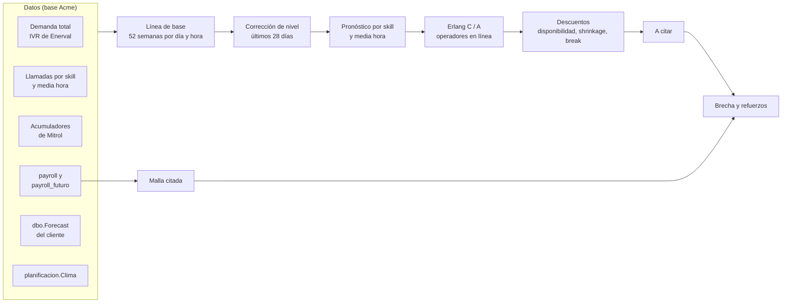

# Planificador

Pronostica cuántas llamadas van a entrar en cada media hora y cuántos operadores hacen falta para atenderlas,
y lo compara con la gente que la malla tiene citada. Pantalla `/planificador`.

- **Permisos:** `planificador.view` para ver; `planificador.edit` para recalcular y configurar. Los dos
  nacen sin asignar.
- **Campañas con fuente hoy:** **Voltara** (campaña 20), **Hidra Técnico** (campaña 1, Mitrol) y **Gasur**
  (campaña 30, Uruguay; con la migración 2026-09-24d). Hidra Comercial (Hermes) no tiene fuente de datos
  todavía.
- El criterio estadístico (Erlang, nivel de servicio, shrinkage, error del pronóstico) está explicado para no
  estadísticos en [ESTADISTICA.md](ESTADISTICA.md). Las decisiones de diseño con su fecha, en
  [DECISIONES.md](DECISIONES.md#planificador).

---

## Cómo funciona

Un recálculo (`planificador_servicio.recalcular`) hace esto, por campaña:

1. Lee la configuración de la campaña y el estado del clima.
2. Lee la demanda: la **total** (Voltara: el IVR de Enerval, del que la parte de Acme es la BPO-04) repartida
   por skill según los tramos de `planificacion.Asignacion`; o, si no hay demanda total, la serie por skill.
   Si no hay tramos cargados, usa el reparto medido de los últimos 60 días y avisa.
3. Carga feriados (`dbo.Feriados` más la librería `holidays`), días atípicos excluidos y ajustes manuales.
4. Calcula el **pronóstico**: perfil del mismo día de semana y hora sobre 52 semanas × factor de clima ×
   corrección de nivel reciente; después, el reparto, la combinación con el pronóstico del cliente (si está
   prendida) y la corrección intradía (si está prendida).
5. Crea una corrida (`planificacion.Corrida`) y guarda el pronóstico (`planificacion.Pronostico`).
6. Por cada pool (grupo de skills que atiende la misma gente): dimensiona con Erlang, aplica la cadena de
   descuentos, compara contra la malla citada y calcula la brecha y los refuerzos
   (`planificacion.Requerimiento`).
7. Cierra la corrida y la marca como **vigente**.

El recálculo corre solo a las 06:00 y a las 14:00 (cron de SRV01) para los próximos 30 días, y a mano con el
botón *Recalcular* o `POST /planificador/recalcular`.

---

## Código

| Archivo (`backend/app/`) | Qué hace |
|---|---|
| `planificador.py` | Lógica pura: línea de base, calendario, persistencia, intradía, dimensionamiento de cada media hora, medición del error, refuerzos |
| `planificador_erlang.py` | Fórmulas de Erlang B, C y A; `dimensionar` |
| `planificador_datos.py` | Todo el SQL: configuración, series, fuentes por campaña, payroll, corridas |
| `planificador_servicio.py` | Orquestación: recalcular, calibrar, backtest, seguimiento intradía, necesidades, combinación |
| `planificador_clima.py` | Factor de clima por skill |
| `planificador_nivel.py` | Segunda opinión del nivel diario con un modelo GBDT (prendido en Voltara) |
| `planificador_combinacion.py` | Peso del pronóstico del cliente |
| `planificador_presencia.py` | Perfil de presencia por media hora |
| `planificador_antiguedad.py` | Rendimiento de la gente nueva |
| `planificador_escenarios.py` | "Qué pasa si" cambia un supuesto |
| `planificador_insumos.py` | Reparto por skill, proyección intradía, días atípicos |
| `planificador_pedidos.py` | Pedidos de refuerzo y su seguimiento |
| `planificador_turnos.py` | De la brecha a turnos que se pueden pedir (4, 6 u 8 h; extensión de hasta 3 h; piezas de al menos 1 h) |
| `planificador_extras.py` | Horas extra habituales (registro contra malla, 8 semanas) |
| `planificador_cortes.py` | Avisos de corte de Hidra: lectura con IA, llamadas de más estimadas, ajuste propuesto y medición posterior |
| `planificador_salud.py` | Frescura de las fuentes y migraciones aplicadas |
| `planificador_export.py` | Exportación a Excel |

Routers: `routers/planificador.py`, `planificador_escenarios.py`, `planificador_insumos.py`,
`planificador_refuerzos.py` y `planificador_salud.py`, todos con prefijo `/planificador`. Lista completa en
[ARQUITECTURA.md → Índice de endpoints](ARQUITECTURA.md#índice-de-endpoints).

Tests: `backend/tests/test_planificador*.py`.

Pantalla: `frontend/app/templates/planificador.html` + `static/js/planificador*.js`. Todos los gráficos pasan
por `dibujar()` (`planificador.js`), que les suma zoom (arrastrar = acercar un tramo, Ctrl+rueda, Shift+arrastrar
= mover, doble clic = verlo entero; `chartjs-plugin-zoom` + `hammerjs` por CDN), ampliar a toda la ventana,
descarga en PNG y la marca de «ahora» en el intradía de hoy. Con hoy elegido, el plan se relee solo cada 10 minutos
(sólo el plan, no la configuración) y el detalle se para en la media hora en curso. La última comparación de cada
campaña queda en el navegador (`localStorage`) y se muestra marcada como guardada hasta que se vuelva a correr.
`planificador_qol.js` suma lo genérico: pestaña en la URL (`#comparacion`), tablas ordenables y «Copiar», aviso de
cambios sin guardar en Configuración/Laboratorio, períodos rápidos, atajos de teclado (`?` los lista) e índice de
bloques en cada pestaña.

---

## Fuentes de datos

Todas las carga **Reporting** (el equipo que administra la base), salvo el clima y los cortes, que carga el
sistema. Si una se atrasa, el plan se calcula con datos viejos: la pantalla de **Salud** lo avisa.

| Campaña | Fuente (`planificador_datos.FUENTES`) | Tablas |
|---|---|---|---|
| Voltara (20) | `FuenteVoltara` + `FuenteVoltaraTotal` | `dbo.[Voltara Enerval informe IVR]` (demanda total), `dbo.[Voltara Enerval informe skills]` (por skill), `dbo.[Voltara Enerval informe agente]` y vista `dbo.Tablero_Agentes_Voltara` (conectados), vista `dbo.TMO_Voltara` (detalle de llamadas) |
| Hidra Técnico (1) | `FuenteHidraTecnico` (+ avisos de corte de la web de Hidra) | `dbo.Acumuladores_de_campana` (volumen, TMO, conectados), `dbo.detalle_de_interacciones_por_campana_lote` (espera y abandono), `dbo.detalle_de_interacciones_por_agente`, `dbo.acumuladores_de_agentes_por_skill` |
| Gasur (30) | `FuenteGasur` | `dbo.[Gasur Llamadas]` (una fila por llamada: volumen, TMO, espera y abandono; intradía), `dbo.[Gasur Actividad]` (logins y logouts, día cerrado) y `dbo.[Gasur Auxiliares]` (pausas por día) |
| Todas | — | `dbo.payroll` (registro de turnos) y `dbo.payroll_futuro` (malla), `dbo.nomina`, `dbo.usuarios`, `dbo.operadores`, `dbo.Forecast` (pronóstico del cliente; el de Hidra y el de Gasur vienen por hora y sin skill), `dbo.Feriados` (feriados argentinos: Gasur usa los no laborables de Uruguay de la librería `holidays`) |

`dbo.Forecast` **se carga a mano** con lo que manda el cliente.

---

## Tablas (`planificacion.*`)

| Tabla | Qué guarda |
|---|---|
| `Campana` | Parámetros de cada campaña: ocupación máxima, shrinkage por tipo de día, break, redondeo nocturno, paciencia, clima, combinación, persistencia, intradía. La columna `Nota` es texto libre y **puede estar desactualizada**: mandan las columnas |
| `Pool` | Grupos de skills que atiende la misma gente, con `MinOperadores` |
| `Skill` | Objetivo de nivel de servicio, umbral, techo de abandono, paciencia, prioridad |
| `Disponibilidad` | Factor de disponibilidad por día de semana y hora |
| `PoolOrigen`, `PoolSubCampana` | Qué sub-campañas de RRHH forman cada pool y de qué clase son (telefónica parcial, digital, dedicada) |
| `PoolRefuerzo` | Palanca de refuerzo desde Digital |
| `CodigoPayroll`, `PuestoMalla` | Qué códigos de payroll y qué puestos cuentan como gente en línea |
| `Asignacion` | Tramos del reparto de la demanda por skill, con vigencia |
| `Evento`, `Ajuste` | Días atípicos (excluidos del entrenamiento) y ajustes manuales con motivo |
| `Clima`, `CorteEnre`, `CorteEnreTipo`, `CorteEnreComunicado`, `AvisoCorte` | Insumos que cargan los crons (`AvisoCorte`: avisos de corte de Hidra con su ajuste propuesto) |
| `PerfilPresencia`, `CurvaAntiguedad` | Insumos que se recalculan los lunes |
| `Corrida` | Encabezado de cada recálculo y cuál es la vigente |
| `Pronostico` | Por corrida, skill y media hora (la tabla más grande) |
| `Requerimiento` | Por corrida, pool y media hora: tráfico, en línea, a citar, NDS, abandono, citados, brecha |
| `RefuerzoPedido` | Pedidos de refuerzo |

Ninguna lleva `Entorno`: el recálculo automático corre solo en SRV01. Un recálculo manual desde dev escribe
en la misma base y queda como corrida vigente.

---

## Crons que lo alimentan

Detalle y comandos en OPERACION.md → Crontab.

| Script | Cuándo | Escribe |
|---|---|---|
| `scripts/planificador_recalcular_diario.sh` | 06:00 y 14:00 | `Corrida`, `Pronostico`, `Requerimiento` (30 días, cada campaña con fuente) |
| `scripts/clima_diario.sh` | 05:30 y 13:30 | `Clima` (Open-Meteo: observado y 16 días de pronóstico) |
| `scripts/cortes_enre.py` | cada hora (y `--solo-tabla` cada 15 min) | `CorteEnre`, `CorteEnreTipo`, `CorteEnreComunicado` |
| `scripts/cortes_hidra.py` | cada hora | `AvisoCorte` (y mide los cortes que ya pasaron) |
| `scripts/planificador_perfil_presencia.py` | lunes 05:30 | `PerfilPresencia` |
| `scripts/planificador_antiguedad.py` | lunes 05:45 | `CurvaAntiguedad` |
| `scripts/planificador_combinacion_semanal.py` | lunes 06:40 | Mide el peso del pronóstico del cliente (no lo prende) |
| `scripts/enerval_ivr_diario.sh` | 04:00 | `dbo.[Voltara Enerval informe IVR]`, la demanda total de Voltara |

---

## Pantalla de Salud

`GET /planificador/salud` (`planificador_salud.py`) revisa que cada fuente esté al día:

| Chequeo | Qué exige |
|---|---|
| Demanda total (IVR) | Datos hasta ayer |
| Informe por skill | No más de 2 h de atraso entre las 8 y las 23 |
| Acumuladores de Mitrol | Al día |
| Registro de RRHH (payroll) | Al día |
| Malla publicada | 14 días hacia adelante |
| Clima | 7 días de pronóstico |
| Pronóstico del cliente | 14 días hacia adelante |
| Cortes ENRE | No más de 3 h de atraso |
| Cortes ENRE por tipo | No más de 3 h de atraso (hora que informa el ENRE) |
| Reparto | Todo skill con demanda tiene un tramo en `Asignacion` |

También dice qué migraciones del planificador están aplicadas (`REGISTRO_MIGRACIONES`; un test obliga a
registrar ahí cada migración nueva del planificador). El resultado se guarda 5 minutos en caché.

**Es la primera pantalla a mirar cuando el plan "da raro".**

---

## Dónde se configura cada cosa

Todo desde la pantalla del planificador, con `planificador.edit`:

| Pestaña | Qué se cambia | Endpoint |
|---|---|---|
| Configuración | Campaña (ocupación, shrinkage, break, redondeo, paciencia, clima, persistencia), pools, skills (objetivo de NDS, umbral, abandono), disponibilidad, sub-campañas de RRHH, códigos de payroll, puestos de malla | `PUT /planificador/config/...` |
| Calibración | Mide y propone paciencia, disponibilidad y shrinkage a partir de lo que pasó; se aplican con un botón | `GET /planificador/calibracion`, `POST /planificador/calibracion/aplicar` |
| Laboratorio | Prueba otros parámetros con el backtest antes de aplicarlos | `GET /planificador/backtest?...` |
| Combinación | Prende y pesa el pronóstico del cliente | `POST /planificador/combinacion/aplicar` |
| Insumos | Reparto por skill, días atípicos, ajustes manuales | `/planificador/asignacion`, `/eventos`, `/ajustes` |

`MinOperadores` de cada pool se puede cambiar por la API (`PUT /planificador/config/pools`) pero la pantalla
solo lo muestra.

---

## Estado de las campañas (24/09/2026)

| | Voltara (20) | Hidra Técnico (1) | Gasur (30), con la migración 2026-09-24d |
|---|---|---|
| Objetivo de nivel de servicio | 80% en 30 s en todos los skills, medido sobre las llamadas **entrantes** | 80% en 30 s (skill 481). El umbral de 30 s está sin confirmar con el cliente | 80% en **10 s** (el umbral de `Gasur Eficiencia`; el «NDS real» también se mide a 10 s). El 80% está sin confirmar |
| Pool | Uno solo ("General", skills 1 a 9 y 13); los pools 2 y 3 están inactivos | Pool 4, un solo skill (481) | Uno solo (sub-campaña 121), skill sintético 1 (las 12 colas de entrada); Despacho (135) como refuerzo |
| Techo de abandono | Electrodependientes (skill 5): 0,5%, con prioridad en la cola | — | — |
| Ocupación máxima | 85% | 85% | 85% |
| Shrinkage | 7,3% hábil, 9,9% no hábil, 7,6% feriado | 2,4% | 0,8% |
| Break | 5 min por hora | — | — |
| Redondeo para abajo | de 0 a 8 h | — | — |
| Clima | prendido | apagado | prendido (Montevideo) |
| Persistencia | 0,45 hoy / 0,15 los 2 días siguientes (con la migración 2026-09-24) | 0,53 hoy / 0,35 los 6 días siguientes | 0,7 hoy / 0,5 los 6 días siguientes |
| Intradía | desde las 14 (con la migración 2026-09-24) | desde las 12 | apagado (empeora) |
| GBDT del nivel diario | prendido, peso 0,4 (con la migración 2026-09-24) | apagado (necesita el clima) | prendido, peso 0,4 |
| Feriados | como domingo | como sábado, con factor para días puente | los 5 no laborables de Uruguay, como domingo |
| Semanas de base | 52 | 52 | 26 (la línea atiende hasta las 24 desde el 26/03/2026) |
| Forma del día | mediana de las semanas de base | ídem | últimos 28 días del mismo tipo (con la migración 2026-09-24e) |
| Días atípicos en la persistencia | se arrastran | se arrastran | se saltean (paros) |
| Ancla al total del mes del cliente | apagada | apagada | peso 0,75 desde 7 días de antelación |
| Combinación con el cliente, elasticidad del domingo | apagadas | apagadas | apagadas |

Los cortes del ENRE no entran al modelo: solo se muestran en Salud y en la pantalla. Medido el 24/09/2026
sobre el pronóstico con GBDT y persistencia (enero a septiembre): el total de usuarios sin luz de ayer o de
la madrugada **empeora** el plan (14,4% → 14,7-14,9%); sólo el del mismo día ayuda (13,6%), y eso ya lo
cubre el reescalado intradía. Ese total mezcla los cortes programados (el 59% al mediodía del 24/09) con los
imprevistos. Desde el 24/09 se guardan separados (`CorteEnreTipo`) para volver a medir con los imprevistos
solos, como alerta intradía, y con los programados por comunicado (`CorteEnreComunicado`) como aviso
anticipado. Hace falta juntar 4 a 6 semanas.

### Cortes anunciados por Hidra

Hidra anuncia sus cortes programados uno o dos días antes en
[Novedades](https://www.hidra.example/portal/usuarios/Novedades). `scripts/cortes_hidra.py` (cada hora) lee cada
nota nueva con Gemini (inicio y fin, instalaciones, zonas, si toca CABA, escala `rutina` o `grande`) y deja en
`planificacion.AvisoCorte` una **propuesta**: cuántas llamadas de más va a traer y el factor que eso
significa sobre la ventana del corte (del inicio a 4 h después del fin). La propuesta **no se aplica sola**:
en la pestaña Plan, tarjeta **Cortes anunciados por Hidra**, alguien con `planificador.edit` la aplica (crea un
ajuste manual y, si el factor llega a 1,15, un evento que saca ese día del entrenamiento) o la descarta.
Un mail con el aviso se carga con `python scripts/cortes_hidra.py --archivo aviso.eml` (o `.txt`).

Cuánto trae un corte, medido en 2026 con la tipificación "Corte programado": uno de rutina (estación
elevadora o inspección de río subterráneo, de noche) ~54 llamadas, o sea +2-3% del día; uno grande (planta,
torre toma, válvulas troncales en CABA) ~470, con picos de 1.600 (14/08). Son valores semilla: el mismo
script mide cada corte dos días después de que terminó y, con cinco cortes medidos de una escala, la
estimación pasa a ser la mediana de lo medido. Casi ningún aviso dice cuántos usuarios afecta; si lo dice
(los mails), se guarda pero todavía no entra en la cuenta.

Gasur (distribución de garrafas en Uruguay) es gas para calefacción: estacionalidad fuerte (enero ~250
llamadas por día, junio ~1.500) y un día muy distinto del siguiente según el frío. Por eso nace con clima,
GBDT y persistencia, que en el backtest de un año bajan el error del total diario del plan de la mañana de 46%
a 33% (el pronóstico del cliente da 48%). Aun así es la campaña más ruidosa: con ~25 llamadas por media hora,
el error por media hora no baja de ~40% aunque se acierte el día. Detalle en el encabezado de
`scripts/migrations/2026-09-24d_planificador_gasur.sql`. Los conectados salen de los logins y logouts de
`Gasur Actividad`, que cargan con el día cerrado: hoy no tiene conectados hasta mañana.

### Gasur: desborde, paros y el total del mes

A Gasur no le llega la demanda del cliente sino el **desborde** de su propio call center (y el 100% cuando
ellos tienen un paro). Por eso, además de lo de arriba:

- **Forma del día reciente** (`FormaDias` 28): el reparto entre las medias horas depende de a qué hora les
  falta gente a ellos, y sale de los últimos 28 días del mismo tipo. Error por media hora 51,9% → 46,1%.
- **Paros:** el detector de atípicos los marca solo al día siguiente (x3 a x6). Al confirmarlos en Insumos,
  tipo «paro del cliente». La persistencia no los arrastra (`PersistenciaSalteaEventos`): el día después de
  un paro viene normal o bajo. **Si la operación se entera antes** (suele ser con uno o dos días), cargar un
  ajuste sobre las horas del paro: medido sobre 9 paros de 2026, el día entero vino x1,8 sobre nuestro
  pronóstico y las horas del paro entre x2 y x4,5; un **x2,5 sobre las horas del paro** es un punto de
  partida razonable. Registrar cada paro (fecha y horario) es lo que va a permitir medir el factor en serio.
- **Total del mes del cliente** (`AnclaMensualPeso` 0,75 desde 7 días): el mínimo mensual que paga el
  cliente viene en `dbo.Forecast` 'Gasur' (repartido por hora) y acierta el mes con ~8% de error. Lo que
  queda del mes, a partir de 7 días de antelación, se lleva hacia ese total descontando lo ya entrado. A 7
  días: 45,1% → 40,6% y sesgo -13,5% → -4,4%; a 1-3 días empeora y no se aplica. No se puede probar en el
  Laboratorio (el backtest pronostica día por día).

Por qué Voltara prendió GBDT, persistencia e intradía el 24/09/2026: backtest de un año, MAPE del total diario del plan de la mañana 17,7% → 14,4% (a 1 día 18,3% → 16,7%, a 7 días 18,8% → 17,7%), gana los cuatro tipos de día y todos los trimestres. El detalle está en el encabezado de `scripts/migrations/2026-09-24_planificador_voltara_nivel_persistencia.sql`.

---

## Qué puede salir mal

| Síntoma | Causa probable | Qué hacer |
|---|---|---|
| El plan de hoy es el de ayer | No corrió el recálculo o falló | `logs/planificador_recalcular_diario.log`; correrlo a mano (OPERACION.md) |
| El pronóstico se dispara o se desploma | Una fuente atrasada (IVR, clima) o un día atípico sin marcar | Pantalla de Salud; marcar el día como evento en Insumos |
| Aviso "skills sin tramo de reparto" | Apareció un skill nuevo con demanda | Cargar el tramo en Insumos → Reparto |
| La brecha es enorme en un día puntual | La malla de ese día no está publicada en `payroll_futuro` | Salud → "Malla publicada"; avisar a Reporting |
| Números distintos entre dev y prod | Alguien recalculó desde dev: la corrida vigente es la última | Recalcular desde prod |
| Se cambió un parámetro "a ojo" y el plan se movió mucho | Los parámetros encadenados multiplican | Revisar con el Laboratorio y el backtest antes de aplicar; ver la lista de [ESTADISTICA.md → No tocar sin entender](ESTADISTICA.md#no-tocar-sin-entender) |
